# CHEMICALS-OUTDOOR-SCHEMA

**metamodel version:** 1.11.0

**version:** 1.1.0

This metadata schema represents the minimum metadata community standard for reporting data concerning  the occurrence of chemicals in the outdoor environment (environmental monitoring data) as discussed and agreed upon  by the European Partnership for the Assessment of Risks from Chemicals. The schema contains metadata elements and associated codelists to describe a project or monitoring programme that generated the data, elements to describe the monitoring site, sample,  concentration and other parameters, and the associated codelists. Atmospheric, terrestrial, and aquatic environments,  as well as in biota, are covered.

## Class Diagram

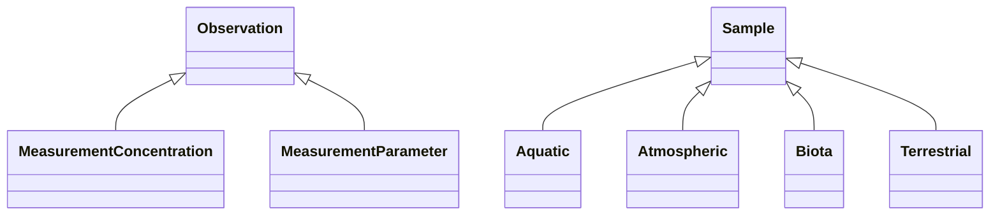

## ERD Diagrams

### Component 1 (Biota, Taxon)

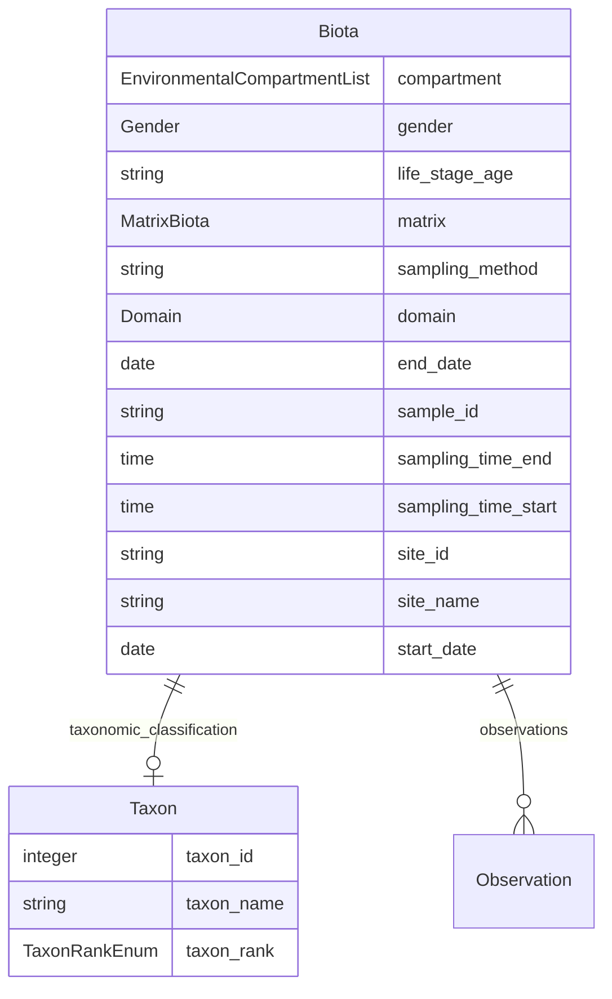

### Component 2 (Campaign, Contact, Funder...)

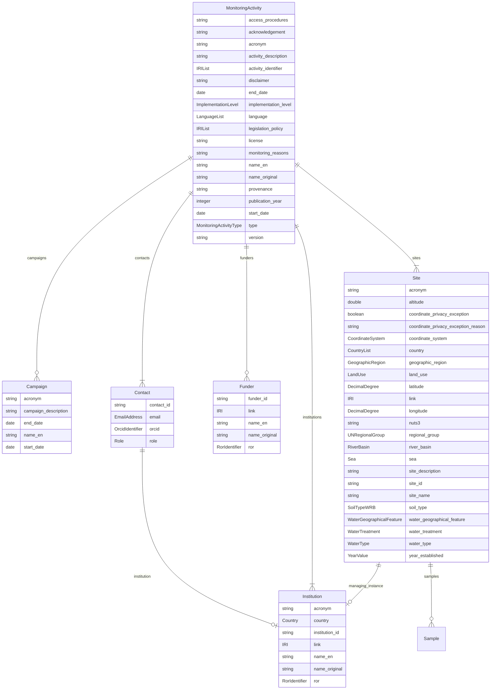

### Component 3 (ChemicalCompound, MeasurementConcentration)

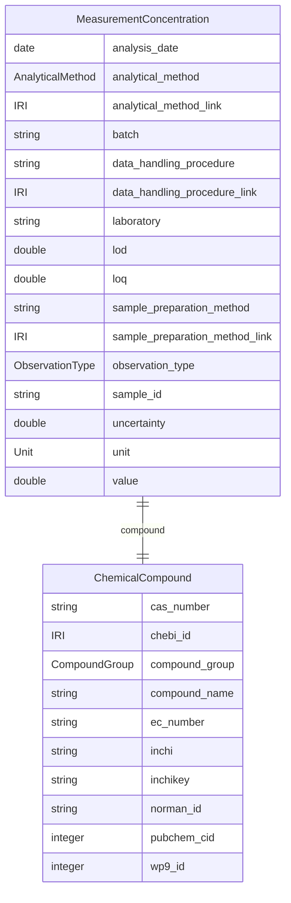

## Base Classes

Foundational classes in the hierarchy (root classes and direct children of Thing):

| Class | Description |
| --- | --- |
| [Observation](#Observation) | Abstract base class for all observations associated with a sample. Every observation must be either a MeasurementConcentration or a MeasurementParameter. Contains shared slots (unit, uncertainty, value) common to all observation types. |
| [Sample](#Sample) | Abstract base class for all sample types |

## Standalone Classes

These classes are completely isolated with no relationships and are not used as base classes:

| Class | Description |
| --- | --- |
| [Aquatic](#Aquatic) | Aquatic sample |
| [Atmospheric](#Atmospheric) | Atmospheric sample |
| [MeasurementParameter](#MeasurementParameter) | An additional parameter measured in the sample (e.g. pH, temperature, TOC). Depends on matrix type. Gives context to the chemical concentration measurement. |
| [Terrestrial](#Terrestrial) | A sample from the terrestrial domain (soil) |

## Abstract Classes

### Observation

Abstract base class for all observations associated with a sample. Every observation must be either a MeasurementConcentration or a MeasurementParameter. Contains shared slots (unit, uncertainty, value) common to all observation types.

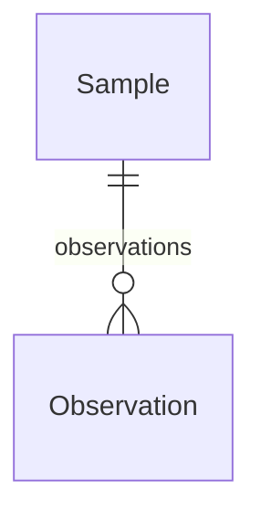

#### Attributes

| Name | Cardinality: | Type | Description |
| --- | --- | --- | --- |
| **[observation_type](#ObservationType)** | 1..1 | [ObservationType](#ObservationType) | Type of measurement/observation: i) Chemical concentration in the environment or biota - main observation and; ii) Other parameters - they give context to the main measurement. |
| **[sample_id](#SampleId)** | 1..1 | string | Unique identifier for the sample |
| **[uncertainty](#Uncertainty)** | 0..1 | double | Measurement uncertainty of the concentration/paramter value, expressed as a percentage (%) at 95% confidence level. |
| **[unit](#Unit)** | 1..1 | [Unit](#Unit) | Unit of measurement |
| **[value](#Value)** | 0..1 | double | Measured value of the chemical concentration or other parameter |

#### Children

 * [MeasurementConcentration](#MeasurementConcentration) - A measured concentration of a chemical compound in a sample. At least one of concentration, LOQ, or LOD must be provided.
 * [MeasurementParameter](#MeasurementParameter) - An additional parameter measured in the sample (e.g. pH, temperature, TOC). Depends on matrix type.  Gives context to the chemical concentration measurement.

#### Referenced by:

 *  **[Sample](#Sample)** : sample__observations  0..\* 

### Sample

Abstract base class for all sample types

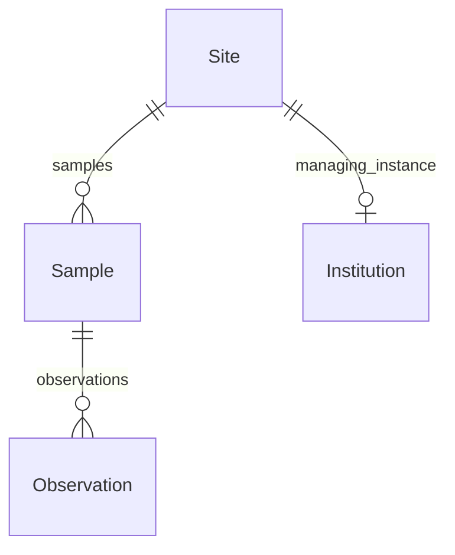

#### Attributes

| Name | Cardinality: | Type | Description |
| --- | --- | --- | --- |
| **[domain](#Domain)** | 1..1 | [Domain](#Domain) | Sample type according to sampled matrix: Atmospheric for air, particles, precipitation, dust; Aquatic for water and sediment; Terrestrial for soil Biota for plants and animals |
| **[end_date](#EndDate)** | 0..1 | date | End date in format YYYY-MM-DD |
| **[observations](#Observations)** | 0..\* | [Observation](#Observation) | Observations (concentration measurements and parameters) associated with this sample. |
| **[sample_id](#SampleId)** | 1..1 | string | Unique identifier for the sample |
| **[sampling_time_end](#SamplingTimeEnd)** | 0..1 | time | Sampling end time according to ISO 8601. |
| **[sampling_time_start](#SamplingTimeStart)** | 0..1 | time | Sampling start time according to ISO 8601, 24-hour clock. Format T[hh][mm][ss]. |
| **[site_id](#SiteId)** | 1..1 | string | Unique identifier of the monitoring site where the sample was collected. References the site_id of a Site record. |
| **[site_name](#SiteName)** | 1..1 | string | Name of the monitoring site. Provide in the local language as the primary name. An English name may be added if available and commonly used. Multiple names in different languages are accepted. |
| **[start_date](#StartDate)** | 1..1 | date | Start date in format YYYY-MM-DD |

#### Children

 * [Aquatic](#Aquatic) - Aquatic sample
 * [Atmospheric](#Atmospheric) - Atmospheric sample
 * [Biota](#Biota) - Biota sample
 * [Terrestrial](#Terrestrial) - A sample from the terrestrial domain (soil)

#### Referenced by:

 *  **[Site](#Site)** : site__samples  0..\* 

## Classes

### Aquatic

Aquatic sample

#### Attributes

| Name | Cardinality: | Type | Description |
| --- | --- | --- | --- |
| **[domain](#Domain)** | 1..1 | [Domain](#Domain) | Sample type according to sampled matrix: Atmospheric for air, particles, precipitation, dust; Aquatic for water and sediment; Terrestrial for soil Biota for plants and animals |
| **[end_date](#EndDate)** | 0..1 | date | End date in format YYYY-MM-DD |
| **[observations](#Observations)** | 0..\* | [Observation](#Observation) | Observations (concentration measurements and parameters) associated with this sample. |
| **[sample_id](#SampleId)** | 1..1 | string | Unique identifier for the sample |
| **[sampling_time_end](#SamplingTimeEnd)** | 0..1 | time | Sampling end time according to ISO 8601. |
| **[sampling_time_start](#SamplingTimeStart)** | 0..1 | time | Sampling start time according to ISO 8601, 24-hour clock. Format T[hh][mm][ss]. |
| **[site_id](#SiteId)** | 1..1 | string | Unique identifier of the monitoring site where the sample was collected. References the site_id of a Site record. |
| **[site_name](#SiteName)** | 1..1 | string | Name of the monitoring site. Provide in the local language as the primary name. An English name may be added if available and commonly used. Multiple names in different languages are accepted. |
| **[start_date](#StartDate)** | 1..1 | date | Start date in format YYYY-MM-DD |
| **[fraction](#Fraction)** | 0..1 | [AquaticMatrixFraction](#AquaticMatrixFraction) | If the collected sample is divided into multiple fractions for separate analysis, this field identifies each subsample. |
| **[matrix](#Matrix)** | 1..1 | [MatrixAquatic](#MatrixAquatic) | Sampled matrix |
| **[sampling_method](#SamplingMethod)** | 1..1 | [SamplingMethodAquatic](#SamplingMethodAquatic) | Method used to collect the sample |

#### Parents

 * [Sample](#Sample) - Abstract base class for all sample types

### Atmospheric

Atmospheric sample

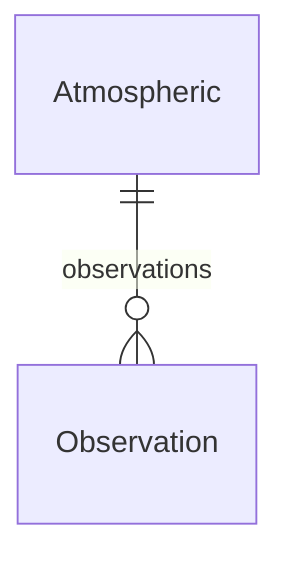

#### Attributes

| Name | Cardinality: | Type | Description |
| --- | --- | --- | --- |
| **[domain](#Domain)** | 1..1 | [Domain](#Domain) | Sample type according to sampled matrix: Atmospheric for air, particles, precipitation, dust; Aquatic for water and sediment; Terrestrial for soil Biota for plants and animals |
| **[end_date](#EndDate)** | 0..1 | date | End date in format YYYY-MM-DD |
| **[observations](#Observations)** | 0..\* | [Observation](#Observation) | Observations (concentration measurements and parameters) associated with this sample. |
| **[sample_id](#SampleId)** | 1..1 | string | Unique identifier for the sample |
| **[sampling_time_end](#SamplingTimeEnd)** | 0..1 | time | Sampling end time according to ISO 8601. |
| **[sampling_time_start](#SamplingTimeStart)** | 0..1 | time | Sampling start time according to ISO 8601, 24-hour clock. Format T[hh][mm][ss]. |
| **[site_id](#SiteId)** | 1..1 | string | Unique identifier of the monitoring site where the sample was collected. References the site_id of a Site record. |
| **[site_name](#SiteName)** | 1..1 | string | Name of the monitoring site. Provide in the local language as the primary name. An English name may be added if available and commonly used. Multiple names in different languages are accepted. |
| **[start_date](#StartDate)** | 1..1 | date | Start date in format YYYY-MM-DD |
| **[matrix](#Matrix)** | 1..1 | [MatrixAtmospheric](#MatrixAtmospheric) | Sampled matrix |
| **[sampling_method](#SamplingMethod)** | 1..1 | [SamplingMethodAtmospheric](#SamplingMethodAtmospheric) | Method used to collect the sample |

#### Parents

 * [Sample](#Sample) - Abstract base class for all sample types

### Biota

Biota sample

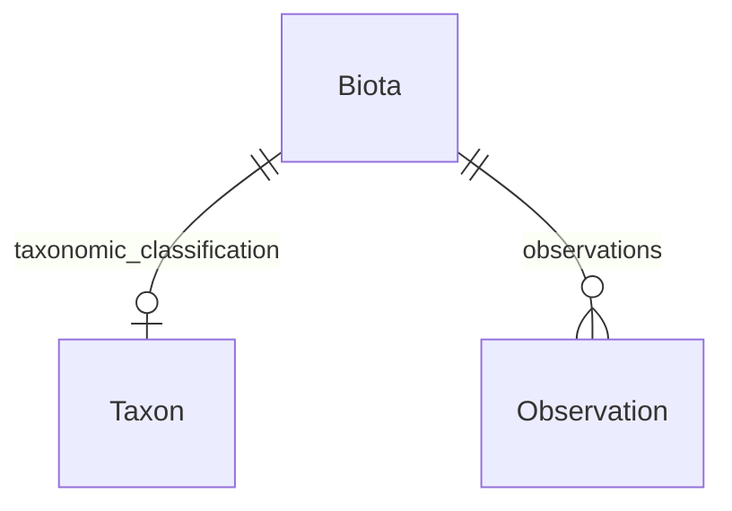

#### Attributes

| Name | Cardinality: | Type | Description |
| --- | --- | --- | --- |
| **[domain](#Domain)** | 1..1 | [Domain](#Domain) | Sample type according to sampled matrix: Atmospheric for air, particles, precipitation, dust; Aquatic for water and sediment; Terrestrial for soil Biota for plants and animals |
| **[end_date](#EndDate)** | 0..1 | date | End date in format YYYY-MM-DD |
| **[observations](#Observations)** | 0..\* | [Observation](#Observation) | Observations (concentration measurements and parameters) associated with this sample. |
| **[sample_id](#SampleId)** | 1..1 | string | Unique identifier for the sample |
| **[sampling_time_end](#SamplingTimeEnd)** | 0..1 | time | Sampling end time according to ISO 8601. |
| **[sampling_time_start](#SamplingTimeStart)** | 0..1 | time | Sampling start time according to ISO 8601, 24-hour clock. Format T[hh][mm][ss]. |
| **[site_id](#SiteId)** | 1..1 | string | Unique identifier of the monitoring site where the sample was collected. References the site_id of a Site record. |
| **[site_name](#SiteName)** | 1..1 | string | Name of the monitoring site. Provide in the local language as the primary name. An English name may be added if available and commonly used. Multiple names in different languages are accepted. |
| **[start_date](#StartDate)** | 1..1 | date | Start date in format YYYY-MM-DD |
| **[compartment](#Compartment)** | 0..\* | [EnvironmentalCompartment](#EnvironmentalCompartment) | The environmental compartment where the organism was sampled from. |
| **[gender](#Gender)** | 0..1 | [Gender](#Gender) | Collected organism gender |
| **[life_stage_age](#LifeStageAge)** | 0..1 | string | Life stage or age of the organism |
| **[matrix](#Matrix)** | 1..1 | [MatrixBiota](#MatrixBiota) | Sampled matrix |
| **[sampling_method](#SamplingMethod)** | 0..1 | string | Sampling method for biota samples (to be discussed) |
| **[taxonomic_classification](#TaxonomicClassification)** | 0..1 | [Taxon](#Taxon) | A taxonomic entity identified in a biological sample, referenced against the GBIF Backbone Taxonomy. |

#### Parents

 * [Sample](#Sample) - Abstract base class for all sample types

### Campaign

A time-bounded data collection period within a project or monitoring programme. Mandatory if the campaign exists.

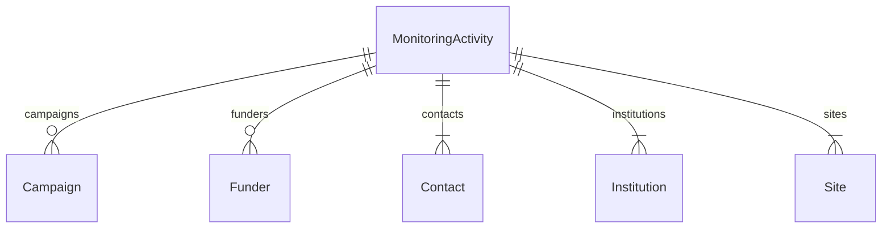

#### Attributes

| Name | Cardinality: | Type | Description |
| --- | --- | --- | --- |
| **[acronym](#Acronym)** | 1..1 | string | Short name or acronym. |
| **[campaign_description](#CampaignDescription)** | 0..1 | string | Description of the campaign |
| **[end_date](#EndDate)** | 1..1 | date | End date in format YYYY-MM-DD |
| **[name_en](#NameEn)** | 1..1 | string | Name or designation in English |
| **[start_date](#StartDate)** | 1..1 | date | Start date in format YYYY-MM-DD |

#### Referenced by:

 *  **[MonitoringActivity](#MonitoringActivity)** : monitoringActivity__campaigns  0..\* 

### ChemicalCompound

A chemical compound monitored in environmental samples. The compound list (1500+ substances) was developed in PARC WP9 in collaboration with other WPs. Each compound is identified by multiple persistent identifiers and assigned to a compound group. See: https://doi.org/10.5281/zenodo.17175075

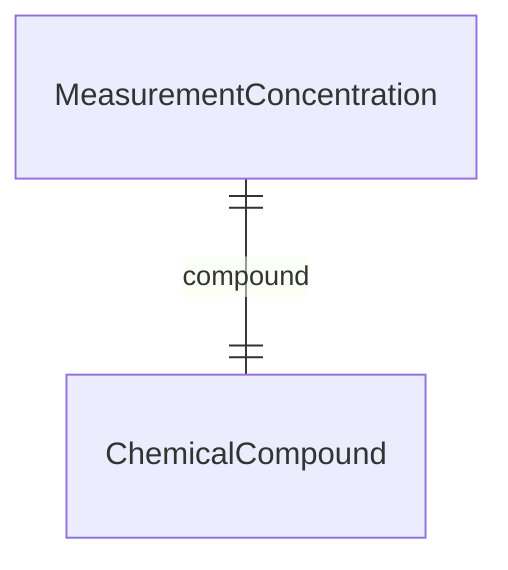

#### Attributes

| Name | Cardinality: | Type | Description |
| --- | --- | --- | --- |
| **[cas_number](#CasNumber)** | 0..1 | string | CAS Registry Number — unique numerical identifier assigned by the Chemical Abstracts Service. Format: NNNNNN-NN-N |
| **[chebi_id](#ChebiId)** | 0..1 | IRI | ChEBI identifier for the compound. To be populated by mapping from InChIKey to ChEBI. Format: CHEBI:NNNNN |
| **[compound_group](#CompoundGroup)** | 0..1 | [CompoundGroup](#CompoundGroup) | Chemical group classification of the compound as defined in the PARC WP9 compound list (e.g. PFAS, biocides, PCBs, PAHs). # TODO: Future alignment planned with ChemFOnt functional classes # and/or C3PO (ChEBI Chemical Class Program Ontology) |
| **[compound_name](#CompoundName)** | 1..1 | string | Common or abbreviated name of the compound as used in the PARC community (e.g. PFOS, triclosan). |
| **[ec_number](#EcNumber)** | 0..1 | string | EC Number (European Community Number) — identifier used in the ECHA substance inventory (EINECS, ELINCS, NLP). Format: NNN-NNN-N |
| **[inchi](#Inchi)** | 1..1 | string | IUPAC International Chemical Identifier (InChI) — a standard textual representation of the molecular structure. Begins with 'InChI=1S/'. |
| **[inchikey](#Inchikey)** | 0..1 | string | InChIKey — a fixed-length (27-character) hash of the InChI string. Used as a compact, web-searchable identifier. Format: XXXXXXXXXXXXXX-XXXXXXXXXX-X |
| **[norman_id](#NormanId)** | 0..1 | string | NORMAN substance identifier. Source: NORMAN EMPODAT / SusDat database. |
| **[pubchem_cid](#PubchemCid)** | 0..1 | integer | PubChem Compound ID (CID). To be populated by mapping from InChIKey to PubChem. |
| **[wp9_id](#Wp9Id)** | 1..1 | integer | Internal PARC WP9 identifier for the compound. Unique within the PARC compound list. |

#### Referenced by:

 *  **[MeasurementConcentration](#MeasurementConcentration)** : measurementConcentration__compound  1..1 

### Contact

A contact person associated with the monitoring activity.

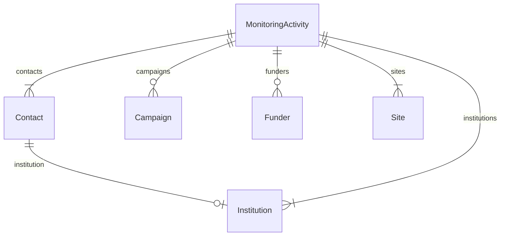

#### Attributes

| Name | Cardinality: | Type | Description |
| --- | --- | --- | --- |
| **[contact_id](#ContactId)** | 1..1 | string | Unique contact ID |
| **[email](#Email)** | 1..1 | EmailAddress | Email address of the project contact point. Institutional email is recommended. |
| **[institution](#Institution)** | 0..1 | [Institution](#Institution) | Contact's institution |
| **[orcid](#Orcid)** | 0..1 | OrcidIdentifier | ORCID identifier of the contact person |
| **[role](#Role)** | 0..1 | [Role](#Role) | Role/function performed by the contact person. Source: ISO 19115:2003/19139 and EC Regulation No 1205/2008 (INSPIRE). |

#### Referenced by:

 *  **[MonitoringActivity](#MonitoringActivity)** : monitoringActivity__contacts  1..\* 

### Funder

Funder

#### Attributes

| Name | Cardinality: | Type | Description |
| --- | --- | --- | --- |
| **[link](#Link)** | 0..1 | IRI | URL with information about the institution |
| **[name_en](#NameEn)** | 1..1 | string | Name or designation in English |
| **[name_original](#NameOriginal)** | 1..1 | string | Name of the entity in the original language of the institution/site/project. Use the local official name. |
| **[ror](#Ror)** | 0..1 | RorIdentifier | ROR identifier of the institution (format ror.org/xxxxxxxx) |
| **[funder_id](#FunderId)** | 1..1 | string | Unique funder ID |

#### Uses

 *  mixin: [OrganisationMetadata](#OrganisationMetadata) - Shared metadata for organisations — institutions and funders.

#### Referenced by:

 *  **[MonitoringActivity](#MonitoringActivity)** : monitoringActivity__funders  0..\* 

### Institution

Institution

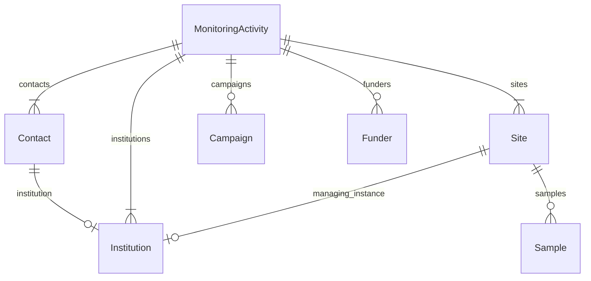

#### Attributes

| Name | Cardinality: | Type | Description |
| --- | --- | --- | --- |
| **[link](#Link)** | 0..1 | IRI | URL with information about the institution |
| **[name_en](#NameEn)** | 1..1 | string | Name or designation in English |
| **[name_original](#NameOriginal)** | 1..1 | string | Name of the entity in the original language of the institution/site/project. Use the local official name. |
| **[ror](#Ror)** | 0..1 | RorIdentifier | ROR identifier of the institution (format ror.org/xxxxxxxx) |
| **[acronym](#Acronym)** | 0..1 | string | Short name or acronym. |
| **[country](#Country)** | 1..1 | [Country](#Country) | Country where the site, institution or project is located, according to ISO 3166-1 alpha-2 (two-letter uppercase code). |
| **[institution_id](#InstitutionId)** | 1..1 | string | Unique institution id |

#### Uses

 *  mixin: [OrganisationMetadata](#OrganisationMetadata) - Shared metadata for organisations — institutions and funders.

#### Referenced by:

 *  **[Contact](#Contact)** : contact__institution  0..1 
 *  **[MonitoringActivity](#MonitoringActivity)** : monitoringActivity__institutions  1..\* 
 *  **[Site](#Site)** : site__managing_instance  0..1 

### MeasurementConcentration

A measured concentration of a chemical compound in a sample. At least one of concentration, LOQ, or LOD must be provided.

#### Attributes

| Name | Cardinality: | Type | Description |
| --- | --- | --- | --- |
| **[observation_type](#ObservationType)** | 1..1 | [ObservationType](#ObservationType) | Type of measurement/observation: i) Chemical concentration in the environment or biota - main observation and; ii) Other parameters - they give context to the main measurement. |
| **[sample_id](#SampleId)** | 1..1 | string | Unique identifier for the sample |
| **[uncertainty](#Uncertainty)** | 0..1 | double | Measurement uncertainty of the concentration/paramter value, expressed as a percentage (%) at 95% confidence level. |
| **[unit](#Unit)** | 1..1 | [Unit](#Unit) | Unit of measurement |
| **[value](#Value)** | 0..1 | double | Measured value of the chemical concentration or other parameter |
| **[analysis_date](#AnalysisDate)** | 0..1 | date | The date on which the concentration was determined |
| **[analytical_method](#AnalyticalMethod)** | 1..1 | [AnalyticalMethod](#AnalyticalMethod) | Analytical method used to determine the analyte |
| **[analytical_method_link](#AnalyticalMethodLink)** | 0..1 | IRI | GUPRI linking to a public SOP or document describing the method |
| **[batch](#Batch)** | 0..1 | string | Internal laboratory designation of the group of samples analyzed together |
| **[compound](#Compound)** | 1..1 | [ChemicalCompound](#ChemicalCompound) | Chemical compound measured in the sample. Reference to the PARC WP9 compound list entry (ChemicalCompound class). Identified by WP9_id, name, CAS, EC, InChI, and InChIKey. Mappable to ChEBI, PubChem, and NORMAN identifiers. A single measurement record should typically correspond to one compound. |
| **[data_handling_procedure](#DataHandlingProcedure)** | 1..1 | string | Description of steps taken after chemical analysis (e.g., blank correction, quality control, calibration, recovery, standardization, recalculations). |
| **[data_handling_procedure_link](#DataHandlingProcedureLink)** | 0..1 | IRI | GUPRI linking to a document describing the data handling procedure |
| **[laboratory](#Laboratory)** | 1..1 | string | Name of the laboratory performing the analysis |
| **[lod](#Lod)** | 0..1 | double | Limit of detection |
| **[loq](#Loq)** | 0..1 | double | Limit of quantification |
| **[sample_preparation_method](#SamplePreparationMethod)** | 1..1 | string | Description of the process from sample collection to chemical analysis (e.g., extraction, cleanup, fractionation). |
| **[sample_preparation_method_link](#SamplePreparationMethodLink)** | 0..1 | IRI | GUPRI (e.g. DOI) linking to a public SOP, article, or other document describing the method. |

#### Parents

 * [Observation](#Observation) - Abstract base class for all observations associated with a sample. Every observation must be either a MeasurementConcentration or a MeasurementParameter. Contains shared slots (unit, uncertainty, value) common to all observation types.

### MeasurementParameter

An additional parameter measured in the sample (e.g. pH, temperature, TOC). Depends on matrix type.  Gives context to the chemical concentration measurement.

#### Local class diagram

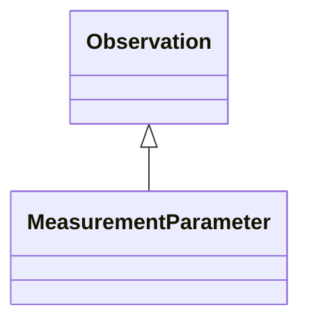

#### Attributes

| Name | Cardinality: | Type | Description |
| --- | --- | --- | --- |
| **[observation_type](#ObservationType)** | 1..1 | [ObservationType](#ObservationType) | Type of measurement/observation: i) Chemical concentration in the environment or biota - main observation and; ii) Other parameters - they give context to the main measurement. |
| **[sample_id](#SampleId)** | 1..1 | string | Unique identifier for the sample |
| **[uncertainty](#Uncertainty)** | 0..1 | double | Measurement uncertainty of the concentration/paramter value, expressed as a percentage (%) at 95% confidence level. |
| **[unit](#Unit)** | 1..1 | [Unit](#Unit) | Unit of measurement |
| **[value](#Value)** | 0..1 | double | Measured value of the chemical concentration or other parameter |
| **[parameter](#Parameter)** | 1..1 | [Parameter](#Parameter) | Name of the parameter measured. Refer to the codelist-parameter tab for the list. |

#### Parents

 * [Observation](#Observation) - Abstract base class for all observations associated with a sample. Every observation must be either a MeasurementConcentration or a MeasurementParameter. Contains shared slots (unit, uncertainty, value) common to all observation types.

### MonitoringActivity

A research project or monitoring programme collecting environmental data on chemicals in the outdoor environment (air, water, sediment, soil, biota)

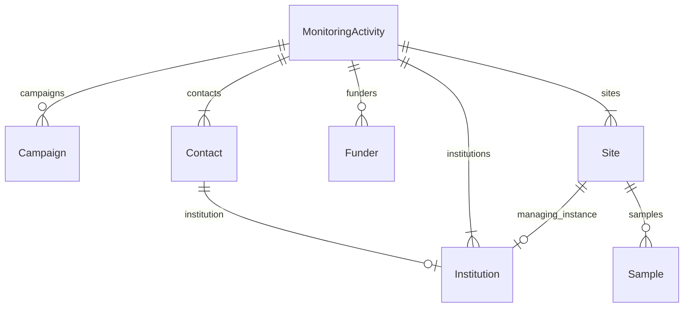

#### Attributes

| Name | Cardinality: | Type | Description |
| --- | --- | --- | --- |
| **[access_procedures](#AccessProcedures)** | 1..1 | string | Information on procedure to obtain access to the dataset. |
| **[acknowledgement](#Acknowledgement)** | 1..1 | string | Text for acknowledgement which should be reported when using/re-using the data. |
| **[acronym](#Acronym)** | 1..1 | string | Short name or acronym. |
| **[activity_description](#ActivityDescription)** | 1..1 | string | A brief summary with the most important details summarising the project (objectives, scope, target group, key aspects, design, methods). |
| **[activity_identifier](#ActivityIdentifier)** | 0..\* | IRI | Project/monitoring programme identifier provided as URL (GUPRI). At least one identifier required. |
| **[campaigns](#Campaigns)** | 0..\* | [Campaign](#Campaign) | If an Environmental Monitoring Programme/Project has a long-term perspective of at least a few years, it may be necessary to input data at suitable time intervals. For this time period, is used the term "Campaign". A Campaign is defined by its start and end, and it is recommended to name it within the project using a consistent style. |
| **[contacts](#Contacts)** | 1..\* | [Contact](#Contact) | Contact person(s) for the monitoring activity. |
| **[disclaimer](#Disclaimer)** | 0..1 | string | Text for disclaimer when using/re-using the data. |
| **[end_date](#EndDate)** | 0..1 | date | End date of the project/monitoring programme. |
| **[funders](#Funders)** | 0..\* | [Funder](#Funder) | Funding entity/entities supporting the monitoring activity. |
| **[implementation_level](#ImplementationLevel)** | 0..1 | [ImplementationLevel](#ImplementationLevel) | The geographic scale of the monitoring coverage (international, national, regional, or local). |
| **[institutions](#Institutions)** | 1..\* | [Institution](#Institution) | Institution(s) responsible for implementing the monitoring activity. |
| **[language](#Language)** | 0..\* | [Language](#Language) | Language(s) used, as 2-letter codes according to ISO 639-1. |
| **[legislation_policy](#LegislationPolicy)** | 0..\* | IRI | Link(s) to policy, convention, or legislation underpinning the monitoring activity. Mandatory for monitoring programmes; optional for projects if relevant. |
| **[license](#License)** | 1..1 | string | License or terms for data reuse. |
| **[monitoring_reasons](#MonitoringReasons)** | 0..1 | string | Primary reasons for performing monitoring (e.g. regulatory requirements). Mandatory for monitoring programmes; optional for projects if relevant. |
| **[name_en](#NameEn)** | 1..1 | string | Name or designation in English |
| **[name_original](#NameOriginal)** | 1..1 | string | Name of the entity in the original language of the institution/site/project. Use the local official name. |
| **[provenance](#Provenance)** | 0..1 | string | A statement about the lineage of the dataset. |
| **[publication_year](#PublicationYear)** | 0..1 | integer | Year when the dataset was or will be made publicly available. |
| **[sites](#Sites)** | 1..\* | [Site](#Site) | Monitoring site(s) associated with this project or monitoring programme. |
| **[start_date](#StartDate)** | 1..1 | date | The beginning (or previewed starting) date of the monitoring programme/project. |
| **[type](#Type)** | 1..1 | [MonitoringActivityType](#MonitoringActivityType) | Type of monitoring activity |
| **[version](#Version)** | 0..1 | string | Version of the dataset. |

### Site

A monitoring site or location where samples are collected. Coordinates (latitude and longitude) are mandatory unless they cannot be provided for privacy, security or confidentiality reasons. When coordinates are provided, GIS-derived fields (NUTS3, land use, river basin, sea, soil type) can be automatically retrieved from GIS layers. When coordinates are not provided, expert-described location fields (country, geographic region, NUTS3) are required instead.

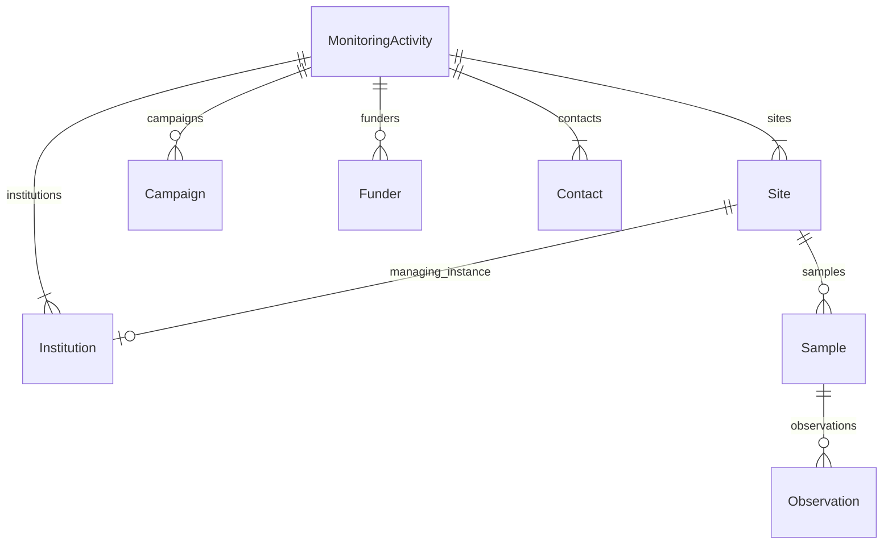

#### Attributes

| Name | Cardinality: | Type | Description |
| --- | --- | --- | --- |
| **[acronym](#Acronym)** | 0..1 | string | Short name or acronym. |
| **[altitude](#Altitude)** | 0..1 | double | Altitude in meters above sea level (MSL). Use positive values for above and negative for below sea level. |
| **[coordinate_privacy_exception](#CoordinatePrivacyException)** | 0..1 | boolean | Set to true (value = true) if coordinates cannot be provided for privacy, security or confidentiality reasons. If true, expert location fields (country, geographic_region, nuts3) are required instead. Optional - if not provided, it is assumed coordinates are not withheld for privacy reasons. |
| **[coordinate_privacy_exception_reason](#CoordinatePrivacyExceptionReason)** | 0..1 | string | Justification for not providing coordinates. Required when coordinate_privacy_exception is true. Provide a brief explanation of the privacy, security or confidentiality reason that prevents disclosure of the exact site location. |
| **[coordinate_system](#CoordinateSystem)** | 0..1 | [CoordinateSystem](#CoordinateSystem) | Coordinate reference system used. Default is EPSG:4326 (WGS 84). |
| **[country](#Country)** | 1..\* | [Country](#Country) | Country code(s) according to ISO 3166-1 alpha-2. Extended with XX (unknown) and XZ (international waters). |
| **[geographic_region](#GeographicRegion)** | 0..1 | [GeographicRegion](#GeographicRegion) | UN M49 geographic region |
| **[land_use](#LandUse)** | 0..1 | [LandUse](#LandUse) | Land use classification according to CORINE Land Cover nomenclature. |
| **[latitude](#Latitude)** | 0..1 | DecimalDegree | Latitude in signed decimal degrees (format 0.000000, range -90 to 90). South latitude with minus sign. Coordinate reference system: WGS 84 (EPSG:4326). Mandatory unless coordinate_privacy_exception is true. |
| **[link](#Link)** | 0..1 | IRI | URL with information about the institution |
| **[longitude](#Longitude)** | 0..1 | DecimalDegree | Longitude in signed decimal degrees (format 0.000000, range -180 to 180). West longitude with minus sign. Coordinate reference system: WGS 84 (EPSG:4326). Mandatory unless coordinate_privacy_exception is true. |
| **[managing_instance](#ManagingInstance)** | 0..1 | [Institution](#Institution) | The institution that manages the sampling site |
| **[nuts3](#Nuts3)** | 0..1 | string | NUTS3 region code according to the Eurostat NUTS classification (Nomenclature of Territorial Units for Statistics), level 3. Example: CZ080 (Moravskoslezsky kraj), DE300 (Berlin). If NUTS3 is not applicable (e.g. non-EU countries), use an alternative administrative classification. |
| **[regional_group](#RegionalGroup)** | 0..1 | [UNRegionalGroup](#UNRegionalGroup) | Regional group of United Nations member states |
| **[river_basin](#RiverBasin)** | 0..1 | [RiverBasin](#RiverBasin) | River basin associated with the site, based on the EEA river basin districts dataset. Only relevant for water and sediment sampling. |
| **[samples](#Samples)** | 0..\* | [Sample](#Sample) | Samples collected at this monitoring site. |
| **[sea](#Sea)** | 0..1 | [Sea](#Sea) | Sea or ocean associated with the site, based on the Marine Regions Gazetteer. Only relevant for water and sediment sampling. |
| **[site_description](#SiteDescription)** | 0..1 | string | Description of the site where samples were collected. Provide all important information that cannot be captured in other fields. |
| **[site_id](#SiteId)** | 1..1 | string | Unique identifier of the monitoring site where the sample was collected. References the site_id of a Site record. |
| **[site_name](#SiteName)** | 1..1 | string | Name of the monitoring site. Provide in the local language as the primary name. An English name may be added if available and commonly used. Multiple names in different languages are accepted. |
| **[soil_type](#SoilType)** | 0..1 | [SoilTypeWRB](#SoilTypeWRB) | World Reference Base for Soil Resources (WRB) 2006/2007 Reference Soil Group at the site. Only relevant for soil sampling. |
| **[water_geographical_feature](#WaterGeographicalFeature)** | 0..1 | [WaterGeographicalFeature](#WaterGeographicalFeature) | Geographical water feature type at the site. Only relevant for water and sediment sampling. |
| **[water_treatment](#WaterTreatment)** | 0..1 | [WaterTreatment](#WaterTreatment) | Water treatment status at the site. Only relevant for water and sediment sampling. |
| **[water_type](#WaterType)** | 0..1 | [WaterType](#WaterType) | Type of water body at the site. Only relevant for water and sediment sampling. |
| **[year_established](#YearEstablished)** | 0..1 | YearValue | Year of establishment of the monitoring station (YYYY) |

#### Referenced by:

 *  **[MonitoringActivity](#MonitoringActivity)** : monitoringActivity__sites  1..\* 

### Taxon

A taxonomic entity identified in a biological sample, referenced against the GBIF Backbone Taxonomy.

#### Attributes

| Name | Cardinality: | Type | Description |
| --- | --- | --- | --- |
| **[taxon_id](#TaxonId)** | 1..1 | integer | GBIF species key (integer). Resolves to https://www.gbif.org/species/{taxon_id} |
| **[taxon_name](#TaxonName)** | 1..1 | string | Scientific name of the taxon (genus, species or higher rank) as accepted in the GBIF Backbone Taxonomy. |
| **[taxon_rank](#TaxonRank)** | 0..1 | [TaxonRankEnum](#TaxonRankEnum) | Taxonomic rank of the identified taxon. |

#### Referenced by:

 *  **[Biota](#Biota)** : biota__taxonomic_classification  0..1 

### Terrestrial

A sample from the terrestrial domain (soil)

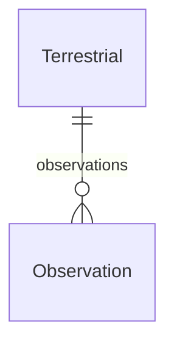

#### Attributes

| Name | Cardinality: | Type | Description |
| --- | --- | --- | --- |
| **[domain](#Domain)** | 1..1 | [Domain](#Domain) | Sample type according to sampled matrix: Atmospheric for air, particles, precipitation, dust; Aquatic for water and sediment; Terrestrial for soil Biota for plants and animals |
| **[end_date](#EndDate)** | 0..1 | date | End date in format YYYY-MM-DD |
| **[observations](#Observations)** | 0..\* | [Observation](#Observation) | Observations (concentration measurements and parameters) associated with this sample. |
| **[sample_id](#SampleId)** | 1..1 | string | Unique identifier for the sample |
| **[sampling_time_end](#SamplingTimeEnd)** | 0..1 | time | Sampling end time according to ISO 8601. |
| **[sampling_time_start](#SamplingTimeStart)** | 0..1 | time | Sampling start time according to ISO 8601, 24-hour clock. Format T[hh][mm][ss]. |
| **[site_id](#SiteId)** | 1..1 | string | Unique identifier of the monitoring site where the sample was collected. References the site_id of a Site record. |
| **[site_name](#SiteName)** | 1..1 | string | Name of the monitoring site. Provide in the local language as the primary name. An English name may be added if available and commonly used. Multiple names in different languages are accepted. |
| **[start_date](#StartDate)** | 1..1 | date | Start date in format YYYY-MM-DD |
| **[matrix](#Matrix)** | 1..1 | [MatrixTerrestrial](#MatrixTerrestrial) | Sampled matrix |
| **[sampling_method](#SamplingMethod)** | 1..1 | string | Sampling method for terrestrial samples |

#### Parents

 * [Sample](#Sample) - Abstract base class for all sample types

## Mixins

### OrganisationMetadata

Shared metadata for organisations — institutions and funders.

#### Attributes

| Name | Cardinality: | Type | Description |
| --- | --- | --- | --- |
| **[link](#Link)** | 0..1 | IRI | URL with information about the institution |
| **[name_en](#NameEn)** | 1..1 | string | Name or designation in English |
| **[name_original](#NameOriginal)** | 1..1 | string | Name of the entity in the original language of the institution/site/project. Use the local official name. |
| **[ror](#Ror)** | 0..1 | RorIdentifier | ROR identifier of the institution (format ror.org/xxxxxxxx) |

#### Used as mixin by

 * [Funder](#Funder) - Funder
 * [Institution](#Institution) - Institution

## Slots

| Name | Cardinality/Range | Used By |
| --- | --- | --- |
| **Campaign_acronym** Short name or acronym. | 1..1 string |  |
| **Campaign_end_date** End date in format YYYY-MM-DD | 1..1 date |  |
| **Campaign_name_en** Name or designation in English | 1..1 string |  |
| **MonitoringActivity_acronym** Short name or acronym. | 1..1 string |  |
| **Sample_sample_id** Unique identifier for the sample | 1..1 string |  |
| **Site_country** Country code(s) according to ISO 3166-1 alpha-2. Extended with XX (unknown) and XZ (international waters). | 1..\* [Country](#Country) |  |
| **Site_site_id** Unique identifier of the monitoring site where the sample was collected. References the site_id of a Site record. | 1..1 string |  |
| **acronym** Short name or acronym. | 0..1 string | [Campaign](#Campaign), [Institution](#Institution), [MonitoringActivity](#MonitoringActivity), [Site](#Site) |
| **aquatic__fraction** If the collected sample is divided into multiple fractions for separate analysis, this field identifies each subsample. | 0..1 [AquaticMatrixFraction](#AquaticMatrixFraction) |  |
| **aquatic__matrix** Sampled matrix | 1..1 [MatrixAquatic](#MatrixAquatic) |  |
| **aquatic__sampling_method** Method used to collect the sample | 1..1 [SamplingMethodAquatic](#SamplingMethodAquatic) |  |
| **atmospheric__matrix** Sampled matrix | 1..1 [MatrixAtmospheric](#MatrixAtmospheric) |  |
| **atmospheric__sampling_method** Method used to collect the sample | 1..1 [SamplingMethodAtmospheric](#SamplingMethodAtmospheric) |  |
| **biota__compartment** The environmental compartment where the organism was sampled from. | 0..\* [EnvironmentalCompartment](#EnvironmentalCompartment) |  |
| **biota__gender** Collected organism gender | 0..1 [Gender](#Gender) |  |
| **biota__life_stage_age** Life stage or age of the organism | 0..1 string |  |
| **biota__matrix** Sampled matrix | 1..1 [MatrixBiota](#MatrixBiota) |  |
| **biota__sampling_method** Sampling method for biota samples (to be discussed) | 0..1 string |  |
| **biota__taxonomic_classification** A taxonomic entity identified in a biological sample, referenced against the GBIF Backbone Taxonomy. | 0..1 [Taxon](#Taxon) |  |
| **campaign__campaign_description** Description of the campaign | 0..1 string |  |
| **chemicalCompound__cas_number** CAS Registry Number — unique numerical identifier assigned by the Chemical Abstracts Service. Format: NNNNNN-NN-N | 0..1 string |  |
| **chemicalCompound__chebi_id** ChEBI identifier for the compound. To be populated by mapping from InChIKey to ChEBI. Format: CHEBI:NNNNN | 0..1 IRI |  |
| **chemicalCompound__compound_group** Chemical group classification of the compound as defined in the PARC WP9 compound list (e.g. PFAS, biocides, PCBs, PAHs). # TODO: Future alignment planned with ChemFOnt functional classes # and/or C3PO (ChEBI Chemical Class Program Ontology) | 0..1 [CompoundGroup](#CompoundGroup) |  |
| **chemicalCompound__compound_name** Common or abbreviated name of the compound as used in the PARC community (e.g. PFOS, triclosan). | 1..1 string |  |
| **chemicalCompound__ec_number** EC Number (European Community Number) — identifier used in the ECHA substance inventory (EINECS, ELINCS, NLP). Format: NNN-NNN-N | 0..1 string |  |
| **chemicalCompound__inchi** IUPAC International Chemical Identifier (InChI) — a standard textual representation of the molecular structure. Begins with 'InChI=1S/'. | 1..1 string |  |
| **chemicalCompound__inchikey** InChIKey — a fixed-length (27-character) hash of the InChI string. Used as a compact, web-searchable identifier. Format: XXXXXXXXXXXXXX-XXXXXXXXXX-X | 0..1 string |  |
| **chemicalCompound__norman_id** NORMAN substance identifier. Source: NORMAN EMPODAT / SusDat database. | 0..1 string |  |
| **chemicalCompound__pubchem_cid** PubChem Compound ID (CID). To be populated by mapping from InChIKey to PubChem. | 0..1 integer |  |
| **chemicalCompound__wp9_id** Internal PARC WP9 identifier for the compound. Unique within the PARC compound list. | 1..1 integer |  |
| **contact__contact_id** Unique contact ID | 1..1 string |  |
| **contact__institution** Contact's institution | 0..1 [Institution](#Institution) |  |
| **contact__role** Role/function performed by the contact person. Source: ISO 19115:2003/19139 and EC Regulation No 1205/2008 (INSPIRE). | 0..1 [Role](#Role) |  |
| **country** Country where the site, institution or project is located, according to ISO 3166-1 alpha-2 (two-letter uppercase code). | 1..1 [Country](#Country) | [Institution](#Institution), [Site](#Site) |
| **email** Email address of the project contact point. Institutional email is recommended. | 1..1 EmailAddress | [Contact](#Contact) |
| **end_date** End date in format YYYY-MM-DD | 0..1 date | [Aquatic](#Aquatic), [Atmospheric](#Atmospheric), [Biota](#Biota), [Campaign](#Campaign), [MonitoringActivity](#MonitoringActivity), [Sample](#Sample), [Terrestrial](#Terrestrial) |
| **funder__funder_id** Unique funder ID | 1..1 string |  |
| **institution__institution_id** Unique institution id | 1..1 string |  |
| **link** URL with information about the institution | 0..1 IRI | [Funder](#Funder), [Institution](#Institution), [OrganisationMetadata](#OrganisationMetadata), [Site](#Site) |
| **measurementConcentration__analysis_date** The date on which the concentration was determined | 0..1 date |  |
| **measurementConcentration__analytical_method** Analytical method used to determine the analyte | 1..1 [AnalyticalMethod](#AnalyticalMethod) |  |
| **measurementConcentration__analytical_method_link** GUPRI linking to a public SOP or document describing the method | 0..1 IRI |  |
| **measurementConcentration__batch** Internal laboratory designation of the group of samples analyzed together | 0..1 string |  |
| **measurementConcentration__compound** Chemical compound measured in the sample. Reference to the PARC WP9 compound list entry (ChemicalCompound class). Identified by WP9_id, name, CAS, EC, InChI, and InChIKey. Mappable to ChEBI, PubChem, and NORMAN identifiers. A single measurement record should typically correspond to one compound. | 1..1 [ChemicalCompound](#ChemicalCompound) |  |
| **measurementConcentration__data_handling_procedure** Description of steps taken after chemical analysis (e.g., blank correction, quality control, calibration, recovery, standardization, recalculations). | 1..1 string |  |
| **measurementConcentration__data_handling_procedure_link** GUPRI linking to a document describing the data handling procedure | 0..1 IRI |  |
| **measurementConcentration__laboratory** Name of the laboratory performing the analysis | 1..1 string |  |
| **measurementConcentration__lod** Limit of detection | 0..1 double |  |
| **measurementConcentration__loq** Limit of quantification | 0..1 double |  |
| **measurementConcentration__sample_preparation_method** Description of the process from sample collection to chemical analysis (e.g., extraction, cleanup, fractionation). | 1..1 string |  |
| **measurementConcentration__sample_preparation_method_link** GUPRI (e.g. DOI) linking to a public SOP, article, or other document describing the method. | 0..1 IRI |  |
| **measurementParameter__parameter** Name of the parameter measured. Refer to the codelist-parameter tab for the list. | 1..1 [Parameter](#Parameter) |  |
| **monitoringActivity__access_procedures** Information on procedure to obtain access to the dataset. | 1..1 string |  |
| **monitoringActivity__acknowledgement** Text for acknowledgement which should be reported when using/re-using the data. | 1..1 string |  |
| **monitoringActivity__activity_description** A brief summary with the most important details summarising the project (objectives, scope, target group, key aspects, design, methods). | 1..1 string |  |
| **monitoringActivity__activity_identifier** Project/monitoring programme identifier provided as URL (GUPRI). At least one identifier required. | 0..\* IRI |  |
| **monitoringActivity__campaigns** If an Environmental Monitoring Programme/Project has a long-term perspective of at least a few years, it may be necessary to input data at suitable time intervals. For this time period, is used the term "Campaign". A Campaign is defined by its start and end, and it is recommended to name it within the project using a consistent style. | 0..\* [Campaign](#Campaign) |  |
| **monitoringActivity__contacts** Contact person(s) for the monitoring activity. | 1..\* [Contact](#Contact) |  |
| **monitoringActivity__disclaimer** Text for disclaimer when using/re-using the data. | 0..1 string |  |
| **monitoringActivity__end_date** End date of the project/monitoring programme. | 0..1 date |  |
| **monitoringActivity__funders** Funding entity/entities supporting the monitoring activity. | 0..\* [Funder](#Funder) |  |
| **monitoringActivity__implementation_level** The geographic scale of the monitoring coverage (international, national, regional, or local). | 0..1 [ImplementationLevel](#ImplementationLevel) |  |
| **monitoringActivity__institutions** Institution(s) responsible for implementing the monitoring activity. | 1..\* [Institution](#Institution) |  |
| **monitoringActivity__language** Language(s) used, as 2-letter codes according to ISO 639-1. | 0..\* [Language](#Language) |  |
| **monitoringActivity__legislation_policy** Link(s) to policy, convention, or legislation underpinning the monitoring activity. Mandatory for monitoring programmes; optional for projects if relevant. | 0..\* IRI |  |
| **monitoringActivity__license** License or terms for data reuse. | 1..1 string |  |
| **monitoringActivity__monitoring_reasons** Primary reasons for performing monitoring (e.g. regulatory requirements). Mandatory for monitoring programmes; optional for projects if relevant. | 0..1 string |  |
| **monitoringActivity__provenance** A statement about the lineage of the dataset. | 0..1 string |  |
| **monitoringActivity__publication_year** Year when the dataset was or will be made publicly available. | 0..1 integer |  |
| **monitoringActivity__sites** Monitoring site(s) associated with this project or monitoring programme. | 1..\* [Site](#Site) |  |
| **monitoringActivity__start_date** The beginning (or previewed starting) date of the monitoring programme/project. | 1..1 date |  |
| **monitoringActivity__type** Type of monitoring activity | 1..1 [MonitoringActivityType](#MonitoringActivityType) |  |
| **monitoringActivity__version** Version of the dataset. | 0..1 string |  |
| **name_en** Name or designation in English | 1..1 string | [Campaign](#Campaign), [Funder](#Funder), [Institution](#Institution), [MonitoringActivity](#MonitoringActivity), [OrganisationMetadata](#OrganisationMetadata) |
| **name_original** Name of the entity in the original language of the institution/site/project. Use the local official name. | 1..1 string | [Funder](#Funder), [Institution](#Institution), [MonitoringActivity](#MonitoringActivity), [OrganisationMetadata](#OrganisationMetadata) |
| **observation__observation_type** Type of measurement/observation: i) Chemical concentration in the environment or biota - main observation and; ii) Other parameters - they give context to the main measurement. | 1..1 [ObservationType](#ObservationType) |  |
| **orcid** ORCID identifier of the contact person | 0..1 OrcidIdentifier | [Contact](#Contact) |
| **ror** ROR identifier of the institution (format ror.org/xxxxxxxx) | 0..1 RorIdentifier | [Funder](#Funder), [Institution](#Institution), [OrganisationMetadata](#OrganisationMetadata) |
| **sample__domain** Sample type according to sampled matrix: Atmospheric for air, particles, precipitation, dust; Aquatic for water and sediment; Terrestrial for soil Biota for plants and animals | 1..1 [Domain](#Domain) |  |
| **sample__observations** Observations (concentration measurements and parameters) associated with this sample. | 0..\* [Observation](#Observation) |  |
| **sample_id** Unique identifier for the sample | 1..1 string | [Aquatic](#Aquatic), [Atmospheric](#Atmospheric), [Biota](#Biota), [MeasurementConcentration](#MeasurementConcentration), [MeasurementParameter](#MeasurementParameter), [Observation](#Observation), [Sample](#Sample), [Terrestrial](#Terrestrial) |
| **sampling_time_end** Sampling end time according to ISO 8601. | 0..1 time | [Aquatic](#Aquatic), [Atmospheric](#Atmospheric), [Biota](#Biota), [Sample](#Sample), [Terrestrial](#Terrestrial) |
| **sampling_time_start** Sampling start time according to ISO 8601, 24-hour clock. Format T[hh][mm][ss]. | 0..1 time | [Aquatic](#Aquatic), [Atmospheric](#Atmospheric), [Biota](#Biota), [Sample](#Sample), [Terrestrial](#Terrestrial) |
| **site__altitude** Altitude in meters above sea level (MSL). Use positive values for above and negative for below sea level. | 0..1 double |  |
| **site__coordinate_privacy_exception** Set to true (value = true) if coordinates cannot be provided for privacy, security or confidentiality reasons. If true, expert location fields (country, geographic_region, nuts3) are required instead. Optional - if not provided, it is assumed coordinates are not withheld for privacy reasons. | 0..1 boolean |  |
| **site__coordinate_privacy_exception_reason** Justification for not providing coordinates. Required when coordinate_privacy_exception is true. Provide a brief explanation of the privacy, security or confidentiality reason that prevents disclosure of the exact site location. | 0..1 string |  |
| **site__coordinate_system** Coordinate reference system used. Default is EPSG:4326 (WGS 84). | 0..1 [CoordinateSystem](#CoordinateSystem) |  |
| **site__geographic_region** UN M49 geographic region | 0..1 [GeographicRegion](#GeographicRegion) |  |
| **site__land_use** Land use classification according to CORINE Land Cover nomenclature. | 0..1 [LandUse](#LandUse) |  |
| **site__latitude** Latitude in signed decimal degrees (format 0.000000, range -90 to 90). South latitude with minus sign. Coordinate reference system: WGS 84 (EPSG:4326). Mandatory unless coordinate_privacy_exception is true. | 0..1 DecimalDegree |  |
| **site__longitude** Longitude in signed decimal degrees (format 0.000000, range -180 to 180). West longitude with minus sign. Coordinate reference system: WGS 84 (EPSG:4326). Mandatory unless coordinate_privacy_exception is true. | 0..1 DecimalDegree |  |
| **site__managing_instance** The institution that manages the sampling site | 0..1 [Institution](#Institution) |  |
| **site__nuts3** NUTS3 region code according to the Eurostat NUTS classification (Nomenclature of Territorial Units for Statistics), level 3. Example: CZ080 (Moravskoslezsky kraj), DE300 (Berlin). If NUTS3 is not applicable (e.g. non-EU countries), use an alternative administrative classification. | 0..1 string |  |
| **site__regional_group** Regional group of United Nations member states | 0..1 [UNRegionalGroup](#UNRegionalGroup) |  |
| **site__river_basin** River basin associated with the site, based on the EEA river basin districts dataset. Only relevant for water and sediment sampling. | 0..1 [RiverBasin](#RiverBasin) |  |
| **site__samples** Samples collected at this monitoring site. | 0..\* [Sample](#Sample) |  |
| **site__sea** Sea or ocean associated with the site, based on the Marine Regions Gazetteer. Only relevant for water and sediment sampling. | 0..1 [Sea](#Sea) |  |
| **site__site_description** Description of the site where samples were collected. Provide all important information that cannot be captured in other fields. | 0..1 string |  |
| **site__soil_type** World Reference Base for Soil Resources (WRB) 2006/2007 Reference Soil Group at the site. Only relevant for soil sampling. | 0..1 [SoilTypeWRB](#SoilTypeWRB) |  |
| **site__water_geographical_feature** Geographical water feature type at the site. Only relevant for water and sediment sampling. | 0..1 [WaterGeographicalFeature](#WaterGeographicalFeature) |  |
| **site__water_treatment** Water treatment status at the site. Only relevant for water and sediment sampling. | 0..1 [WaterTreatment](#WaterTreatment) |  |
| **site__water_type** Type of water body at the site. Only relevant for water and sediment sampling. | 0..1 [WaterType](#WaterType) |  |
| **site__year_established** Year of establishment of the monitoring station (YYYY) | 0..1 YearValue |  |
| **site_id** Unique identifier of the monitoring site where the sample was collected. References the site_id of a Site record. | 1..1 string | [Aquatic](#Aquatic), [Atmospheric](#Atmospheric), [Biota](#Biota), [Sample](#Sample), [Site](#Site), [Terrestrial](#Terrestrial) |
| **site_name** Name of the monitoring site. Provide in the local language as the primary name. An English name may be added if available and commonly used. Multiple names in different languages are accepted. | 1..1 string | [Aquatic](#Aquatic), [Atmospheric](#Atmospheric), [Biota](#Biota), [Sample](#Sample), [Site](#Site), [Terrestrial](#Terrestrial) |
| **start_date** Start date in format YYYY-MM-DD | 1..1 date | [Aquatic](#Aquatic), [Atmospheric](#Atmospheric), [Biota](#Biota), [Campaign](#Campaign), [MonitoringActivity](#MonitoringActivity), [Sample](#Sample), [Terrestrial](#Terrestrial) |
| **taxon__taxon_id** GBIF species key (integer). Resolves to https://www.gbif.org/species/{taxon_id} | 1..1 integer |  |
| **taxon__taxon_name** Scientific name of the taxon (genus, species or higher rank) as accepted in the GBIF Backbone Taxonomy. | 1..1 string |  |
| **taxon__taxon_rank** Taxonomic rank of the identified taxon. | 0..1 [TaxonRankEnum](#TaxonRankEnum) |  |
| **terrestrial__matrix** Sampled matrix | 1..1 [MatrixTerrestrial](#MatrixTerrestrial) |  |
| **terrestrial__sampling_method** Sampling method for terrestrial samples | 1..1 string |  |
| **uncertainty** Measurement uncertainty of the concentration/paramter value, expressed as a percentage (%) at 95% confidence level. | 0..1 double | [MeasurementConcentration](#MeasurementConcentration), [MeasurementParameter](#MeasurementParameter), [Observation](#Observation) |
| **unit** Unit of measurement | 1..1 [Unit](#Unit) | [MeasurementConcentration](#MeasurementConcentration), [MeasurementParameter](#MeasurementParameter), [Observation](#Observation) |
| **value** Measured value of the chemical concentration or other parameter | 0..1 double | [MeasurementConcentration](#MeasurementConcentration), [MeasurementParameter](#MeasurementParameter), [Observation](#Observation) |

## Enums

### AnalyticalMethod

Analytical method used to determine the analyte in the sample. NOTE: Placeholder only — final vocabulary pending.

| Text | Meaning: | Description |
| --- | --- | --- |
| PLACEHOLDER | None | Placeholder value — final vocabulary pending. Do not use in production data. |

#### Used by

 *  **[MeasurementConcentration](#MeasurementConcentration)** *[measurementConcentration__analytical_method](#MeasurementConcentrationAnalyticalMethod)*  1..1 

### AquaticMatrixFraction

TBC - might be integrated with the matrix vocabulary

| Text | Meaning: | Description |
| --- | --- | --- |
| PLACEHOLDER | None | Placeholder — do not use in production. |
| sediment_colloidal_fraction | None | Sediment - Colloidal fraction |
| sediment_pore_water | None | Sediment - pore water |
| sediment_solid_phase | None | Sediment - Solid phase |
| water_cfree | None | Water - Colloid-free |
| water_colloidal_fraction | None | Water - Colloidal fraction |
| water_dom | None | Water - Dissolved Organic Matter |
| water_dom+cfree | None | water - Dissolved Organic Matter that is also colloid-free |
| water_spm | None | Water - Suspended Particulate Matter |

#### Used by

 *  **[Aquatic](#Aquatic)** *[aquatic__fraction](#AquaticFraction)*  0..1 

### CompoundGroup

Chemical group classification as used in the PARC WP9 compound list. Groups are based on chemical structure and/or regulatory relevance.

| Text | Meaning: | Description |
| --- | --- | --- |
| HBCDs | None | Hexabromocyclododecanes |
| OCPs | None | Organochlorine pesticides |
| PAHs | None | Polycyclic aromatic hydrocarbons |
| PBDEs | None | Polybrominated diphenyl ethers |
| PCBs | None | Polychlorinated biphenyls |
| PFAS | None | Per- and polyfluoroalkyl substances |
| PFRs | None | Phosphorus flame retardants |
| UV_filters | None | UV filters and stabilizers |
| biocides | None | Biocidal substances |
| dioxins_furans | None | Dioxins and furans (PCDD/PCDF) |
| heavy_metals | None | Heavy metals and metalloids |
| hormones | None | Natural and synthetic hormones |
| musks | None | Synthetic and natural musks |
| other | None | Other compounds not classified above |
| pesticides_other | None | Other pesticides not covered above |
| pharmaceuticals | None | Pharmaceutical compounds and metabolites |
| plasticizers | None | Plasticizers including phthalates |
| siloxanes | None | Siloxanes and silicones |

#### Used by

 *  **[ChemicalCompound](#ChemicalCompound)** *[chemicalCompound__compound_group](#ChemicalCompoundCompoundGroup)*  0..1 

### CoordinateSystem

Coordinate reference system used for geographic coordinates

| Text | Meaning: | Description |
| --- | --- | --- |
| WGS84 | http://www.opengis.net/def/crs/EPSG/0/4326 | World Geodetic System 1984. Global coordinate system widely used for GPS navigation. |

#### Used by

 *  **[Site](#Site)** *[site__coordinate_system](#SiteCoordinateSystem)*  0..1 

### Country

Country codes according to ISO 3166-1 alpha-2 (two-letter uppercase codes). URIs from OMG Languages, Countries and Codes (LCC) ontology, which provides the authoritative linked data representation of ISO 3166-1 since neither ISO nor UN Statistics Division publish official RDF vocabularies.

| Text | Meaning: | Description |
| --- | --- | --- |
| AD | https://www.omg.org/spec/LCC/Countries/ISO3166-1-CountryCodes/AD | Andorra |
| AE | https://www.omg.org/spec/LCC/Countries/ISO3166-1-CountryCodes/AE | United Arab Emirates |
| AF | https://www.omg.org/spec/LCC/Countries/ISO3166-1-CountryCodes/AF | Afghanistan |
| AG | https://www.omg.org/spec/LCC/Countries/ISO3166-1-CountryCodes/AG | Antigua and Barbuda |
| AI | https://www.omg.org/spec/LCC/Countries/ISO3166-1-CountryCodes/AI | Anguilla |
| AL | https://www.omg.org/spec/LCC/Countries/ISO3166-1-CountryCodes/AL | Albania |
| AM | https://www.omg.org/spec/LCC/Countries/ISO3166-1-CountryCodes/AM | Armenia |
| AN | None | Netherlands Antilles (dissolved 2010) |
| AO | https://www.omg.org/spec/LCC/Countries/ISO3166-1-CountryCodes/AO | Angola |
| AQ | https://www.omg.org/spec/LCC/Countries/ISO3166-1-CountryCodes/AQ | Antarctica |
| AR | https://www.omg.org/spec/LCC/Countries/ISO3166-1-CountryCodes/AR | Argentina |
| AS | https://www.omg.org/spec/LCC/Countries/ISO3166-1-CountryCodes/AS | American Samoa |
| AT | https://www.omg.org/spec/LCC/Countries/ISO3166-1-CountryCodes/AT | Austria |
| AU | https://www.omg.org/spec/LCC/Countries/ISO3166-1-CountryCodes/AU | Australia |
| AW | https://www.omg.org/spec/LCC/Countries/ISO3166-1-CountryCodes/AW | Aruba |
| AX | https://www.omg.org/spec/LCC/Countries/ISO3166-1-CountryCodes/AX | Aland Islands |
| AZ | https://www.omg.org/spec/LCC/Countries/ISO3166-1-CountryCodes/AZ | Azerbaijan |
| BA | https://www.omg.org/spec/LCC/Countries/ISO3166-1-CountryCodes/BA | Bosnia and Herzegovina |
| BB | https://www.omg.org/spec/LCC/Countries/ISO3166-1-CountryCodes/BB | Barbados |
| BD | https://www.omg.org/spec/LCC/Countries/ISO3166-1-CountryCodes/BD | Bangladesh |
| BE | https://www.omg.org/spec/LCC/Countries/ISO3166-1-CountryCodes/BE | Belgium |
| BF | https://www.omg.org/spec/LCC/Countries/ISO3166-1-CountryCodes/BF | Burkina Faso |
| BG | https://www.omg.org/spec/LCC/Countries/ISO3166-1-CountryCodes/BG | Bulgaria |
| BH | https://www.omg.org/spec/LCC/Countries/ISO3166-1-CountryCodes/BH | Bahrain |
| BI | https://www.omg.org/spec/LCC/Countries/ISO3166-1-CountryCodes/BI | Burundi |
| BJ | https://www.omg.org/spec/LCC/Countries/ISO3166-1-CountryCodes/BJ | Benin |
| BM | https://www.omg.org/spec/LCC/Countries/ISO3166-1-CountryCodes/BM | Bermuda |
| BN | https://www.omg.org/spec/LCC/Countries/ISO3166-1-CountryCodes/BN | Brunei Darussalam |
| BO | https://www.omg.org/spec/LCC/Countries/ISO3166-1-CountryCodes/BO | Bolivia |
| BR | https://www.omg.org/spec/LCC/Countries/ISO3166-1-CountryCodes/BR | Brazil |
| BS | https://www.omg.org/spec/LCC/Countries/ISO3166-1-CountryCodes/BS | Bahamas |
| BT | https://www.omg.org/spec/LCC/Countries/ISO3166-1-CountryCodes/BT | Bhutan |
| BV | https://www.omg.org/spec/LCC/Countries/ISO3166-1-CountryCodes/BV | Bouvet Island |
| BW | https://www.omg.org/spec/LCC/Countries/ISO3166-1-CountryCodes/BW | Botswana |
| BY | https://www.omg.org/spec/LCC/Countries/ISO3166-1-CountryCodes/BY | Belarus |
| BZ | https://www.omg.org/spec/LCC/Countries/ISO3166-1-CountryCodes/BZ | Belize |
| CA | https://www.omg.org/spec/LCC/Countries/ISO3166-1-CountryCodes/CA | Canada |
| CC | https://www.omg.org/spec/LCC/Countries/ISO3166-1-CountryCodes/CC | Cocos (Keeling) Islands |
| CD | https://www.omg.org/spec/LCC/Countries/ISO3166-1-CountryCodes/CD | Congo, The Democratic Republic Of The |
| CF | https://www.omg.org/spec/LCC/Countries/ISO3166-1-CountryCodes/CF | Central African Republic |
| CG | https://www.omg.org/spec/LCC/Countries/ISO3166-1-CountryCodes/CG | Congo |
| CH | https://www.omg.org/spec/LCC/Countries/ISO3166-1-CountryCodes/CH | Switzerland |
| CI | https://www.omg.org/spec/LCC/Countries/ISO3166-1-CountryCodes/CI | Cote d'Ivoire |
| CK | https://www.omg.org/spec/LCC/Countries/ISO3166-1-CountryCodes/CK | Cook Islands |
| CL | https://www.omg.org/spec/LCC/Countries/ISO3166-1-CountryCodes/CL | Chile |
| CM | https://www.omg.org/spec/LCC/Countries/ISO3166-1-CountryCodes/CM | Cameroon |
| CN | https://www.omg.org/spec/LCC/Countries/ISO3166-1-CountryCodes/CN | China |
| CO | https://www.omg.org/spec/LCC/Countries/ISO3166-1-CountryCodes/CO | Colombia |
| CR | https://www.omg.org/spec/LCC/Countries/ISO3166-1-CountryCodes/CR | Costa Rica |
| CU | https://www.omg.org/spec/LCC/Countries/ISO3166-1-CountryCodes/CU | Cuba |
| CV | https://www.omg.org/spec/LCC/Countries/ISO3166-1-CountryCodes/CV | Cape Verde |
| CX | https://www.omg.org/spec/LCC/Countries/ISO3166-1-CountryCodes/CX | Christmas Island |
| CY | https://www.omg.org/spec/LCC/Countries/ISO3166-1-CountryCodes/CY | Cyprus |
| CZ | https://www.omg.org/spec/LCC/Countries/ISO3166-1-CountryCodes/CZ | Czech Republic |
| DE | https://www.omg.org/spec/LCC/Countries/ISO3166-1-CountryCodes/DE | Germany |
| DJ | https://www.omg.org/spec/LCC/Countries/ISO3166-1-CountryCodes/DJ | Djibouti |
| DK | https://www.omg.org/spec/LCC/Countries/ISO3166-1-CountryCodes/DK | Denmark |
| DM | https://www.omg.org/spec/LCC/Countries/ISO3166-1-CountryCodes/DM | Dominica |
| DO | https://www.omg.org/spec/LCC/Countries/ISO3166-1-CountryCodes/DO | Dominican Republic |
| DZ | https://www.omg.org/spec/LCC/Countries/ISO3166-1-CountryCodes/DZ | Algeria |
| EC | https://www.omg.org/spec/LCC/Countries/ISO3166-1-CountryCodes/EC | Ecuador |
| EE | https://www.omg.org/spec/LCC/Countries/ISO3166-1-CountryCodes/EE | Estonia |
| EG | https://www.omg.org/spec/LCC/Countries/ISO3166-1-CountryCodes/EG | Egypt |
| EH | https://www.omg.org/spec/LCC/Countries/ISO3166-1-CountryCodes/EH | Western Sahara |
| ER | https://www.omg.org/spec/LCC/Countries/ISO3166-1-CountryCodes/ER | Eritrea |
| ES | https://www.omg.org/spec/LCC/Countries/ISO3166-1-CountryCodes/ES | Spain |
| ET | https://www.omg.org/spec/LCC/Countries/ISO3166-1-CountryCodes/ET | Ethiopia |
| FI | https://www.omg.org/spec/LCC/Countries/ISO3166-1-CountryCodes/FI | Finland |
| FJ | https://www.omg.org/spec/LCC/Countries/ISO3166-1-CountryCodes/FJ | Fiji |
| FK | https://www.omg.org/spec/LCC/Countries/ISO3166-1-CountryCodes/FK | Falkland Islands (Malvinas) |
| FM | https://www.omg.org/spec/LCC/Countries/ISO3166-1-CountryCodes/FM | Micronesia, Federated States Of |
| FO | https://www.omg.org/spec/LCC/Countries/ISO3166-1-CountryCodes/FO | Faroe Islands |
| FR | https://www.omg.org/spec/LCC/Countries/ISO3166-1-CountryCodes/FR | France |
| GA | https://www.omg.org/spec/LCC/Countries/ISO3166-1-CountryCodes/GA | Gabon |
| GB | https://www.omg.org/spec/LCC/Countries/ISO3166-1-CountryCodes/GB | United Kingdom |
| GD | https://www.omg.org/spec/LCC/Countries/ISO3166-1-CountryCodes/GD | Grenada |
| GE | https://www.omg.org/spec/LCC/Countries/ISO3166-1-CountryCodes/GE | Georgia |
| GF | https://www.omg.org/spec/LCC/Countries/ISO3166-1-CountryCodes/GF | French Guiana |
| GG | https://www.omg.org/spec/LCC/Countries/ISO3166-1-CountryCodes/GG | Guernsey |
| GH | https://www.omg.org/spec/LCC/Countries/ISO3166-1-CountryCodes/GH | Ghana |
| GI | https://www.omg.org/spec/LCC/Countries/ISO3166-1-CountryCodes/GI | Gibraltar |
| GL | https://www.omg.org/spec/LCC/Countries/ISO3166-1-CountryCodes/GL | Greenland |
| GM | https://www.omg.org/spec/LCC/Countries/ISO3166-1-CountryCodes/GM | Gambia |
| GN | https://www.omg.org/spec/LCC/Countries/ISO3166-1-CountryCodes/GN | Guinea |
| GP | https://www.omg.org/spec/LCC/Countries/ISO3166-1-CountryCodes/GP | Guadeloupe |
| GQ | https://www.omg.org/spec/LCC/Countries/ISO3166-1-CountryCodes/GQ | Equatorial Guinea |
| GR | https://www.omg.org/spec/LCC/Countries/ISO3166-1-CountryCodes/GR | Greece |
| GS | https://www.omg.org/spec/LCC/Countries/ISO3166-1-CountryCodes/GS | South Georgia and The South Sandwich Islands |
| GT | https://www.omg.org/spec/LCC/Countries/ISO3166-1-CountryCodes/GT | Guatemala |
| GU | https://www.omg.org/spec/LCC/Countries/ISO3166-1-CountryCodes/GU | Guam |
| GW | https://www.omg.org/spec/LCC/Countries/ISO3166-1-CountryCodes/GW | Guinea-Bissau |
| GY | https://www.omg.org/spec/LCC/Countries/ISO3166-1-CountryCodes/GY | Guyana |
| HK | https://www.omg.org/spec/LCC/Countries/ISO3166-1-CountryCodes/HK | Hong Kong |
| HM | https://www.omg.org/spec/LCC/Countries/ISO3166-1-CountryCodes/HM | Heard Island and Mcdonald Islands |
| HN | https://www.omg.org/spec/LCC/Countries/ISO3166-1-CountryCodes/HN | Honduras |
| HR | https://www.omg.org/spec/LCC/Countries/ISO3166-1-CountryCodes/HR | Croatia |
| HT | https://www.omg.org/spec/LCC/Countries/ISO3166-1-CountryCodes/HT | Haiti |
| HU | https://www.omg.org/spec/LCC/Countries/ISO3166-1-CountryCodes/HU | Hungary |
| ID | https://www.omg.org/spec/LCC/Countries/ISO3166-1-CountryCodes/ID | Indonesia |
| IE | https://www.omg.org/spec/LCC/Countries/ISO3166-1-CountryCodes/IE | Ireland |
| IL | https://www.omg.org/spec/LCC/Countries/ISO3166-1-CountryCodes/IL | Israel |
| IM | https://www.omg.org/spec/LCC/Countries/ISO3166-1-CountryCodes/IM | Isle Of Man |
| IN | https://www.omg.org/spec/LCC/Countries/ISO3166-1-CountryCodes/IN | India |
| IO | https://www.omg.org/spec/LCC/Countries/ISO3166-1-CountryCodes/IO | British Indian Ocean Territory |
| IQ | https://www.omg.org/spec/LCC/Countries/ISO3166-1-CountryCodes/IQ | Iraq |
| IR | https://www.omg.org/spec/LCC/Countries/ISO3166-1-CountryCodes/IR | Iran, Islamic Republic Of |
| IS | https://www.omg.org/spec/LCC/Countries/ISO3166-1-CountryCodes/IS | Iceland |
| IT | https://www.omg.org/spec/LCC/Countries/ISO3166-1-CountryCodes/IT | Italy |
| JE | https://www.omg.org/spec/LCC/Countries/ISO3166-1-CountryCodes/JE | Jersey |
| JM | https://www.omg.org/spec/LCC/Countries/ISO3166-1-CountryCodes/JM | Jamaica |
| JO | https://www.omg.org/spec/LCC/Countries/ISO3166-1-CountryCodes/JO | Jordan |
| JP | https://www.omg.org/spec/LCC/Countries/ISO3166-1-CountryCodes/JP | Japan |
| KE | https://www.omg.org/spec/LCC/Countries/ISO3166-1-CountryCodes/KE | Kenya |
| KG | https://www.omg.org/spec/LCC/Countries/ISO3166-1-CountryCodes/KG | Kyrgyzstan |
| KH | https://www.omg.org/spec/LCC/Countries/ISO3166-1-CountryCodes/KH | Cambodia |
| KI | https://www.omg.org/spec/LCC/Countries/ISO3166-1-CountryCodes/KI | Kiribati |
| KM | https://www.omg.org/spec/LCC/Countries/ISO3166-1-CountryCodes/KM | Comoros |
| KN | https://www.omg.org/spec/LCC/Countries/ISO3166-1-CountryCodes/KN | Saint Kitts and Nevis |
| KP | https://www.omg.org/spec/LCC/Countries/ISO3166-1-CountryCodes/KP | Korea, Democratic People's Republic Of |
| KR | https://www.omg.org/spec/LCC/Countries/ISO3166-1-CountryCodes/KR | Korea, Republic Of |
| KW | https://www.omg.org/spec/LCC/Countries/ISO3166-1-CountryCodes/KW | Kuwait |
| KY | https://www.omg.org/spec/LCC/Countries/ISO3166-1-CountryCodes/KY | Cayman Islands |
| KZ | https://www.omg.org/spec/LCC/Countries/ISO3166-1-CountryCodes/KZ | Kazakhstan |
| LA | https://www.omg.org/spec/LCC/Countries/ISO3166-1-CountryCodes/LA | Lao People's Democratic Republic |
| LB | https://www.omg.org/spec/LCC/Countries/ISO3166-1-CountryCodes/LB | Lebanon |
| LC | https://www.omg.org/spec/LCC/Countries/ISO3166-1-CountryCodes/LC | Saint Lucia |
| LI | https://www.omg.org/spec/LCC/Countries/ISO3166-1-CountryCodes/LI | Liechtenstein |
| LK | https://www.omg.org/spec/LCC/Countries/ISO3166-1-CountryCodes/LK | Sri Lanka |
| LR | https://www.omg.org/spec/LCC/Countries/ISO3166-1-CountryCodes/LR | Liberia |
| LS | https://www.omg.org/spec/LCC/Countries/ISO3166-1-CountryCodes/LS | Lesotho |
| LT | https://www.omg.org/spec/LCC/Countries/ISO3166-1-CountryCodes/LT | Lithuania |
| LU | https://www.omg.org/spec/LCC/Countries/ISO3166-1-CountryCodes/LU | Luxembourg |
| LV | https://www.omg.org/spec/LCC/Countries/ISO3166-1-CountryCodes/LV | Latvia |
| LY | https://www.omg.org/spec/LCC/Countries/ISO3166-1-CountryCodes/LY | Libyan Arab Jamahiriya |
| MA | https://www.omg.org/spec/LCC/Countries/ISO3166-1-CountryCodes/MA | Morocco |
| MC | https://www.omg.org/spec/LCC/Countries/ISO3166-1-CountryCodes/MC | Monaco |
| MD | https://www.omg.org/spec/LCC/Countries/ISO3166-1-CountryCodes/MD | Moldova, Republic Of |
| ME | https://www.omg.org/spec/LCC/Countries/ISO3166-1-CountryCodes/ME | Montenegro |
| MG | https://www.omg.org/spec/LCC/Countries/ISO3166-1-CountryCodes/MG | Madagascar |
| MH | https://www.omg.org/spec/LCC/Countries/ISO3166-1-CountryCodes/MH | Marshall Islands |
| MK | https://www.omg.org/spec/LCC/Countries/ISO3166-1-CountryCodes/MK | North Macedonia |
| ML | https://www.omg.org/spec/LCC/Countries/ISO3166-1-CountryCodes/ML | Mali |
| MM | https://www.omg.org/spec/LCC/Countries/ISO3166-1-CountryCodes/MM | Myanmar |
| MN | https://www.omg.org/spec/LCC/Countries/ISO3166-1-CountryCodes/MN | Mongolia |
| MO | https://www.omg.org/spec/LCC/Countries/ISO3166-1-CountryCodes/MO | Macao |
| MP | https://www.omg.org/spec/LCC/Countries/ISO3166-1-CountryCodes/MP | Northern Mariana Islands |
| MQ | https://www.omg.org/spec/LCC/Countries/ISO3166-1-CountryCodes/MQ | Martinique |
| MR | https://www.omg.org/spec/LCC/Countries/ISO3166-1-CountryCodes/MR | Mauritania |
| MS | https://www.omg.org/spec/LCC/Countries/ISO3166-1-CountryCodes/MS | Montserrat |
| MT | https://www.omg.org/spec/LCC/Countries/ISO3166-1-CountryCodes/MT | Malta |
| MU | https://www.omg.org/spec/LCC/Countries/ISO3166-1-CountryCodes/MU | Mauritius |
| MV | https://www.omg.org/spec/LCC/Countries/ISO3166-1-CountryCodes/MV | Maldives |
| MW | https://www.omg.org/spec/LCC/Countries/ISO3166-1-CountryCodes/MW | Malawi |
| MX | https://www.omg.org/spec/LCC/Countries/ISO3166-1-CountryCodes/MX | Mexico |
| MY | https://www.omg.org/spec/LCC/Countries/ISO3166-1-CountryCodes/MY | Malaysia |
| MZ | https://www.omg.org/spec/LCC/Countries/ISO3166-1-CountryCodes/MZ | Mozambique |
| NA | https://www.omg.org/spec/LCC/Countries/ISO3166-1-CountryCodes/NA | Namibia |
| NC | https://www.omg.org/spec/LCC/Countries/ISO3166-1-CountryCodes/NC | New Caledonia |
| NE | https://www.omg.org/spec/LCC/Countries/ISO3166-1-CountryCodes/NE | Niger |
| NF | https://www.omg.org/spec/LCC/Countries/ISO3166-1-CountryCodes/NF | Norfolk Island |
| NG | https://www.omg.org/spec/LCC/Countries/ISO3166-1-CountryCodes/NG | Nigeria |
| NI | https://www.omg.org/spec/LCC/Countries/ISO3166-1-CountryCodes/NI | Nicaragua |
| NL | https://www.omg.org/spec/LCC/Countries/ISO3166-1-CountryCodes/NL | Netherlands |
| NO | https://www.omg.org/spec/LCC/Countries/ISO3166-1-CountryCodes/NO | Norway |
| NP | https://www.omg.org/spec/LCC/Countries/ISO3166-1-CountryCodes/NP | Nepal |
| NR | https://www.omg.org/spec/LCC/Countries/ISO3166-1-CountryCodes/NR | Nauru |
| NU | https://www.omg.org/spec/LCC/Countries/ISO3166-1-CountryCodes/NU | Niue |
| NZ | https://www.omg.org/spec/LCC/Countries/ISO3166-1-CountryCodes/NZ | New Zealand |
| OM | https://www.omg.org/spec/LCC/Countries/ISO3166-1-CountryCodes/OM | Oman |
| PA | https://www.omg.org/spec/LCC/Countries/ISO3166-1-CountryCodes/PA | Panama |
| PE | https://www.omg.org/spec/LCC/Countries/ISO3166-1-CountryCodes/PE | Peru |
| PF | https://www.omg.org/spec/LCC/Countries/ISO3166-1-CountryCodes/PF | French Polynesia |
| PG | https://www.omg.org/spec/LCC/Countries/ISO3166-1-CountryCodes/PG | Papua New Guinea |
| PH | https://www.omg.org/spec/LCC/Countries/ISO3166-1-CountryCodes/PH | Philippines |
| PK | https://www.omg.org/spec/LCC/Countries/ISO3166-1-CountryCodes/PK | Pakistan |
| PL | https://www.omg.org/spec/LCC/Countries/ISO3166-1-CountryCodes/PL | Poland |
| PM | https://www.omg.org/spec/LCC/Countries/ISO3166-1-CountryCodes/PM | Saint Pierre and Miquelon |
| PN | https://www.omg.org/spec/LCC/Countries/ISO3166-1-CountryCodes/PN | Pitcairn |
| PR | https://www.omg.org/spec/LCC/Countries/ISO3166-1-CountryCodes/PR | Puerto Rico |
| PS | https://www.omg.org/spec/LCC/Countries/ISO3166-1-CountryCodes/PS | Palestinian Territory, Occupied |
| PT | https://www.omg.org/spec/LCC/Countries/ISO3166-1-CountryCodes/PT | Portugal |
| PW | https://www.omg.org/spec/LCC/Countries/ISO3166-1-CountryCodes/PW | Palau |
| PY | https://www.omg.org/spec/LCC/Countries/ISO3166-1-CountryCodes/PY | Paraguay |
| QA | https://www.omg.org/spec/LCC/Countries/ISO3166-1-CountryCodes/QA | Qatar |
| RE | https://www.omg.org/spec/LCC/Countries/ISO3166-1-CountryCodes/RE | Reunion |
| RO | https://www.omg.org/spec/LCC/Countries/ISO3166-1-CountryCodes/RO | Romania |
| RS | https://www.omg.org/spec/LCC/Countries/ISO3166-1-CountryCodes/RS | Serbia |
| RU | https://www.omg.org/spec/LCC/Countries/ISO3166-1-CountryCodes/RU | Russian Federation |
| RW | https://www.omg.org/spec/LCC/Countries/ISO3166-1-CountryCodes/RW | Rwanda |
| SA | https://www.omg.org/spec/LCC/Countries/ISO3166-1-CountryCodes/SA | Saudi Arabia |
| SB | https://www.omg.org/spec/LCC/Countries/ISO3166-1-CountryCodes/SB | Solomon Islands |
| SC | https://www.omg.org/spec/LCC/Countries/ISO3166-1-CountryCodes/SC | Seychelles |
| SD | https://www.omg.org/spec/LCC/Countries/ISO3166-1-CountryCodes/SD | Sudan |
| SE | https://www.omg.org/spec/LCC/Countries/ISO3166-1-CountryCodes/SE | Sweden |
| SG | https://www.omg.org/spec/LCC/Countries/ISO3166-1-CountryCodes/SG | Singapore |
| SH | https://www.omg.org/spec/LCC/Countries/ISO3166-1-CountryCodes/SH | Saint Helena |
| SI | https://www.omg.org/spec/LCC/Countries/ISO3166-1-CountryCodes/SI | Slovenia |
| SJ | https://www.omg.org/spec/LCC/Countries/ISO3166-1-CountryCodes/SJ | Svalbard and Jan Mayen |
| SK | https://www.omg.org/spec/LCC/Countries/ISO3166-1-CountryCodes/SK | Slovakia |
| SL | https://www.omg.org/spec/LCC/Countries/ISO3166-1-CountryCodes/SL | Sierra Leone |
| SM | https://www.omg.org/spec/LCC/Countries/ISO3166-1-CountryCodes/SM | San Marino |
| SN | https://www.omg.org/spec/LCC/Countries/ISO3166-1-CountryCodes/SN | Senegal |
| SO | https://www.omg.org/spec/LCC/Countries/ISO3166-1-CountryCodes/SO | Somalia |
| SR | https://www.omg.org/spec/LCC/Countries/ISO3166-1-CountryCodes/SR | Suriname |
| ST | https://www.omg.org/spec/LCC/Countries/ISO3166-1-CountryCodes/ST | Sao Tome and Principe |
| SV | https://www.omg.org/spec/LCC/Countries/ISO3166-1-CountryCodes/SV | El Salvador |
| SY | https://www.omg.org/spec/LCC/Countries/ISO3166-1-CountryCodes/SY | Syrian Arab Republic |
| SZ | https://www.omg.org/spec/LCC/Countries/ISO3166-1-CountryCodes/SZ | Swaziland |
| TC | https://www.omg.org/spec/LCC/Countries/ISO3166-1-CountryCodes/TC | Turks and Caicos Islands |
| TD | https://www.omg.org/spec/LCC/Countries/ISO3166-1-CountryCodes/TD | Chad |
| TF | https://www.omg.org/spec/LCC/Countries/ISO3166-1-CountryCodes/TF | French Southern Territories |
| TG | https://www.omg.org/spec/LCC/Countries/ISO3166-1-CountryCodes/TG | Togo |
| TH | https://www.omg.org/spec/LCC/Countries/ISO3166-1-CountryCodes/TH | Thailand |
| TJ | https://www.omg.org/spec/LCC/Countries/ISO3166-1-CountryCodes/TJ | Tajikistan |
| TK | https://www.omg.org/spec/LCC/Countries/ISO3166-1-CountryCodes/TK | Tokelau |
| TL | https://www.omg.org/spec/LCC/Countries/ISO3166-1-CountryCodes/TL | Timor-Leste |
| TM | https://www.omg.org/spec/LCC/Countries/ISO3166-1-CountryCodes/TM | Turkmenistan |
| TN | https://www.omg.org/spec/LCC/Countries/ISO3166-1-CountryCodes/TN | Tunisia |
| TO | https://www.omg.org/spec/LCC/Countries/ISO3166-1-CountryCodes/TO | Tonga |
| TR | https://www.omg.org/spec/LCC/Countries/ISO3166-1-CountryCodes/TR | Turkey |
| TT | https://www.omg.org/spec/LCC/Countries/ISO3166-1-CountryCodes/TT | Trinidad and Tobago |
| TV | https://www.omg.org/spec/LCC/Countries/ISO3166-1-CountryCodes/TV | Tuvalu |
| TW | https://www.omg.org/spec/LCC/Countries/ISO3166-1-CountryCodes/TW | Taiwan, Province Of China |
| TZ | https://www.omg.org/spec/LCC/Countries/ISO3166-1-CountryCodes/TZ | Tanzania, United Republic Of |
| UA | https://www.omg.org/spec/LCC/Countries/ISO3166-1-CountryCodes/UA | Ukraine |
| UG | https://www.omg.org/spec/LCC/Countries/ISO3166-1-CountryCodes/UG | Uganda |
| UM | https://www.omg.org/spec/LCC/Countries/ISO3166-1-CountryCodes/UM | United States Minor Outlying Islands |
| US | https://www.omg.org/spec/LCC/Countries/ISO3166-1-CountryCodes/US | United States |
| UY | https://www.omg.org/spec/LCC/Countries/ISO3166-1-CountryCodes/UY | Uruguay |
| UZ | https://www.omg.org/spec/LCC/Countries/ISO3166-1-CountryCodes/UZ | Uzbekistan |
| VA | https://www.omg.org/spec/LCC/Countries/ISO3166-1-CountryCodes/VA | Holy See (Vatican City State) |
| VC | https://www.omg.org/spec/LCC/Countries/ISO3166-1-CountryCodes/VC | Saint Vincent and The Grenadines |
| VE | https://www.omg.org/spec/LCC/Countries/ISO3166-1-CountryCodes/VE | Venezuela |
| VG | https://www.omg.org/spec/LCC/Countries/ISO3166-1-CountryCodes/VG | Virgin Islands, British |
| VI | https://www.omg.org/spec/LCC/Countries/ISO3166-1-CountryCodes/VI | Virgin Islands, U.S. |
| VN | https://www.omg.org/spec/LCC/Countries/ISO3166-1-CountryCodes/VN | Viet Nam |
| VU | https://www.omg.org/spec/LCC/Countries/ISO3166-1-CountryCodes/VU | Vanuatu |
| WF | https://www.omg.org/spec/LCC/Countries/ISO3166-1-CountryCodes/WF | Wallis and Futuna |
| WS | https://www.omg.org/spec/LCC/Countries/ISO3166-1-CountryCodes/WS | Samoa |
| XX | None | Unspecified or unknown country (user-assigned code, not an official ISO 3166-1 code) |
| XZ | https://service.unece.org/trade/locode/xz.htm | International waters (user-assigned code from UN/LOCODE) |
| YE | https://www.omg.org/spec/LCC/Countries/ISO3166-1-CountryCodes/YE | Yemen |
| YT | https://www.omg.org/spec/LCC/Countries/ISO3166-1-CountryCodes/YT | Mayotte |
| ZA | https://www.omg.org/spec/LCC/Countries/ISO3166-1-CountryCodes/ZA | South Africa |
| ZM | https://www.omg.org/spec/LCC/Countries/ISO3166-1-CountryCodes/ZM | Zambia |
| ZW | https://www.omg.org/spec/LCC/Countries/ISO3166-1-CountryCodes/ZW | Zimbabwe |

#### Used by

 *  **[Site](#Site)** *[Site_country](#SiteCountry)*  1..\* 
 *  **[Institution](#Institution)** *[country](#Country)*  1..1 
 *  **[Site](#Site)** *[country](#Country)*  1..1 

### Domain

Environmental domain - sample type according to sampled matrix/ environmental compartment.

| Text | Meaning: | Description |
| --- | --- | --- |
| Aquatic | None | Aquatic for water and sediment; |
| Atmospheric | None | Atmospheric for air, particles, precipitation, dust; |
| Biota | None | Biota for animal and plant tissues; |
| Terrestrial | None | Terrestrial for soil; |

#### Used by

 *  **[Sample](#Sample)** *[sample__domain](#SampleDomain)*  1..1 

### EnvironmentalCompartment

Environmental compartment where a biota organism was sampled from. Excludes Biota since an organism cannot have Biota as its habitat.

| Text | Meaning: | Description |
| --- | --- | --- |
| Aquatic | None | Aquatic compartment — water, sediment |
| Atmospheric | None | Atmospheric compartment — air, particles, deposition |
| Terrestrial | None | Terrestrial compartment — soil |

#### Used by

 *  **[Biota](#Biota)** *[biota__compartment](#BiotaCompartment)*  0..\* 

### Gender

Biological sex of a sampled organism

| Text | Meaning: | Description |
| --- | --- | --- |
| female | None | Female organism |
| hermaphrodite | None | Hermaphrodite organism — both male and female reproductive organs |
| male | None | Male organism |
| not_relevant | None | Sex not relevant for this sample type |
| not_specified | None | Sex not recorded or unknown |

#### Used by

 *  **[Biota](#Biota)** *[biota__gender](#BiotaGender)*  0..1 

### GeographicRegion

UN M49 geographic region. Source: https://unstats.un.org/unsd/methodology/m49/

| Text | Meaning: | Description |
| --- | --- | --- |
| Africa | None | Africa |
| Americas | None | Americas |
| Asia | None | Asia |
| Europe | None | Europe |
| Oceania | None | Oceania |

#### Used by

 *  **[Site](#Site)** *[site__geographic_region](#SiteGeographicRegion)*  0..1 

### ImplementationLevel

The geographic scale of the monitoring coverage  (e.g. international, national, regional, or local).

| Text | Meaning: | Description |
| --- | --- | --- |
| international | None | Covers international area. |
| local | None | Covers local area |
| national | None | Covers national area |
| regional | None | Covers regional area |

#### Used by

 *  **[MonitoringActivity](#MonitoringActivity)** *[monitoringActivity__implementation_level](#MonitoringActivityImplementationLevel)*  0..1 

### LandUse

CORINE Land Cover (CLC) land use classification. Coordination of Information on the Environment Land Cover inventory, coordinated by the European Environment Agency (EEA).

| Text | Meaning: | Description |
| --- | --- | --- |
| agro_forestry_areas | http://www.w3.org/2015/03/corine#clc244 | Agro-forestry areas (CLC 244) |
| airports | http://www.w3.org/2015/03/corine#clc124 | Airports (CLC 124) |
| annual_crops_associated_with_permanent_crops | http://www.w3.org/2015/03/corine#clc241 | Annual crops associated with permanent crops (CLC 241) |
| bare_rocks | http://www.w3.org/2015/03/corine#clc332 | Bare rocks (CLC 332) |
| beaches_dunes_sands | http://www.w3.org/2015/03/corine#clc331 | Beaches, dunes, sands (CLC 331) |
| broad_leaved_forest | http://www.w3.org/2015/03/corine#clc311 | Broad-leaved forest (CLC 311) |
| burnt_areas | http://www.w3.org/2015/03/corine#clc334 | Burnt areas (CLC 334) |
| coastal_lagoons | http://www.w3.org/2015/03/corine#clc521 | Coastal lagoons (CLC 521) |
| complex_cultivation_patterns | http://www.w3.org/2015/03/corine#clc242 | Complex cultivation patterns (CLC 242) |
| coniferous_forest | http://www.w3.org/2015/03/corine#clc312 | Coniferous forest (CLC 312) |
| construction_sites | http://www.w3.org/2015/03/corine#clc133 | Construction sites (CLC 133) |
| continuous_urban_fabric | http://www.w3.org/2015/03/corine#clc111 | Continuous urban fabric (CLC 111) |
| discontinuous_urban_fabric | http://www.w3.org/2015/03/corine#clc112 | Discontinuous urban fabric (CLC 112) |
| dump_sites | http://www.w3.org/2015/03/corine#clc132 | Dump sites (CLC 132) |
| estuaries | http://www.w3.org/2015/03/corine#clc522 | Estuaries (CLC 522) |
| fruit_trees_and_berry_plantations | http://www.w3.org/2015/03/corine#clc222 | Fruit trees and berry plantations (CLC 222) |
| glaciers_and_perpetual_snow | http://www.w3.org/2015/03/corine#clc335 | Glaciers and perpetual snow (CLC 335) |
| green_urban_areas | http://www.w3.org/2015/03/corine#clc141 | Green urban areas (CLC 141) |
| industrial_or_commercial_units | http://www.w3.org/2015/03/corine#clc121 | Industrial or commercial units (CLC 121) |
| inland_marshes | http://www.w3.org/2015/03/corine#clc411 | Inland marshes (CLC 411) |
| intertidal_flats | http://www.w3.org/2015/03/corine#clc423 | Intertidal flats (CLC 423) |
| land_principally_occupied_by_agriculture | http://www.w3.org/2015/03/corine#clc243 | Land principally occupied by agriculture, with significant areas of natural vegetation (CLC 243) |
| mineral_extraction_sites | http://www.w3.org/2015/03/corine#clc131 | Mineral extraction sites (CLC 131) |
| mixed_forest | http://www.w3.org/2015/03/corine#clc313 | Mixed forest (CLC 313) |
| moors_and_heathland | http://www.w3.org/2015/03/corine#clc322 | Moors and heathland (CLC 322) |
| natural_grasslands | http://www.w3.org/2015/03/corine#clc321 | Natural grasslands (CLC 321) |
| no_data | None | No data (CLC 999) |
| non_irrigated_arable_land | http://www.w3.org/2015/03/corine#clc211 | Non-irrigated arable land (CLC 211) |
| olive_groves | http://www.w3.org/2015/03/corine#clc223 | Olive groves (CLC 223) |
| pastures | http://www.w3.org/2015/03/corine#clc231 | Pastures (CLC 231) |
| peat_bogs | http://www.w3.org/2015/03/corine#clc412 | Peat bogs (CLC 412) |
| permanently_irrigated_land | http://www.w3.org/2015/03/corine#clc212 | Permanently irrigated land (CLC 212) |
| port_areas | http://www.w3.org/2015/03/corine#clc123 | Port areas (CLC 123) |
| road_and_rail_networks | http://www.w3.org/2015/03/corine#clc122 | Road and rail networks and associated land (CLC 122) |
| salines | http://www.w3.org/2015/03/corine#clc422 | Salines (CLC 422) |
| salt_marshes | http://www.w3.org/2015/03/corine#clc421 | Salt marshes (CLC 421) |
| sclerophyllous_vegetation | http://www.w3.org/2015/03/corine#clc323 | Sclerophyllous vegetation (CLC 323) |
| sea_and_ocean | http://www.w3.org/2015/03/corine#clc523 | Sea and ocean (CLC 523) |
| sparsely_vegetated_areas | http://www.w3.org/2015/03/corine#clc333 | Sparsely vegetated areas (CLC 333) |
| sport_and_leisure_facilities | http://www.w3.org/2015/03/corine#clc142 | Sport and leisure facilities (CLC 142) |
| transitional_woodland_shrub | http://www.w3.org/2015/03/corine#clc324 | Transitional woodland-shrub (CLC 324) |
| unclassified_land_surface | None | Unclassified land surface (CLC 990) |
| unclassified_water_bodies | None | Unclassified water bodies (CLC 995) |
| water_bodies | http://www.w3.org/2015/03/corine#clc512 | Water bodies (CLC 512) |
| water_courses | http://www.w3.org/2015/03/corine#clc511 | Water courses (CLC 511) |

#### Used by

 *  **[Site](#Site)** *[site__land_use](#SiteLandUse)*  0..1 

### Language

Language codes according to ISO 639-1 (two-letter lowercase codes).

| Text | Meaning: | Description |
| --- | --- | --- |
| aa | http://id.loc.gov/vocabulary/iso639-1/aa | Afar |
| ae | http://id.loc.gov/vocabulary/iso639-1/ae | Avestan |
| af | http://id.loc.gov/vocabulary/iso639-1/af | Afrikaans |
| ak | http://id.loc.gov/vocabulary/iso639-1/ak | Akan |
| am | http://id.loc.gov/vocabulary/iso639-1/am | Amharic |
| an | http://id.loc.gov/vocabulary/iso639-1/an | Aragonese |
| ar | http://id.loc.gov/vocabulary/iso639-1/ar | Arabic |
| as | http://id.loc.gov/vocabulary/iso639-1/as | Assamese |
| av | http://id.loc.gov/vocabulary/iso639-1/av | Avaric |
| ay | http://id.loc.gov/vocabulary/iso639-1/ay | Aymara |
| az | http://id.loc.gov/vocabulary/iso639-1/az | Azerbaijani |
| ba | http://id.loc.gov/vocabulary/iso639-1/ba | Bashkir |
| be | http://id.loc.gov/vocabulary/iso639-1/be | Belarusian |
| bg | http://id.loc.gov/vocabulary/iso639-1/bg | Bulgarian |
| bh | http://id.loc.gov/vocabulary/iso639-1/bh | Bihari |
| bi | http://id.loc.gov/vocabulary/iso639-1/bi | Bislama |
| bm | http://id.loc.gov/vocabulary/iso639-1/bm | Bambara |
| bn | http://id.loc.gov/vocabulary/iso639-1/bn | Bengali |
| bo | http://id.loc.gov/vocabulary/iso639-1/bo | Tibetan |
| br | http://id.loc.gov/vocabulary/iso639-1/br | Breton |
| bs | http://id.loc.gov/vocabulary/iso639-1/bs | Bosnian |
| ca | http://id.loc.gov/vocabulary/iso639-1/ca | Catalan |
| ce | http://id.loc.gov/vocabulary/iso639-1/ce | Chechen |
| ch | http://id.loc.gov/vocabulary/iso639-1/ch | Chamorro |
| co | http://id.loc.gov/vocabulary/iso639-1/co | Corsican |
| cr | http://id.loc.gov/vocabulary/iso639-1/cr | Cree |
| cs | http://id.loc.gov/vocabulary/iso639-1/cs | Czech |
| cu | http://id.loc.gov/vocabulary/iso639-1/cu | Old Church Slavonic |
| cv | http://id.loc.gov/vocabulary/iso639-1/cv | Chuvash |
| cy | http://id.loc.gov/vocabulary/iso639-1/cy | Welsh |
| da | http://id.loc.gov/vocabulary/iso639-1/da | Danish |
| de | http://id.loc.gov/vocabulary/iso639-1/de | German |
| dv | http://id.loc.gov/vocabulary/iso639-1/dv | Divehi |
| dz | http://id.loc.gov/vocabulary/iso639-1/dz | Dzongkha |
| ee | http://id.loc.gov/vocabulary/iso639-1/ee | Ewe |
| el | http://id.loc.gov/vocabulary/iso639-1/el | Greek |
| en | http://id.loc.gov/vocabulary/iso639-1/en | English |
| eo | http://id.loc.gov/vocabulary/iso639-1/eo | Esperanto |
| es | http://id.loc.gov/vocabulary/iso639-1/es | Spanish |
| et | http://id.loc.gov/vocabulary/iso639-1/et | Estonian |
| eu | http://id.loc.gov/vocabulary/iso639-1/eu | Basque |
| fa | http://id.loc.gov/vocabulary/iso639-1/fa | Persian |
| ff | http://id.loc.gov/vocabulary/iso639-1/ff | Fula |
| fi | http://id.loc.gov/vocabulary/iso639-1/fi | Finnish |
| fj | http://id.loc.gov/vocabulary/iso639-1/fj | Fijian |
| fo | http://id.loc.gov/vocabulary/iso639-1/fo | Faroese |
| fr | http://id.loc.gov/vocabulary/iso639-1/fr | French |
| fy | http://id.loc.gov/vocabulary/iso639-1/fy | Western Frisian |
| ga | http://id.loc.gov/vocabulary/iso639-1/ga | Irish |
| gd | http://id.loc.gov/vocabulary/iso639-1/gd | Scottish Gaelic |
| gl | http://id.loc.gov/vocabulary/iso639-1/gl | Galician |
| gn | http://id.loc.gov/vocabulary/iso639-1/gn | Guaraní |
| gu | http://id.loc.gov/vocabulary/iso639-1/gu | Gujarati |
| gv | http://id.loc.gov/vocabulary/iso639-1/gv | Manx |
| ha | http://id.loc.gov/vocabulary/iso639-1/ha | Hausa |
| he | http://id.loc.gov/vocabulary/iso639-1/he | Hebrew |
| hi | http://id.loc.gov/vocabulary/iso639-1/hi | Hindi |
| ho | http://id.loc.gov/vocabulary/iso639-1/ho | Hiri Motu |
| hr | http://id.loc.gov/vocabulary/iso639-1/hr | Croatian |
| ht | http://id.loc.gov/vocabulary/iso639-1/ht | Haitian Creole |
| hu | http://id.loc.gov/vocabulary/iso639-1/hu | Hungarian |
| hy | http://id.loc.gov/vocabulary/iso639-1/hy | Armenian |
| hz | http://id.loc.gov/vocabulary/iso639-1/hz | Herero |
| ia | http://id.loc.gov/vocabulary/iso639-1/ia | Interlingua |
| id | http://id.loc.gov/vocabulary/iso639-1/id | Indonesian |
| ie | http://id.loc.gov/vocabulary/iso639-1/ie | Interlingue |
| ig | http://id.loc.gov/vocabulary/iso639-1/ig | Igbo |
| ii | http://id.loc.gov/vocabulary/iso639-1/ii | Nuosu |
| ik | http://id.loc.gov/vocabulary/iso639-1/ik | Inupiaq |
| io | http://id.loc.gov/vocabulary/iso639-1/io | Ido |
| is | http://id.loc.gov/vocabulary/iso639-1/is | Icelandic |
| it | http://id.loc.gov/vocabulary/iso639-1/it | Italian |
| iu | http://id.loc.gov/vocabulary/iso639-1/iu | Inuktitut |
| ja | http://id.loc.gov/vocabulary/iso639-1/ja | Japanese |
| jv | http://id.loc.gov/vocabulary/iso639-1/jv | Javanese |
| ka | http://id.loc.gov/vocabulary/iso639-1/ka | Georgian |
| kg | http://id.loc.gov/vocabulary/iso639-1/kg | Kongo |
| ki | http://id.loc.gov/vocabulary/iso639-1/ki | Kikuyu |
| kj | http://id.loc.gov/vocabulary/iso639-1/kj | Kwanyama |
| kk | http://id.loc.gov/vocabulary/iso639-1/kk | Kazakh |
| kl | http://id.loc.gov/vocabulary/iso639-1/kl | Greenlandic |
| km | http://id.loc.gov/vocabulary/iso639-1/km | Khmer |
| kn | http://id.loc.gov/vocabulary/iso639-1/kn | Kannada |
| ko | http://id.loc.gov/vocabulary/iso639-1/ko | Korean |
| kr | http://id.loc.gov/vocabulary/iso639-1/kr | Kanuri |
| ks | http://id.loc.gov/vocabulary/iso639-1/ks | Kashmiri |
| ku | http://id.loc.gov/vocabulary/iso639-1/ku | Kurdish |
| kv | http://id.loc.gov/vocabulary/iso639-1/kv | Komi |
| kw | http://id.loc.gov/vocabulary/iso639-1/kw | Cornish |
| ky | http://id.loc.gov/vocabulary/iso639-1/ky | Kyrgyz |
| la | http://id.loc.gov/vocabulary/iso639-1/la | Latin |
| lb | http://id.loc.gov/vocabulary/iso639-1/lb | Luxembourgish |
| lg | http://id.loc.gov/vocabulary/iso639-1/lg | Luganda |
| li | http://id.loc.gov/vocabulary/iso639-1/li | Limburgish |
| ln | http://id.loc.gov/vocabulary/iso639-1/ln | Lingala |
| lo | http://id.loc.gov/vocabulary/iso639-1/lo | Lao |
| lt | http://id.loc.gov/vocabulary/iso639-1/lt | Lithuanian |
| lu | http://id.loc.gov/vocabulary/iso639-1/lu | Luba-Katanga |
| lv | http://id.loc.gov/vocabulary/iso639-1/lv | Latvian |
| mg | http://id.loc.gov/vocabulary/iso639-1/mg | Malagasy |
| mh | http://id.loc.gov/vocabulary/iso639-1/mh | Marshallese |
| mi | http://id.loc.gov/vocabulary/iso639-1/mi | Māori |
| mk | http://id.loc.gov/vocabulary/iso639-1/mk | Macedonian |
| ml | http://id.loc.gov/vocabulary/iso639-1/ml | Malayalam |
| mn | http://id.loc.gov/vocabulary/iso639-1/mn | Mongolian |
| mr | http://id.loc.gov/vocabulary/iso639-1/mr | Marathi |
| ms | http://id.loc.gov/vocabulary/iso639-1/ms | Malay |
| mt | http://id.loc.gov/vocabulary/iso639-1/mt | Maltese |
| my | http://id.loc.gov/vocabulary/iso639-1/my | Burmese |
| na | http://id.loc.gov/vocabulary/iso639-1/na | Nauru |
| nb | http://id.loc.gov/vocabulary/iso639-1/nb | Norwegian Bokmål |
| nd | http://id.loc.gov/vocabulary/iso639-1/nd | Northern Ndebele |
| ne | http://id.loc.gov/vocabulary/iso639-1/ne | Nepali |
| ng | http://id.loc.gov/vocabulary/iso639-1/ng | Ndonga |
| nl | http://id.loc.gov/vocabulary/iso639-1/nl | Dutch |
| nn | http://id.loc.gov/vocabulary/iso639-1/nn | Norwegian Nynorsk |
| no | http://id.loc.gov/vocabulary/iso639-1/no | Norwegian |
| nr | http://id.loc.gov/vocabulary/iso639-1/nr | Southern Ndebele |
| nv | http://id.loc.gov/vocabulary/iso639-1/nv | Navajo |
| ny | http://id.loc.gov/vocabulary/iso639-1/ny | Chichewa |
| oc | http://id.loc.gov/vocabulary/iso639-1/oc | Occitan |
| oj | http://id.loc.gov/vocabulary/iso639-1/oj | Ojibwe |
| om | http://id.loc.gov/vocabulary/iso639-1/om | Oromo |
| or | http://id.loc.gov/vocabulary/iso639-1/or | Odia |
| os | http://id.loc.gov/vocabulary/iso639-1/os | Ossetian |
| pa | http://id.loc.gov/vocabulary/iso639-1/pa | Punjabi |
| pi | http://id.loc.gov/vocabulary/iso639-1/pi | Pali |
| pl | http://id.loc.gov/vocabulary/iso639-1/pl | Polish |
| ps | http://id.loc.gov/vocabulary/iso639-1/ps | Pashto |
| pt | http://id.loc.gov/vocabulary/iso639-1/pt | Portuguese |
| qu | http://id.loc.gov/vocabulary/iso639-1/qu | Quechua |
| rm | http://id.loc.gov/vocabulary/iso639-1/rm | Romansh |
| rn | http://id.loc.gov/vocabulary/iso639-1/rn | Kirundi |
| ro | http://id.loc.gov/vocabulary/iso639-1/ro | Romanian |
| ru | http://id.loc.gov/vocabulary/iso639-1/ru | Russian |
| rw | http://id.loc.gov/vocabulary/iso639-1/rw | Kinyarwanda |
| sa | http://id.loc.gov/vocabulary/iso639-1/sa | Sanskrit |
| sd | http://id.loc.gov/vocabulary/iso639-1/sd | Sindhi |
| se | http://id.loc.gov/vocabulary/iso639-1/se | Northern Sami |
| sg | http://id.loc.gov/vocabulary/iso639-1/sg | Sango |
| sh | http://id.loc.gov/vocabulary/iso639-1/sh | Serbo-Croatian |
| si | http://id.loc.gov/vocabulary/iso639-1/si | Sinhala |
| sk | http://id.loc.gov/vocabulary/iso639-1/sk | Slovak |
| sl | http://id.loc.gov/vocabulary/iso639-1/sl | Slovenian |
| sm | http://id.loc.gov/vocabulary/iso639-1/sm | Samoan |
| sn | http://id.loc.gov/vocabulary/iso639-1/sn | Shona |
| so | http://id.loc.gov/vocabulary/iso639-1/so | Somali |
| sq | http://id.loc.gov/vocabulary/iso639-1/sq | Albanian |
| sr | http://id.loc.gov/vocabulary/iso639-1/sr | Serbian |
| ss | http://id.loc.gov/vocabulary/iso639-1/ss | Swati |
| st | http://id.loc.gov/vocabulary/iso639-1/st | Southern Sotho |
| su | http://id.loc.gov/vocabulary/iso639-1/su | Sundanese |
| sv | http://id.loc.gov/vocabulary/iso639-1/sv | Swedish |
| sw | http://id.loc.gov/vocabulary/iso639-1/sw | Swahili |
| ta | http://id.loc.gov/vocabulary/iso639-1/ta | Tamil |
| te | http://id.loc.gov/vocabulary/iso639-1/te | Telugu |
| tg | http://id.loc.gov/vocabulary/iso639-1/tg | Tajik |
| th | http://id.loc.gov/vocabulary/iso639-1/th | Thai |
| ti | http://id.loc.gov/vocabulary/iso639-1/ti | Tigrinya |
| tk | http://id.loc.gov/vocabulary/iso639-1/tk | Turkmen |
| tl | http://id.loc.gov/vocabulary/iso639-1/tl | Tagalog |
| tn | http://id.loc.gov/vocabulary/iso639-1/tn | Tswana |
| to | http://id.loc.gov/vocabulary/iso639-1/to | Tonga |
| ts | http://id.loc.gov/vocabulary/iso639-1/ts | Tsonga |
| tt | http://id.loc.gov/vocabulary/iso639-1/tt | Tatar |
| tw | http://id.loc.gov/vocabulary/iso639-1/tw | Twi |
| ty | http://id.loc.gov/vocabulary/iso639-1/ty | Tahitian |
| ug | http://id.loc.gov/vocabulary/iso639-1/ug | Uyghur |
| uk | http://id.loc.gov/vocabulary/iso639-1/uk | Ukrainian |
| ur | http://id.loc.gov/vocabulary/iso639-1/ur | Urdu |
| uz | http://id.loc.gov/vocabulary/iso639-1/uz | Uzbek |
| ve | http://id.loc.gov/vocabulary/iso639-1/ve | Venda |
| vi | http://id.loc.gov/vocabulary/iso639-1/vi | Vietnamese |
| vo | http://id.loc.gov/vocabulary/iso639-1/vo | Volapük |
| wa | http://id.loc.gov/vocabulary/iso639-1/wa | Walloon |
| wo | http://id.loc.gov/vocabulary/iso639-1/wo | Wolof |
| xh | http://id.loc.gov/vocabulary/iso639-1/xh | Xhosa |
| yi | http://id.loc.gov/vocabulary/iso639-1/yi | Yiddish |
| yo | http://id.loc.gov/vocabulary/iso639-1/yo | Yoruba |
| za | http://id.loc.gov/vocabulary/iso639-1/za | Zhuang |
| zh | http://id.loc.gov/vocabulary/iso639-1/zh | Chinese |
| zu | http://id.loc.gov/vocabulary/iso639-1/zu | Zulu |

#### Used by

 *  **[MonitoringActivity](#MonitoringActivity)** *[monitoringActivity__language](#MonitoringActivityLanguage)*  0..\* 

### MatrixAquatic

Matrix values valid for aquatic samples (SampleAquatic). All terms are narrower than AquaticMatrix in the PARC environmental matrix vocabulary.

| Text | Meaning: | Description |
| --- | --- | --- |
| PassiveWaterSamplerFraction | https://w3id.org/peh/matrices/PassiveWaterSamplerFraction | Fraction collected by passive water sampler (e.g. POCIS, Chemcatcher) — integrates freely dissolved fraction over the deployment period |
| SedimentTotal | https://w3id.org/peh/matrices/SedimentTotal | Total sediment sample — bulk sediment |
| WaterTotal | https://w3id.org/peh/matrices/WaterTotal | Total water sample — no phase separation applied |

#### Used by

 *  **[Aquatic](#Aquatic)** *[aquatic__matrix](#AquaticMatrix)*  1..1 

### MatrixAtmospheric

Matrix values valid for atmospheric samples (SampleAtmospheric). All terms are narrower than AtmosphericMatrix in the PARC environmental matrix vocabulary.

| Text | Meaning: | Description |
| --- | --- | --- |
| AirGasPhase | https://w3id.org/peh/matrices/AirGasPhase | Gas phase fraction of air |
| AirParticulatePhase | https://w3id.org/peh/matrices/AirParticulatePhase | Particulate phase fraction of air |
| AirTotal | https://w3id.org/peh/matrices/AirTotal | Total air — no phase separation applied |
| DepositionTotal | https://w3id.org/peh/matrices/DepositionTotal | Total atmospheric deposition (wet + dry combined) |
| DepositionWet | https://w3id.org/peh/matrices/DepositionWet | Wet atmospheric deposition (rain, snow, fog) |
| Dust | https://w3id.org/peh/matrices/Dust | Dust — general, unspecified surface or airborne dust |
| FloorDust | https://w3id.org/peh/matrices/FloorDust | Dust collected from floor surfaces |
| InhalableFraction | https://w3id.org/peh/matrices/InhalableFraction | Inhalable fraction of airborne particles — fraction deposited in the nose, mouth, throat, and upper airways |
| PM10 | https://w3id.org/peh/matrices/PM10 | Particulate matter with aerodynamic diameter <= 10 um |
| PM2_5 | https://w3id.org/peh/matrices/PM2_5 | Particulate matter with aerodynamic diameter <= 2.5 um |
| PassiveSamplerFraction | https://w3id.org/peh/matrices/PassiveSamplerFraction | Fraction collected by passive air sampler — integrates gas and/or particulate phase over the deployment period |
| RespirableFraction | https://w3id.org/peh/matrices/RespirableFraction | Respirable fraction of airborne particles — fraction reaching the alveolar region of the lung |
| SurfaceDust | https://w3id.org/peh/matrices/SurfaceDust | Dust collected from surfaces (e.g. window sills, shelves) by wiping or vacuuming |
| TotalSuspendedParticles | https://w3id.org/peh/matrices/TotalSuspendedParticles | Total suspended particles (TSP) in air |

#### Used by

 *  **[Atmospheric](#Atmospheric)** *[atmospheric__matrix](#AtmosphericMatrix)*  1..1 

### MatrixBiota

Matrix values valid for biota samples (SampleBiota). Covers plant and animal tissues only. HumanMatrix is out of scope for this schema. All terms are narrower than PlantMatrix or AnimalMatrix in the PARC environmental matrix vocabulary.

| Text | Meaning: | Description |
| --- | --- | --- |
| Bark | https://w3id.org/peh/matrices/Bark | Plant bark tissue |
| Blood | https://w3id.org/peh/matrices/Blood | Animal blood sample |
| Bone | https://w3id.org/peh/matrices/Bone | Animal bone tissue |
| Eggs | https://w3id.org/peh/matrices/Eggs | Animal egg sample |
| Fat | https://w3id.org/peh/matrices/Fat | Animal fat/adipose tissue |
| Fruit | https://w3id.org/peh/matrices/Fruit | Plant fruit tissue |
| Hair | https://w3id.org/peh/matrices/Hair | Animal hair or fur sample |
| Kidney | https://w3id.org/peh/matrices/Kidney | Animal kidney tissue |
| Leaves | https://w3id.org/peh/matrices/Leaves | Plant leaf tissue |
| Liver | https://w3id.org/peh/matrices/Liver | Animal liver tissue |
| Muscle | https://w3id.org/peh/matrices/Muscle | Animal muscle tissue |
| Needles | https://w3id.org/peh/matrices/Needles | Conifer needle tissue |
| Root | https://w3id.org/peh/matrices/Root | Plant root tissue |
| Seed | https://w3id.org/peh/matrices/Seed | Plant seed tissue |
| WholePlant | https://w3id.org/peh/matrices/WholePlant | Whole plant sample — no tissue separation |
| Wood | https://w3id.org/peh/matrices/Wood | Plant wood tissue |

#### Used by

 *  **[Biota](#Biota)** *[biota__matrix](#BiotaMatrix)*  1..1 

### MatrixTerrestrial

Matrix values valid for terrestrial samples (SampleTerrestrial). All terms are narrower than TerrestrialMatrix in the PARC environmental matrix vocabulary.

| Text | Meaning: | Description |
| --- | --- | --- |
| A_Horizon | https://w3id.org/peh/matrices/A_Horizon | A horizon — topsoil mineral horizon with incorporated organic matter, darkened by humus |
| B_Horizon | https://w3id.org/peh/matrices/B_Horizon | B horizon — illuviation horizon, enriched by materials leached from above |
| C_Horizon | https://w3id.org/peh/matrices/C_Horizon | C horizon — parent material horizon, unconsolidated mineral material |
| E_Horizon | https://w3id.org/peh/matrices/E_Horizon | E horizon — eluviation horizon, leached of clay, iron and aluminium oxides |
| H_Horizon | https://w3id.org/peh/matrices/H_Horizon | H horizon — histic horizon, organic horizon that is saturated with water for prolonged periods |
| O_Horizon | https://w3id.org/peh/matrices/O_Horizon | O horizon — organic horizon above mineral soil, dominated by organic material in various stages of decomposition |
| R_Horizon | https://w3id.org/peh/matrices/R_Horizon | R horizon — bedrock, consolidated hard rock |
| S_Horizon | https://w3id.org/peh/matrices/S_Horizon | S horizon — salic horizon, enriched with soluble salts |
| SoilProfile | https://w3id.org/peh/matrices/SoilProfile | Composite soil profile sample covering multiple horizons |

#### Used by

 *  **[Terrestrial](#Terrestrial)** *[terrestrial__matrix](#TerrestrialMatrix)*  1..1 

### MonitoringActivityType

Type of monitoring activity

| Text | Meaning: | Description |
| --- | --- | --- |
| monitoring_programme | None | A systematic and long-term observation of specific parameters, organized based on legislative requirements. The purpose of a monitoring programme is to collect data necessary for assessing the state or trends of the environment and to ensure compliance with regulatory standards. Its primary motivation is fulfilling obligations set by laws, directives, or international agreements. |
| scientific_project | None | Usually a time-limited initiative focused on the collection, analysis, and interpretation of data to answer specific scientific questions in the field of environmental studies. These projects are led by scientists and aim at advancing knowledge, verifying hypotheses, or testing new methodologies. Data collected in research projects are driven by the pursuit of scientific understanding rather than by legislative requirements. |

#### Used by

 *  **[MonitoringActivity](#MonitoringActivity)** *[monitoringActivity__type](#MonitoringActivityType)*  1..1 

### ObservationType

Type of measurement/observation: i) Chemical concentration in the environment or biota - main observation and; ii) Other parameters - they give context to the  main measurement.

| Text | Meaning: | Description |
| --- | --- | --- |
| MeasurementConcentration | None | Chemical concentration in the environment or biota - main observation |
| MeasurementParameter | None | Other parameters giving context to the main measurement. |

#### Used by

 *  **[Observation](#Observation)** *[observation__observation_type](#ObservationObservationType)*  1..1 

### Parameter

Parameters measured alongside chemical concentrations in environmental samples or at site. Covers air, water, sediment, soil and biota matrices. The applicable environment is indicated in each parameter description.

| Text | Meaning: | Description |
| --- | --- | --- |
| HA_FA | None | HA/FA ratio (soil; dimensionless) |
| NO2 | None | NO2 concentration — height not specified (air; ug/m3) |
| NO2_1_5m | None | NO2 measured at 1.5m height (air; ug/m3) |
| PM10 | None | Particulate Matter 10 (air; ug/m3) |
| PM10_2m | None | Particulate Matter 10 at 2m height (air; ug/m3) |
| PM25 | None | Particulate Matter 2.5 (air; ug/m3) |
| Q4_6 | None | Q4/6 ratio (soil; dimensionless) |
| absorbency | None | Absorbency (soil; %) |
| airiness | None | Airiness (soil; %) |
| capillar_capacity | None | Capillar capacity (soil; %) |
| cec | None | Cation exchange capacity (CEC) (sediment, soil; meq/kg) |
| cec_Meh_Ca | None | Exchangeable calcium extracted by Mehlich method (sediment, soil; meq/kg) |
| cec_Meh_H | None | Exchangeable hydrogen extracted by Mehlich method (sediment, soil; meq/kg) |
| cec_Meh_K | None | Exchangeable potassium extracted by Mehlich method (sediment, soil; meq/kg) |
| cec_Meh_Mg | None | Exchangeable magnesium extracted by Mehlich method (sediment, soil; meq/kg) |
| cec_Meh_P | None | Extractable phosphorus extracted by Mehlich method (soil; meq/kg) |
| cec_exchange_Al | None | Exchangeable aluminium fraction of cation exchange capacity (soil; meq/kg) |
| cec_exchange_Ca | None | Exchangeable calcium fraction of cation exchange capacity (soil; meq/kg) |
| cec_exchange_Fe | None | Exchangeable iron fraction of cation exchange capacity (soil; meq/kg) |
| cec_exchange_K | None | Exchangeable potassium fraction of cation exchange capacity (soil; meq/kg) |
| cec_exchange_Mg | None | Exchangeable magnesium fraction of cation exchange capacity (soil; meq/kg) |
| cec_exchange_Mn | None | Exchangeable manganese fraction of cation exchange capacity (soil; meq/kg) |
| cec_exchange_Na | None | Exchangeable sodium fraction of cation exchange capacity (soil; meq/kg) |
| cec_t | None | Total (Effective) Cation Exchange Capacity (CEC) (soil; meq/kg) |
| creatinine | None | Creatinine (biota; mg/dl) |
| density | None | Density (soil; g/cm3) |
| depth | None | Depth of the sample (water; m) |
| depth_from | None | Depth from which the sample was collected (water; m) |
| depth_to | None | Depth to which the sample was collected (water; m) |
| dew_point_temperature | None | Dew point temperature (air; deg C) |
| dissolved_inorganic_carbon | None | Dissolved inorganic carbon (water; ng/l) |
| dissolved_organic_carbon | None | Dissolved organic carbon (water; ng/l) |
| dissolved_organic_compounds | None | Dissolved organic compounds (soil; %) |
| dry_mass | None | Dry mass (sediment; %) |
| dry_weight | None | Dry weight (biota; g) |
| fulvic_acids | None | Fulvic acids (soil; %) |
| granularity_clay_1_10um | None | Granularity clay 1-10 um (soil; %) |
| granularity_clay_lt10um | None | Granularity clay < 10 um (soil; %) |
| granularity_clay_lt1um | None | Granularity clay < 1 um (soil; %) |
| granularity_clay_lt2um | None | Granularity clay < 2 um (soil; %) |
| granularity_clay_lt6um | None | Granularity clay < 6 um (soil; %) |
| granularity_sand_100_2000um | None | Granularity sand 100-2000 um (soil; %) |
| granularity_sand_250_2000um | None | Granularity sand 250-2000 um (soil; %) |
| granularity_sand_50_100um | None | Granularity sand 50-100 um (soil; %) |
| granularity_sand_50_250um | None | Granularity sand 50-250 um (soil; %) |
| granularity_silt_10_50um | None | Granularity silt 10-50 um (soil; %) |
| height | None | Height of measurement (air; m) |
| humic_acids | None | Humic acids (soil; %) |
| humidity | None | Humidity (soil; %) |
| ions_Al | None | Aluminium cation (water; ug/l) |
| ions_Ba | None | Barium cation (water; ug/l) |
| ions_Ca | None | Calcium cation (water; mg/l) |
| ions_Fe | None | Iron cation (water; ug/l) |
| ions_K | None | Potassium cation (water; mg/l) |
| ions_Mg | None | Magnesium cation (water; mg/l) |
| ions_Mn | None | Manganese cation (water; ug/l) |
| ions_Na | None | Sodium cation (water; mg/l) |
| ions_chlorides | None | Chloride ions (water; mg/l) |
| ions_hydrogencarbonates | None | Hydrogencarbonate ions (water; mg/l) |
| ions_sulphates | None | Sulphate ions (water; mg/l) |
| lipid_weight | None | Lipid weight — tissue lipid content (biota; g) |
| minimum_air_capacity | None | Minimum air capacity (soil; %) |
| pH | None | pH (water, soil, sediment; dimensionless) |
| pH_CaCl2 | None | pH in CaCl2 solution (soil; dimensionless) |
| pH_H2O | None | pH in water (soil; dimensionless) |
| pH_KCl | None | pH in KCl solution (soil; dimensionless) |
| porosity | None | Porosity (soil; %) |
| salinity | None | Salinity (water; PSU) |
| sample_depth_from | None | Sample depth from (sediment, soil; cm) |
| sample_depth_to | None | Sample depth to (sediment, soil; cm) |
| sample_weight | None | Weight of sample (air ug/m3; water g/l) |
| saturation | None | Saturation (soil; %) |
| sea_level_pressure | None | Sea level pressure (air; kPa) |
| sil_Al2O3 | None | Silicate Al2O3 (sediment; %) |
| sil_CaO | None | Silicate CaO (sediment; %) |
| sil_Co2 | None | Silicate CO2 (sediment; %) |
| sil_Fe2O3 | None | Silicate Fe2O3 (sediment; %) |
| sil_K2O | None | Silicate K2O (sediment; %) |
| sil_Li2O | None | Silicate Li2O (sediment; %) |
| sil_MgO | None | Silicate MgO (sediment; %) |
| sil_MnO | None | Silicate MnO (sediment; %) |
| sil_Na2O | None | Silicate Na2O (sediment; %) |
| sil_P2O5 | None | Silicate P2O5 (sediment; %) |
| sil_SO3 | None | Silicate SO3 (sediment; %) |
| sil_SiO2 | None | Silicate SiO2 (sediment; %) |
| sil_TiO2 | None | Silicate TiO2 (sediment; %) |
| sil_combined_water | None | Silicate combined water (sediment; %) |
| sil_ignition_loss | None | Silicate ignition loss (sediment; %) |
| specific_gravity | None | Specific gravity (biota; dimensionless) |
| temperature | None | Temperature (air, water; deg C) |
| total_carbonates | None | Total carbonates (soil; %) |
| total_dissolved_solids | None | Total dissolved solids (water; mg/l) |
| total_inorganic_carbon | None | Total inorganic carbon (water; ng/l) |
| total_nitrogen | None | Total nitrogen (soil; %) |
| total_organic_carbon | None | Total organic carbon (sediment, soil; %) |
| volume | None | Volume of sample collected (air; m3) |
| volume_mass | None | Volume mass (soil; g/cm3) |
| volume_mass_reduced | None | Volume mass reduced (soil; g/cm3) |
| water_vapor_mixing_ratio | None | Water vapor mixing ratio (air; kg/kg) |
| wet_weight | None | Wet weight (biota; g) |
| wind_direction | None | Wind direction (air; degrees) |
| wind_speed | None | Wind speed (air; m/s) |

#### Used by

 *  **[MeasurementParameter](#MeasurementParameter)** *[measurementParameter__parameter](#MeasurementParameterParameter)*  1..1 

### RiverBasin

Major European river basins. Based on the EEA river basin districts dataset. Only the most significant river basins have been included. Additional entries may be added to the code list if needed.

| Text | Meaning: | Description |
| --- | --- | --- |
| danube | None | Danube river basin |
| daugava | None | Daugava river basin |
| dnieper | None | Dnieper river basin |
| drava | None | Drava river basin |
| ebro | None | Ebro river basin |
| elbe | None | Elbe river basin |
| garonne | None | Garonne river basin |
| loire | None | Loire river basin |
| maritsa | None | Maritsa river basin |
| morava | None | Morava river basin |
| neman | None | Neman river basin |
| oder | None | Oder river basin |
| po | None | Po river basin |
| rhine | None | Rhine river basin |
| sava | None | Sava river basin |
| seine | None | Seine river basin |
| tagus | None | Tagus river basin |
| thames | None | Thames river basin |
| tisza | None | Tisza river basin |
| vistula | None | Vistula river basin |

#### Used by

 *  **[Site](#Site)** *[site__river_basin](#SiteRiverBasin)*  0..1 

### Role

Role/function performed by the contact person. Source: ISO 19115:2003/19139 and EC Regulation No 1205/2008 (INSPIRE).

| Text | Meaning: | Description |
| --- | --- | --- |
| author | http://standards.iso.org/iso/19139/resources/gmxCodelists.xml#CI_RoleCode-author | Party who authored the resource |
| custodian | http://standards.iso.org/iso/19139/resources/gmxCodelists.xml#CI_RoleCode-custodian | Party that accepts accountability and responsibility for the data and ensures appropriate care and maintenance |
| distributor | http://standards.iso.org/iso/19139/resources/gmxCodelists.xml#CI_RoleCode-distributor | Party involved in the distribution of the resource |
| originator | http://standards.iso.org/iso/19139/resources/gmxCodelists.xml#CI_RoleCode-originator | Party who created the resource |
| owner | http://standards.iso.org/iso/19139/resources/gmxCodelists.xml#CI_RoleCode-owner | Party that owns the resource |
| pointOfContact | http://standards.iso.org/iso/19139/resources/gmxCodelists.xml#CI_RoleCode-pointOfContact | Party who can be contacted for acquiring knowledge about or acquisition of the resource |
| principalInvestigator | http://standards.iso.org/iso/19139/resources/gmxCodelists.xml#CI_RoleCode-principalInvestigator | Key party responsible for gathering information and conducting research |
| processor | http://standards.iso.org/iso/19139/resources/gmxCodelists.xml#CI_RoleCode-processor | Party who has processed the data in a manner such that the resource has been modified |
| publisher | http://standards.iso.org/iso/19139/resources/gmxCodelists.xml#CI_RoleCode-publisher | Party who published the resource |
| resourceProvider | http://standards.iso.org/iso/19139/resources/gmxCodelists.xml#CI_RoleCode-resourceProvider | Party that supplies the resource |
| user | http://standards.iso.org/iso/19139/resources/gmxCodelists.xml#CI_RoleCode-user | Party that uses the resource |

#### Used by

 *  **[Contact](#Contact)** *[contact__role](#ContactRole)*  0..1 

### SamplingMethodAquatic

Sampling method used to collect aquatic samples (water, sediment). Placeholder — do not use in production. The final controlled vocabulary is being developed separately within the PARC project and will be adopted after completion and publication.

| Text | Meaning: | Description |
| --- | --- | --- |
| PLACEHOLDER | None | Placeholder — do not use in production. |

#### Used by

 *  **[Aquatic](#Aquatic)** *[aquatic__sampling_method](#AquaticSamplingMethod)*  1..1 

### SamplingMethodAtmospheric

Sampling method used to collect atmospheric samples (air, deposition, dust). Placeholder — do not use in production. The final controlled vocabulary is being developed separately within the PARC project and will be adopted after completion and publication.

| Text | Meaning: | Description |
| --- | --- | --- |
| PLACEHOLDER | None | Placeholder — do not use in production. |

#### Used by

 *  **[Atmospheric](#Atmospheric)** *[atmospheric__sampling_method](#AtmosphericSamplingMethod)*  1..1 

### Sea

Major seas and oceans. Based on the Marine Regions Gazetteer (marineregions.org). Only the most significant items have been included. Additional entries may be added to the code list if needed.

| Text | Meaning: | Description |
| --- | --- | --- |
| adriatic_sea | None | Adriatic Sea |
| aegean_sea | None | Aegean Sea |
| alboran_sea | None | Alboran Sea |
| arabian_sea | None | Arabian Sea |
| arctic_ocean | None | Arctic Ocean |
| atlantic_ocean | None | Atlantic Ocean |
| balearic_sea | None | Balearic Sea |
| baltic_sea | None | Baltic Sea |
| barents_sea | None | Barents Sea |
| bering_sea | None | Bering Sea |
| black_sea | None | Black Sea |
| caribbean_sea | None | Caribbean Sea |
| celtic_sea | None | Celtic Sea |
| cretan_sea | None | Cretan Sea |
| indian_ocean | None | Indian Ocean |
| ionian_sea | None | Ionian Sea |
| irish_sea | None | Irish Sea |
| ligurian_sea | None | Ligurian Sea |
| mediterranean_sea | None | Mediterranean Sea |
| north_sea | None | North Sea |
| norwegian_sea | None | Norwegian Sea |
| pacific_ocean | None | Pacific Ocean |
| red_sea | None | Red Sea |
| sea_of_azov | None | Sea of Azov |
| south_china_sea | None | South China Sea |
| southern_ocean | None | Southern Ocean |
| tyrrhenian_sea | None | Tyrrhenian Sea |
| white_sea | None | White Sea |

#### Used by

 *  **[Site](#Site)** *[site__sea](#SiteSea)*  0..1 

### SoilTypeWRB

World Reference Base for Soil Resources (WRB) 2006/2007 Reference Soil Groups (RSGs). The WRB is the international standard for soil classification endorsed by the International Union of Soil Sciences (IUSS). The 2006/2007 edition is the version legally binding under INSPIRE.

| Text | Meaning: | Description |
| --- | --- | --- |
| acrisols | http://w3id.org/glosis/model/codelists/wrb2006rsgCode-Acrisols | Acrisols — strongly weathered soils with a clay-enriched subsoil and low base saturation. |
| albeluvisols | http://w3id.org/glosis/model/codelists/wrb2006rsgCode-Albeluvisols | Albeluvisols — soils with a clay-enriched subsoil and albic material intruding into the argic horizon. |
| alisols | http://w3id.org/glosis/model/codelists/wrb2006rsgCode-Alisols | Alisols — strongly weathered soils with a clay-enriched subsoil, high aluminium saturation and high-activity clay. |
| andosols | http://w3id.org/glosis/model/codelists/wrb2006rsgCode-Andosols | Andosols — soils formed from volcanic materials with andic soil properties. |
| anthrosols | http://w3id.org/glosis/model/codelists/wrb2006rsgCode-Anthrosols | Anthrosols — soils profoundly modified by long-term human activities such as irrigation, addition of organic materials or deep cultivation. |
| arenosols | http://w3id.org/glosis/model/codelists/wrb2006rsgCode-Arenosols | Arenosols — sandy soils with little profile development. |
| calcisols | http://w3id.org/glosis/model/codelists/wrb2006rsgCode-Calcisols | Calcisols — soils with substantial secondary accumulation of calcium carbonate. |
| cambisols | http://w3id.org/glosis/model/codelists/wrb2006rsgCode-Cambisols | Cambisols — moderately developed soils showing evidence of alteration in the subsoil. |
| chernozems | http://w3id.org/glosis/model/codelists/wrb2006rsgCode-Chernozems | Chernozems — soils with a thick, dark, humus-rich topsoil and high base saturation. |
| cryosols | http://w3id.org/glosis/model/codelists/wrb2006rsgCode-Cryosols | Cryosols — soils affected by permafrost. |
| durisols | http://w3id.org/glosis/model/codelists/wrb2006rsgCode-Durisols | Durisols — soils with substantial secondary accumulation of silica. |
| ferralsols | http://w3id.org/glosis/model/codelists/wrb2006rsgCode-Ferralsols | Ferralsols — highly weathered soils dominated by kaolinite, oxides and hydroxides of iron and aluminium. |
| fluvisols | http://w3id.org/glosis/model/codelists/wrb2006rsgCode-Fluvisols | Fluvisols — young soils in fluvial, marine or lacustrine deposits. |
| gleysols | http://w3id.org/glosis/model/codelists/wrb2006rsgCode-Gleysols | Gleysols — soils with permanent or temporary waterlogging at shallow depth. |
| gypsisols | http://w3id.org/glosis/model/codelists/wrb2006rsgCode-Gypsisols | Gypsisols — soils with substantial secondary accumulation of gypsum. |
| histosols | http://w3id.org/glosis/model/codelists/wrb2006rsgCode-Histosols | Histosols — organic soils (peat soils and mucks). |
| kastanozems | http://w3id.org/glosis/model/codelists/wrb2006rsgCode-Kastanozems | Kastanozems — soils with a dark brown, humus-rich topsoil and secondary carbonate accumulation in drier conditions than Chernozems. |
| leptosols | http://w3id.org/glosis/model/codelists/wrb2006rsgCode-Leptosols | Leptosols — very shallow soils over hard rock or with extremely gravelly material. |
| lixisols | http://w3id.org/glosis/model/codelists/wrb2006rsgCode-Lixisols | Lixisols — soils with a clay-enriched subsoil and high base saturation with low-activity clay. |
| luvisols | http://w3id.org/glosis/model/codelists/wrb2006rsgCode-Luvisols | Luvisols — soils with a clay-enriched subsoil and high base saturation with high-activity clay. |
| nitisols | http://w3id.org/glosis/model/codelists/wrb2006rsgCode-Nitisols | Nitisols — deep, well-drained, red, tropical soils with a nitic horizon. |
| phaeozems | http://w3id.org/glosis/model/codelists/wrb2006rsgCode-Phaeozems | Phaeozems — soils with a dark, humus-rich topsoil and high base saturation in more humid conditions than Chernozems. |
| planosols | http://w3id.org/glosis/model/codelists/wrb2006rsgCode-Planosols | Planosols — soils with an abrupt textural change to a slowly permeable subsoil causing periodic waterlogging. |
| plinthosols | http://w3id.org/glosis/model/codelists/wrb2006rsgCode-Plinthosols | Plinthosols — soils with plinthite, petroplinthite or pisoplinthite near the surface. |
| podzols | http://w3id.org/glosis/model/codelists/wrb2006rsgCode-Podzols | Podzols — soils with a subsoil accumulation of organic matter and aluminium and/or iron. |
| regosols | http://w3id.org/glosis/model/codelists/wrb2006rsgCode-Regosols | Regosols — soils with no significant profile development other than an ochric topsoil. |
| solonchaks | http://w3id.org/glosis/model/codelists/wrb2006rsgCode-Solonchaks | Solonchaks — soils with a high concentration of soluble salts. |
| solonetz | http://w3id.org/glosis/model/codelists/wrb2006rsgCode-Solonetz | Solonetz — soils with a natric horizon with high sodium saturation. |
| stagnosols | http://w3id.org/glosis/model/codelists/wrb2006rsgCode-Stagnosols | Stagnosols — soils with periodic surface waterlogging due to a slowly permeable layer. |
| technosols | http://w3id.org/glosis/model/codelists/wrb2006rsgCode-Technosols | Technosols — soils whose properties and pedogenesis are dominated by technical material of human origin. |
| umbrisols | http://w3id.org/glosis/model/codelists/wrb2006rsgCode-Umbrisols | Umbrisols — soils with a dark, acidic, humus-rich topsoil and low base saturation. |
| vertisols | http://w3id.org/glosis/model/codelists/wrb2006rsgCode-Vertisols | Vertisols — clay-rich soils with high shrink-swell capacity, forming wide cracks when dry. |

#### Used by

 *  **[Site](#Site)** *[site__soil_type](#SiteSoilType)*  0..1 

### TaxonRankEnum

Taxonomic rank of the identified taxon, aligned with GBIF Backbone Taxonomy rank vocabulary.

| Text | Meaning: | Description |
| --- | --- | --- |
| CLASS | https://api.gbif.org/v1/enumeration/basic/Rank/CLASS | Class |
| FAMILY | https://api.gbif.org/v1/enumeration/basic/Rank/FAMILY | Family |
| FORM | https://api.gbif.org/v1/enumeration/basic/Rank/FORM | Form — lowest commonly used rank |
| GENUS | https://api.gbif.org/v1/enumeration/basic/Rank/GENUS | Genus |
| KINGDOM | https://api.gbif.org/v1/enumeration/basic/Rank/KINGDOM | Kingdom — highest taxonomic rank |
| ORDER | https://api.gbif.org/v1/enumeration/basic/Rank/ORDER | Order |
| PHYLUM | https://api.gbif.org/v1/enumeration/basic/Rank/PHYLUM | Phylum |
| SPECIES | https://api.gbif.org/v1/enumeration/basic/Rank/SPECIES | Species — most common rank for environmental monitoring |
| SUBSPECIES | https://api.gbif.org/v1/enumeration/basic/Rank/SUBSPECIES | Subspecies |
| VARIETY | https://api.gbif.org/v1/enumeration/basic/Rank/VARIETY | Variety — used for plants |

#### Used by

 *  **[Taxon](#Taxon)** *[taxon__taxon_rank](#TaxonTaxonRank)*  0..1 

### UNRegionalGroup

Regional groups of United Nations member states

| Text | Meaning: | Description |
| --- | --- | --- |
| african | None | African Group |
| asia_pacific | None | Asia-Pacific Group |
| eastern_european | None | Eastern European Group |
| grulac | None | Group of Latin American and Caribbean Countries |
| weog | None | Western European and Others Group |

#### Used by

 *  **[Site](#Site)** *[site__regional_group](#SiteRegionalGroup)*  0..1 

### Unit

Units used for chemical concentration and other parameter measurements

| Text | Meaning: | Description |
| --- | --- | --- |
| Qv_kg_kg | None | Water vapor mixing ratio (Qv, kg/kg) |
| celsius | None | Degrees Celsius (deg C) |
| cm | None | Centimeter (cm) |
| degrees | None | Degrees (wind direction) |
| g | None | Gram (g) |
| g_cm3 | None | Grams per cubic centimeter (g/cm3) |
| g_l1 | None | Grams per liter (g/l) |
| kPa | None | Kilopascal (kPa) |
| kg_kg | None | Kilograms per kilogram — water vapor mixing ratio (kg/kg) |
| m | None | Meter (m) |
| m3 | None | Cubic meter (m3) |
| m_s1 | None | Meters per second (m/s) |
| meq_kg1 | None | Milliequivalents per kilogram (meq/kg) |
| mg_dl | None | Milligrams per deciliter (mg/dl) |
| mg_kg1 | None | Milligrams per kilogram (mg/kg) |
| mg_l1 | None | Milligrams per liter (mg/l) |
| mg_m3 | None | Milligrams per cubic meter (mg/m3) |
| minus | None | Dimensionless ratio (-) |
| ng_g1 | None | Nanograms per gram (ng/g) |
| ng_l1 | None | Nanograms per liter (ng/l) |
| ng_m2 | None | Nanograms per square meter (ng/m2) |
| ng_m2_d1 | None | Nanograms per square meter per day (ng/m2/d) |
| ng_m3 | None | Nanograms per cubic meter (ng/m3) |
| ng_mg1 | None | Nanograms per milligram (ng/mg) |
| ng_sample1 | None | Nanograms per sample (ng/sample) |
| percent | None | Percentage (%) |
| pg_g1 | None | Picograms per gram (pg/g) |
| pg_l1 | None | Picograms per liter (pg/l) |
| pg_m2_d1 | None | Picograms per square meter per day (pg/m2/d) |
| pg_m3 | None | Picograms per cubic meter (pg/m3) |
| pg_sample1 | None | Picograms per sample (pg/sample) |
| ppb | None | Parts per billion |
| ppm | None | Parts per million |
| psu | None | Practical Salinity Units |
| ug_g1 | None | Micrograms per gram (ug/g) |
| ug_l1 | None | Micrograms per liter (ug/l) |
| ug_m2 | None | Micrograms per square meter (ug/m2) |
| ug_m3 | None | Micrograms per cubic meter (ug/m3) |
| ug_mg1 | None | Micrograms per milligram (ug/mg) |
| um | None | Micrometer (um) — used for particle size granularity |
| unitless | None | Dimensionless or unitless |

#### Used by

 *  **[Observation](#Observation)** *[unit](#Unit)*  1..1 

### WaterGeographicalFeature

Geographical water feature type

| Text | Meaning: | Description |
| --- | --- | --- |
| coastal_fjord | None | Coastal waters or fjords |
| drainage_sewer_artificial_water | None | Drainage, sewer or artificial water |
| groundwater_aquifer | None | Groundwater or aquifer |
| lake_pond_pool_reservoir | None | Lake, pond, pool or reservoir |
| not_relevant | None | Geographical water feature type is not relevant for this record |
| not_reported | None | Geographical water feature type was not reported |
| ocean_sea_territorial_waters | None | Ocean, sea and/or territorial waters |
| other | None | Other feature |
| river_stream_canal | None | River, stream or canal |
| swamp_wetland | None | Swamp or wetland |

#### Used by

 *  **[Site](#Site)** *[site__water_geographical_feature](#SiteWaterGeographicalFeature)*  0..1 

### WaterTreatment

Water treatment status

| Text | Meaning: | Description |
| --- | --- | --- |
| post_treatment | None |  |
| pre_treatment | None |  |

#### Used by

 *  **[Site](#Site)** *[site__water_treatment](#SiteWaterTreatment)*  0..1 

### WaterType

Type of water body

| Text | Meaning: | Description |
| --- | --- | --- |
| fresh_surface | None | Fresh or surface water |
| ground | None | Groundwater |
| leachate | None | A liquid that is created when water percolates through permeable materials like soil, waste, or compost |
| liquid_growth_medium | None | Liquid growth medium |
| not_relevant | None | Water type is not relevant for this record |
| not_reported | None | Water type was not reported |
| salt_marine | None | Salt or marine water |
| sludge_waste | None | Sludge or waste water |
| stormwater | None | Stormwater |
| transitional_brackish | None | Transitional or brackish water |

#### Used by

 *  **[Site](#Site)** *[site__water_type](#SiteWaterType)*  0..1

