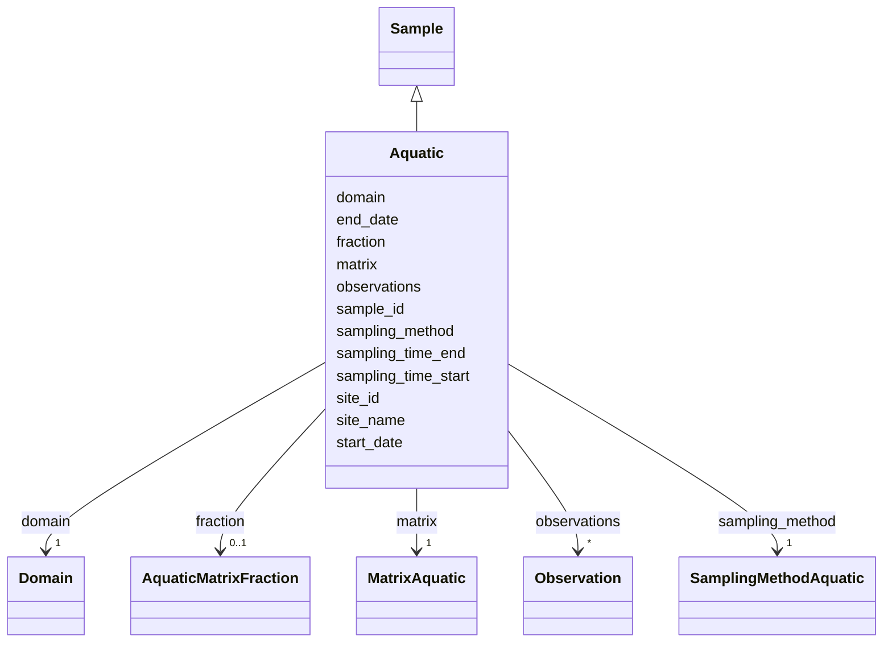

---
search:
  boost: 10.0
---

# Class: Aquatic 


_Aquatic sample_


<div data-search-exclude markdown="1">


URI: [cenvo:Aquatic](https://w3id.org/chemical-exposome/schema/chemicals-outdoor/Aquatic)





## Inheritance
* [Sample](Sample.md)
    * **Aquatic**


## Slots

| Name | Cardinality and Range | Description | Inheritance |
| ---  | --- | --- | --- |
| [matrix](matrix.md) | 1 [MatrixAquatic](MatrixAquatic.md) | Sampled matrix | direct |
| [sampling_method](sampling_method.md) | 1 [SamplingMethodAquatic](SamplingMethodAquatic.md) | Method used to collect the sample | direct |
| [fraction](fraction.md) | 0..1 [AquaticMatrixFraction](AquaticMatrixFraction.md) | If the collected sample is divided into multiple fractions for separate analy... | direct |
| [site_name](site_name.md) | 1 [String](String.md) | Name of the monitoring site | [Sample](Sample.md) |
| [site_id](site_id.md) | 1 [String](String.md) | Unique identifier of the monitoring site where the sample was collected | [Sample](Sample.md) |
| [sample_id](sample_id.md) | 1 [String](String.md) | Unique identifier for the sample | [Sample](Sample.md) |
| [start_date](start_date.md) | 1 [Date](Date.md) | Start date in format YYYY-MM-DD | [Sample](Sample.md) |
| [end_date](end_date.md) | 0..1 [Date](Date.md) | End date in format YYYY-MM-DD | [Sample](Sample.md) |
| [sampling_time_start](sampling_time_start.md) | 0..1 [Time](Time.md) | Sampling start time according to ISO 8601, 24-hour clock | [Sample](Sample.md) |
| [sampling_time_end](sampling_time_end.md) | 0..1 [Time](Time.md) | Sampling end time according to ISO 8601 | [Sample](Sample.md) |
| [domain](domain.md) | 1 [Domain](Domain.md) | Sample type according to sampled matrix:  Atmospheric for air, particles, pre... | [Sample](Sample.md) |
| [observations](observations.md) | * [Observation](Observation.md) | Observations (concentration measurements and parameters) associated with this... | [Sample](Sample.md) |


## Identifier and Mapping Information


### Schema Source


* from schema: https://w3id.org/chemical-exposome/schema/chemicals-outdoor


## Mappings

| Mapping Type | Mapped Value |
| ---  | ---  |
| self | cenvo:Aquatic |
| native | cenvo:Aquatic |


## LinkML Source

<!-- TODO: investigate https://stackoverflow.com/questions/37606292/how-to-create-tabbed-code-blocks-in-mkdocs-or-sphinx -->

### Direct

<details>
```yaml
name: Aquatic
description: Aquatic sample
from_schema: https://w3id.org/chemical-exposome/schema/chemicals-outdoor
is_a: Sample
attributes:
  matrix:
    name: matrix
    description: Sampled matrix
    in_subset:
    - mandatory
    from_schema: https://w3id.org/chemical-exposome/schema/chemicals-outdoor
    domain_of:
    - Atmospheric
    - Aquatic
    - Terrestrial
    - Biota
    range: MatrixAquatic
    required: true
  sampling_method:
    name: sampling_method
    description: Method used to collect the sample
    in_subset:
    - mandatory
    from_schema: https://w3id.org/chemical-exposome/schema/chemicals-outdoor
    domain_of:
    - Atmospheric
    - Aquatic
    - Terrestrial
    - Biota
    range: SamplingMethodAquatic
    required: true
  fraction:
    name: fraction
    description: If the collected sample is divided into multiple fractions for separate
      analysis, this field identifies each subsample.
    from_schema: https://w3id.org/chemical-exposome/schema/chemicals-outdoor
    rank: 1000
    domain_of:
    - Aquatic
    range: AquaticMatrixFraction
    required: false

```
</details>

### Induced

<details>
```yaml
name: Aquatic
description: Aquatic sample
from_schema: https://w3id.org/chemical-exposome/schema/chemicals-outdoor
is_a: Sample
attributes:
  matrix:
    name: matrix
    description: Sampled matrix
    in_subset:
    - mandatory
    from_schema: https://w3id.org/chemical-exposome/schema/chemicals-outdoor
    owner: Aquatic
    domain_of:
    - Atmospheric
    - Aquatic
    - Terrestrial
    - Biota
    range: MatrixAquatic
    required: true
  sampling_method:
    name: sampling_method
    description: Method used to collect the sample
    in_subset:
    - mandatory
    from_schema: https://w3id.org/chemical-exposome/schema/chemicals-outdoor
    owner: Aquatic
    domain_of:
    - Atmospheric
    - Aquatic
    - Terrestrial
    - Biota
    range: SamplingMethodAquatic
    required: true
  fraction:
    name: fraction
    description: If the collected sample is divided into multiple fractions for separate
      analysis, this field identifies each subsample.
    from_schema: https://w3id.org/chemical-exposome/schema/chemicals-outdoor
    rank: 1000
    owner: Aquatic
    domain_of:
    - Aquatic
    range: AquaticMatrixFraction
    required: false
  site_name:
    name: site_name
    description: Name of the monitoring site. Provide in the local language as the
      primary name. An English name may be added if available and commonly used. Multiple
      names in different languages are accepted.
    in_subset:
    - mandatory
    from_schema: https://w3id.org/chemical-exposome/schema/chemicals-outdoor
    rank: 1000
    owner: Aquatic
    domain_of:
    - Site
    - Sample
    range: string
    required: true
  site_id:
    name: site_id
    description: Unique identifier of the monitoring site where the sample was collected.
      References the site_id of a Site record.
    in_subset:
    - mandatory
    from_schema: https://w3id.org/chemical-exposome/schema/chemicals-outdoor
    rank: 1000
    owner: Aquatic
    domain_of:
    - Site
    - Sample
    range: string
    required: true
  sample_id:
    name: sample_id
    description: Unique identifier for the sample
    in_subset:
    - mandatory
    from_schema: https://w3id.org/chemical-exposome/schema/chemicals-outdoor
    rank: 1000
    identifier: true
    owner: Aquatic
    domain_of:
    - Sample
    - Observation
    range: string
    required: true
  start_date:
    name: start_date
    description: Start date in format YYYY-MM-DD
    in_subset:
    - mandatory
    from_schema: https://w3id.org/chemical-exposome/schema/chemicals-outdoor
    rank: 1000
    owner: Aquatic
    domain_of:
    - MonitoringActivity
    - Campaign
    - Sample
    range: date
    required: true
  end_date:
    name: end_date
    description: End date in format YYYY-MM-DD
    from_schema: https://w3id.org/chemical-exposome/schema/chemicals-outdoor
    rank: 1000
    owner: Aquatic
    domain_of:
    - MonitoringActivity
    - Campaign
    - Sample
    range: date
  sampling_time_start:
    name: sampling_time_start
    description: Sampling start time according to ISO 8601, 24-hour clock. Format
      T[hh][mm][ss].
    from_schema: https://w3id.org/chemical-exposome/schema/chemicals-outdoor
    rank: 1000
    owner: Aquatic
    domain_of:
    - Sample
    range: time
  sampling_time_end:
    name: sampling_time_end
    description: Sampling end time according to ISO 8601.
    from_schema: https://w3id.org/chemical-exposome/schema/chemicals-outdoor
    rank: 1000
    owner: Aquatic
    domain_of:
    - Sample
    range: time
  domain:
    name: domain
    description: 'Sample type according to sampled matrix:  Atmospheric for air, particles,
      precipitation, dust; Aquatic for water and sediment; Terrestrial for soil Biota
      for plants and animals'
    in_subset:
    - mandatory
    from_schema: https://w3id.org/chemical-exposome/schema/chemicals-outdoor
    rank: 1000
    designates_type: true
    owner: Aquatic
    domain_of:
    - Sample
    range: Domain
    required: true
  observations:
    name: observations
    description: Observations (concentration measurements and parameters) associated
      with this sample.
    from_schema: https://w3id.org/chemical-exposome/schema/chemicals-outdoor
    rank: 1000
    owner: Aquatic
    domain_of:
    - Sample
    range: Observation
    required: false
    multivalued: true
    inlined: true
    inlined_as_list: true

```
</details></div>