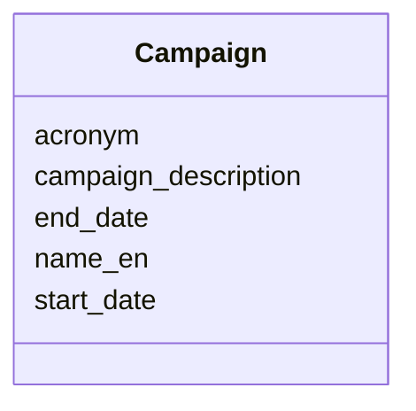

---
search:
  boost: 10.0
---

# Class: Campaign 


_A time-bounded data collection period within a project or monitoring programme. Mandatory if the campaign exists._


<div data-search-exclude markdown="1">


URI: [cenvo:Campaign](https://w3id.org/chemical-exposome/schema/chemicals-outdoor/Campaign)





<!-- no inheritance hierarchy -->

## Slots

| Name | Cardinality and Range | Description | Inheritance |
| ---  | --- | --- | --- |
| [name_en](name_en.md) | 1 [String](String.md) | Name or designation in English | direct |
| [acronym](acronym.md) | 1 [String](String.md) | Short name or acronym | direct |
| [start_date](start_date.md) | 1 [Date](Date.md) | Start date in format YYYY-MM-DD | direct |
| [end_date](end_date.md) | 1 [Date](Date.md) | End date in format YYYY-MM-DD | direct |
| [campaign_description](campaign_description.md) | 0..1 [String](String.md) | Description of the campaign | direct |


## Usages

| used by | used in | type | used |
| ---  | --- | --- | --- |
| [MonitoringActivity](MonitoringActivity.md) | [campaigns](campaigns.md) | range | [Campaign](Campaign.md) |


## Identifier and Mapping Information


### Schema Source


* from schema: https://w3id.org/chemical-exposome/schema/chemicals-outdoor


## Mappings

| Mapping Type | Mapped Value |
| ---  | ---  |
| self | cenvo:Campaign |
| native | cenvo:Campaign |


## LinkML Source

<!-- TODO: investigate https://stackoverflow.com/questions/37606292/how-to-create-tabbed-code-blocks-in-mkdocs-or-sphinx -->

### Direct

<details>
```yaml
name: Campaign
description: A time-bounded data collection period within a project or monitoring
  programme. Mandatory if the campaign exists.
from_schema: https://w3id.org/chemical-exposome/schema/chemicals-outdoor
slots:
- name_en
- acronym
- start_date
- end_date
slot_usage:
  name_en:
    name: name_en
    in_subset:
    - mandatory_if
    required: true
  acronym:
    name: acronym
    in_subset:
    - mandatory_if
    required: true
  end_date:
    name: end_date
    in_subset:
    - mandatory_if
    required: true
attributes:
  campaign_description:
    name: campaign_description
    description: Description of the campaign
    from_schema: https://w3id.org/chemical-exposome/schema/chemicals-outdoor
    rank: 1000
    domain_of:
    - Campaign
    range: string

```
</details>

### Induced

<details>
```yaml
name: Campaign
description: A time-bounded data collection period within a project or monitoring
  programme. Mandatory if the campaign exists.
from_schema: https://w3id.org/chemical-exposome/schema/chemicals-outdoor
slot_usage:
  name_en:
    name: name_en
    in_subset:
    - mandatory_if
    required: true
  acronym:
    name: acronym
    in_subset:
    - mandatory_if
    required: true
  end_date:
    name: end_date
    in_subset:
    - mandatory_if
    required: true
attributes:
  campaign_description:
    name: campaign_description
    description: Description of the campaign
    from_schema: https://w3id.org/chemical-exposome/schema/chemicals-outdoor
    rank: 1000
    owner: Campaign
    domain_of:
    - Campaign
    range: string
  name_en:
    name: name_en
    description: Name or designation in English
    in_subset:
    - mandatory_if
    from_schema: https://w3id.org/chemical-exposome/schema/chemicals-outdoor
    rank: 1000
    owner: Campaign
    domain_of:
    - MonitoringActivity
    - Campaign
    - OrganisationMetadata
    range: string
    required: true
  acronym:
    name: acronym
    description: Short name or acronym.
    in_subset:
    - mandatory_if
    from_schema: https://w3id.org/chemical-exposome/schema/chemicals-outdoor
    rank: 1000
    owner: Campaign
    domain_of:
    - MonitoringActivity
    - Campaign
    - Institution
    - Site
    range: string
    required: true
  start_date:
    name: start_date
    description: Start date in format YYYY-MM-DD
    in_subset:
    - mandatory
    from_schema: https://w3id.org/chemical-exposome/schema/chemicals-outdoor
    rank: 1000
    owner: Campaign
    domain_of:
    - MonitoringActivity
    - Campaign
    - Sample
    range: date
    required: true
  end_date:
    name: end_date
    description: End date in format YYYY-MM-DD
    in_subset:
    - mandatory_if
    from_schema: https://w3id.org/chemical-exposome/schema/chemicals-outdoor
    rank: 1000
    owner: Campaign
    domain_of:
    - MonitoringActivity
    - Campaign
    - Sample
    range: date
    required: true

```
</details></div>