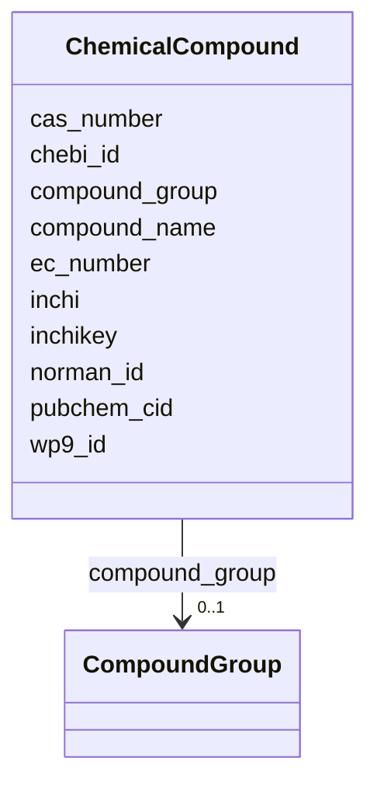

---
search:
  boost: 10.0
---

# Class: ChemicalCompound 


_A chemical compound monitored in environmental samples. The compound list (1500+ substances) was developed in PARC WP9 in collaboration with other WPs. Each compound is identified by multiple persistent identifiers and assigned to a compound group. See: https://doi.org/10.5281/zenodo.17175075_


<div data-search-exclude markdown="1">


URI: [cenvo:ChemicalCompound](https://w3id.org/chemical-exposome/schema/chemicals-outdoor/ChemicalCompound)





<!-- no inheritance hierarchy -->

## Slots

| Name | Cardinality and Range | Description | Inheritance |
| ---  | --- | --- | --- |
| [wp9_id](wp9_id.md) | 1 [Integer](Integer.md) | Internal PARC WP9 identifier for the compound | direct |
| [compound_name](compound_name.md) | 1 [String](String.md) | Common or abbreviated name of the compound as used in the PARC community (e | direct |
| [compound_group](compound_group.md) | 0..1 [CompoundGroup](CompoundGroup.md) | Chemical group classification of the compound as defined in the PARC WP9 comp... | direct |
| [cas_number](cas_number.md) | 0..1 [String](String.md) | CAS Registry Number — unique numerical identifier assigned by the Chemical Ab... | direct |
| [ec_number](ec_number.md) | 0..1 [String](String.md) | EC Number (European Community Number) — identifier used in the ECHA substance... | direct |
| [inchi](inchi.md) | 1 [String](String.md) | IUPAC International Chemical Identifier (InChI) — a standard textual represen... | direct |
| [inchikey](inchikey.md) | 0..1 [String](String.md) | InChIKey — a fixed-length (27-character) hash of the InChI string | direct |
| [chebi_id](chebi_id.md) | 0..1 [IRI](IRI.md) | ChEBI identifier for the compound | direct |
| [pubchem_cid](pubchem_cid.md) | 0..1 [Integer](Integer.md) | PubChem Compound ID (CID) | direct |
| [norman_id](norman_id.md) | 0..1 [String](String.md) | NORMAN substance identifier | direct |


## Usages

| used by | used in | type | used |
| ---  | --- | --- | --- |
| [MeasurementConcentration](MeasurementConcentration.md) | [compound](compound.md) | range | [ChemicalCompound](ChemicalCompound.md) |


## See Also

* [https://doi.org/10.1186/s13321-025-01092-3](https://doi.org/10.1186/s13321-025-01092-3)


## Identifier and Mapping Information


### Schema Source


* from schema: https://w3id.org/chemical-exposome/schema/chemicals-outdoor


## Mappings

| Mapping Type | Mapped Value |
| ---  | ---  |
| self | cenvo:ChemicalCompound |
| native | cenvo:ChemicalCompound |


## LinkML Source

<!-- TODO: investigate https://stackoverflow.com/questions/37606292/how-to-create-tabbed-code-blocks-in-mkdocs-or-sphinx -->

### Direct

<details>
```yaml
name: ChemicalCompound
description: 'A chemical compound monitored in environmental samples. The compound
  list (1500+ substances) was developed in PARC WP9 in collaboration with other WPs.
  Each compound is identified by multiple persistent identifiers and assigned to a
  compound group. See: https://doi.org/10.5281/zenodo.17175075'
from_schema: https://w3id.org/chemical-exposome/schema/chemicals-outdoor
see_also:
- https://doi.org/10.1186/s13321-025-01092-3
attributes:
  wp9_id:
    name: wp9_id
    description: Internal PARC WP9 identifier for the compound. Unique within the
      PARC compound list.
    from_schema: https://w3id.org/chemical-exposome/schema/chemicals-outdoor
    rank: 1000
    identifier: true
    domain_of:
    - ChemicalCompound
    range: integer
    required: true
  compound_name:
    name: compound_name
    description: Common or abbreviated name of the compound as used in the PARC community
      (e.g. PFOS, triclosan).
    in_subset:
    - mandatory
    from_schema: https://w3id.org/chemical-exposome/schema/chemicals-outdoor
    rank: 1000
    domain_of:
    - ChemicalCompound
    range: string
    required: true
  compound_group:
    name: compound_group
    description: 'Chemical group classification of the compound as defined in the
      PARC WP9 compound list (e.g. PFAS, biocides, PCBs, PAHs). # TODO: Future alignment
      planned with ChemFOnt functional classes # and/or C3PO (ChEBI Chemical Class
      Program Ontology)'
    from_schema: https://w3id.org/chemical-exposome/schema/chemicals-outdoor
    rank: 1000
    domain_of:
    - ChemicalCompound
    range: CompoundGroup
    required: false
  cas_number:
    name: cas_number
    description: 'CAS Registry Number — unique numerical identifier assigned by the
      Chemical Abstracts Service. Format: NNNNNN-NN-N'
    from_schema: https://w3id.org/chemical-exposome/schema/chemicals-outdoor
    rank: 1000
    domain_of:
    - ChemicalCompound
    range: string
    required: false
    pattern: ^\d{2,7}-\d{2}-\d$
  ec_number:
    name: ec_number
    description: 'EC Number (European Community Number) — identifier used in the ECHA
      substance inventory (EINECS, ELINCS, NLP). Format: NNN-NNN-N'
    from_schema: https://w3id.org/chemical-exposome/schema/chemicals-outdoor
    rank: 1000
    domain_of:
    - ChemicalCompound
    range: string
    required: false
    pattern: ^\d{3}-\d{3}-\d$
  inchi:
    name: inchi
    description: IUPAC International Chemical Identifier (InChI) — a standard textual
      representation of the molecular structure. Begins with 'InChI=1S/'.
    from_schema: https://w3id.org/chemical-exposome/schema/chemicals-outdoor
    rank: 1000
    domain_of:
    - ChemicalCompound
    range: string
    required: true
    pattern: ^InChI=1S/
  inchikey:
    name: inchikey
    description: 'InChIKey — a fixed-length (27-character) hash of the InChI string.
      Used as a compact, web-searchable identifier. Format: XXXXXXXXXXXXXX-XXXXXXXXXX-X'
    from_schema: https://w3id.org/chemical-exposome/schema/chemicals-outdoor
    rank: 1000
    domain_of:
    - ChemicalCompound
    range: string
    required: false
    pattern: ^[A-Z]{14}-[A-Z]{10}-[A-Z]$
  chebi_id:
    name: chebi_id
    description: 'ChEBI identifier for the compound. To be populated by mapping from
      InChIKey to ChEBI. Format: CHEBI:NNNNN'
    from_schema: https://w3id.org/chemical-exposome/schema/chemicals-outdoor
    rank: 1000
    domain_of:
    - ChemicalCompound
    range: IRI
    required: false
  pubchem_cid:
    name: pubchem_cid
    description: PubChem Compound ID (CID). To be populated by mapping from InChIKey
      to PubChem.
    from_schema: https://w3id.org/chemical-exposome/schema/chemicals-outdoor
    rank: 1000
    domain_of:
    - ChemicalCompound
    range: integer
    required: false
  norman_id:
    name: norman_id
    description: 'NORMAN substance identifier. Source: NORMAN EMPODAT / SusDat database.'
    from_schema: https://w3id.org/chemical-exposome/schema/chemicals-outdoor
    rank: 1000
    domain_of:
    - ChemicalCompound
    range: string
    required: false

```
</details>

### Induced

<details>
```yaml
name: ChemicalCompound
description: 'A chemical compound monitored in environmental samples. The compound
  list (1500+ substances) was developed in PARC WP9 in collaboration with other WPs.
  Each compound is identified by multiple persistent identifiers and assigned to a
  compound group. See: https://doi.org/10.5281/zenodo.17175075'
from_schema: https://w3id.org/chemical-exposome/schema/chemicals-outdoor
see_also:
- https://doi.org/10.1186/s13321-025-01092-3
attributes:
  wp9_id:
    name: wp9_id
    description: Internal PARC WP9 identifier for the compound. Unique within the
      PARC compound list.
    from_schema: https://w3id.org/chemical-exposome/schema/chemicals-outdoor
    rank: 1000
    identifier: true
    owner: ChemicalCompound
    domain_of:
    - ChemicalCompound
    range: integer
    required: true
  compound_name:
    name: compound_name
    description: Common or abbreviated name of the compound as used in the PARC community
      (e.g. PFOS, triclosan).
    in_subset:
    - mandatory
    from_schema: https://w3id.org/chemical-exposome/schema/chemicals-outdoor
    rank: 1000
    owner: ChemicalCompound
    domain_of:
    - ChemicalCompound
    range: string
    required: true
  compound_group:
    name: compound_group
    description: 'Chemical group classification of the compound as defined in the
      PARC WP9 compound list (e.g. PFAS, biocides, PCBs, PAHs). # TODO: Future alignment
      planned with ChemFOnt functional classes # and/or C3PO (ChEBI Chemical Class
      Program Ontology)'
    from_schema: https://w3id.org/chemical-exposome/schema/chemicals-outdoor
    rank: 1000
    owner: ChemicalCompound
    domain_of:
    - ChemicalCompound
    range: CompoundGroup
    required: false
  cas_number:
    name: cas_number
    description: 'CAS Registry Number — unique numerical identifier assigned by the
      Chemical Abstracts Service. Format: NNNNNN-NN-N'
    from_schema: https://w3id.org/chemical-exposome/schema/chemicals-outdoor
    rank: 1000
    owner: ChemicalCompound
    domain_of:
    - ChemicalCompound
    range: string
    required: false
    pattern: ^\d{2,7}-\d{2}-\d$
  ec_number:
    name: ec_number
    description: 'EC Number (European Community Number) — identifier used in the ECHA
      substance inventory (EINECS, ELINCS, NLP). Format: NNN-NNN-N'
    from_schema: https://w3id.org/chemical-exposome/schema/chemicals-outdoor
    rank: 1000
    owner: ChemicalCompound
    domain_of:
    - ChemicalCompound
    range: string
    required: false
    pattern: ^\d{3}-\d{3}-\d$
  inchi:
    name: inchi
    description: IUPAC International Chemical Identifier (InChI) — a standard textual
      representation of the molecular structure. Begins with 'InChI=1S/'.
    from_schema: https://w3id.org/chemical-exposome/schema/chemicals-outdoor
    rank: 1000
    owner: ChemicalCompound
    domain_of:
    - ChemicalCompound
    range: string
    required: true
    pattern: ^InChI=1S/
  inchikey:
    name: inchikey
    description: 'InChIKey — a fixed-length (27-character) hash of the InChI string.
      Used as a compact, web-searchable identifier. Format: XXXXXXXXXXXXXX-XXXXXXXXXX-X'
    from_schema: https://w3id.org/chemical-exposome/schema/chemicals-outdoor
    rank: 1000
    owner: ChemicalCompound
    domain_of:
    - ChemicalCompound
    range: string
    required: false
    pattern: ^[A-Z]{14}-[A-Z]{10}-[A-Z]$
  chebi_id:
    name: chebi_id
    description: 'ChEBI identifier for the compound. To be populated by mapping from
      InChIKey to ChEBI. Format: CHEBI:NNNNN'
    from_schema: https://w3id.org/chemical-exposome/schema/chemicals-outdoor
    rank: 1000
    owner: ChemicalCompound
    domain_of:
    - ChemicalCompound
    range: IRI
    required: false
  pubchem_cid:
    name: pubchem_cid
    description: PubChem Compound ID (CID). To be populated by mapping from InChIKey
      to PubChem.
    from_schema: https://w3id.org/chemical-exposome/schema/chemicals-outdoor
    rank: 1000
    owner: ChemicalCompound
    domain_of:
    - ChemicalCompound
    range: integer
    required: false
  norman_id:
    name: norman_id
    description: 'NORMAN substance identifier. Source: NORMAN EMPODAT / SusDat database.'
    from_schema: https://w3id.org/chemical-exposome/schema/chemicals-outdoor
    rank: 1000
    owner: ChemicalCompound
    domain_of:
    - ChemicalCompound
    range: string
    required: false

```
</details></div>