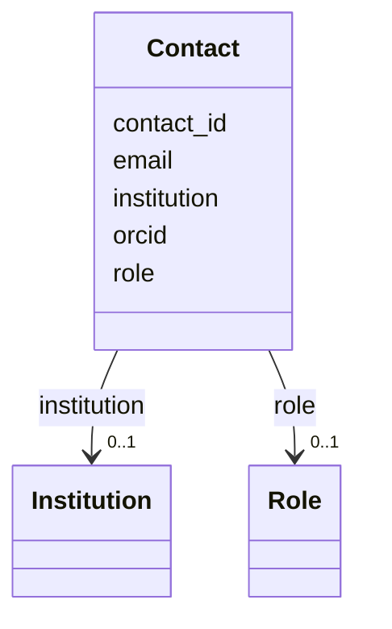

---
search:
  boost: 10.0
---

# Class: Contact 


_A contact person associated with the monitoring activity._


<div data-search-exclude markdown="1">


URI: [cenvo:Contact](https://w3id.org/chemical-exposome/schema/chemicals-outdoor/Contact)





<!-- no inheritance hierarchy -->

## Slots

| Name | Cardinality and Range | Description | Inheritance |
| ---  | --- | --- | --- |
| [email](email.md) | 1 [EmailAddress](EmailAddress.md) | Email address of the project contact point | direct |
| [orcid](orcid.md) | 0..1 [OrcidIdentifier](OrcidIdentifier.md) | ORCID identifier of the contact person | direct |
| [contact_id](contact_id.md) | 1 [String](String.md) | Unique contact ID | direct |
| [role](role.md) | 0..1 [Role](Role.md) | Role/function performed by the contact person | direct |
| [institution](institution.md) | 0..1 [Institution](Institution.md) | Contact's institution | direct |


## Usages

| used by | used in | type | used |
| ---  | --- | --- | --- |
| [MonitoringActivity](MonitoringActivity.md) | [contacts](contacts.md) | range | [Contact](Contact.md) |


## Identifier and Mapping Information


### Schema Source


* from schema: https://w3id.org/chemical-exposome/schema/chemicals-outdoor


## Mappings

| Mapping Type | Mapped Value |
| ---  | ---  |
| self | cenvo:Contact |
| native | cenvo:Contact |


## LinkML Source

<!-- TODO: investigate https://stackoverflow.com/questions/37606292/how-to-create-tabbed-code-blocks-in-mkdocs-or-sphinx -->

### Direct

<details>
```yaml
name: Contact
description: A contact person associated with the monitoring activity.
from_schema: https://w3id.org/chemical-exposome/schema/chemicals-outdoor
slots:
- email
- orcid
attributes:
  contact_id:
    name: contact_id
    description: Unique contact ID
    from_schema: https://w3id.org/chemical-exposome/schema/chemicals-outdoor
    rank: 1000
    identifier: true
    domain_of:
    - Contact
    range: string
    required: true
  role:
    name: role
    description: 'Role/function performed by the contact person. Source: ISO 19115:2003/19139
      and EC Regulation No 1205/2008 (INSPIRE).'
    from_schema: https://w3id.org/chemical-exposome/schema/chemicals-outdoor
    rank: 1000
    domain_of:
    - Contact
    range: Role
    required: false
  institution:
    name: institution
    description: Contact's institution
    from_schema: https://w3id.org/chemical-exposome/schema/chemicals-outdoor
    rank: 1000
    domain_of:
    - Contact
    range: Institution
    required: false

```
</details>

### Induced

<details>
```yaml
name: Contact
description: A contact person associated with the monitoring activity.
from_schema: https://w3id.org/chemical-exposome/schema/chemicals-outdoor
attributes:
  contact_id:
    name: contact_id
    description: Unique contact ID
    from_schema: https://w3id.org/chemical-exposome/schema/chemicals-outdoor
    rank: 1000
    identifier: true
    owner: Contact
    domain_of:
    - Contact
    range: string
    required: true
  role:
    name: role
    description: 'Role/function performed by the contact person. Source: ISO 19115:2003/19139
      and EC Regulation No 1205/2008 (INSPIRE).'
    from_schema: https://w3id.org/chemical-exposome/schema/chemicals-outdoor
    rank: 1000
    owner: Contact
    domain_of:
    - Contact
    range: Role
    required: false
  institution:
    name: institution
    description: Contact's institution
    from_schema: https://w3id.org/chemical-exposome/schema/chemicals-outdoor
    rank: 1000
    owner: Contact
    domain_of:
    - Contact
    range: Institution
    required: false
  email:
    name: email
    description: Email address of the project contact point. Institutional email is
      recommended.
    in_subset:
    - mandatory
    from_schema: https://w3id.org/chemical-exposome/schema/chemicals-outdoor
    rank: 1000
    owner: Contact
    domain_of:
    - Contact
    range: EmailAddress
    required: true
  orcid:
    name: orcid
    description: ORCID identifier of the contact person
    from_schema: https://w3id.org/chemical-exposome/schema/chemicals-outdoor
    rank: 1000
    owner: Contact
    domain_of:
    - Contact
    range: OrcidIdentifier

```
</details></div>