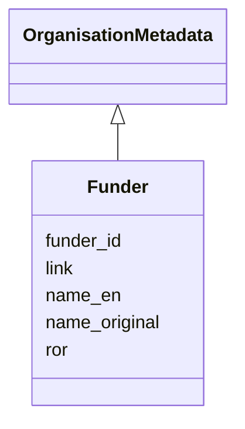

---
search:
  boost: 10.0
---

# Class: Funder 


_Funder_


<div data-search-exclude markdown="1">


URI: [cenvo:Funder](https://w3id.org/chemical-exposome/schema/chemicals-outdoor/Funder)





## Inheritance
* **Funder** [ [OrganisationMetadata](OrganisationMetadata.md)]


## Slots

| Name | Cardinality and Range | Description | Inheritance |
| ---  | --- | --- | --- |
| [funder_id](funder_id.md) | 1 [String](String.md) | Unique funder ID | direct |
| [name_en](name_en.md) | 1 [String](String.md) | Name or designation in English | [OrganisationMetadata](OrganisationMetadata.md) |
| [name_original](name_original.md) | 1 [String](String.md) | Name of the entity in the original language of the  institution/site/project | [OrganisationMetadata](OrganisationMetadata.md) |
| [ror](ror.md) | 0..1 [RorIdentifier](RorIdentifier.md) | ROR identifier of the institution (format ror | [OrganisationMetadata](OrganisationMetadata.md) |
| [link](link.md) | 0..1 [IRI](IRI.md) | URL with information about the institution | [OrganisationMetadata](OrganisationMetadata.md) |


## Usages

| used by | used in | type | used |
| ---  | --- | --- | --- |
| [MonitoringActivity](MonitoringActivity.md) | [funders](funders.md) | range | [Funder](Funder.md) |


## Identifier and Mapping Information


### Schema Source


* from schema: https://w3id.org/chemical-exposome/schema/chemicals-outdoor


## Mappings

| Mapping Type | Mapped Value |
| ---  | ---  |
| self | cenvo:Funder |
| native | cenvo:Funder |


## LinkML Source

<!-- TODO: investigate https://stackoverflow.com/questions/37606292/how-to-create-tabbed-code-blocks-in-mkdocs-or-sphinx -->

### Direct

<details>
```yaml
name: Funder
description: Funder
from_schema: https://w3id.org/chemical-exposome/schema/chemicals-outdoor
mixins:
- OrganisationMetadata
attributes:
  funder_id:
    name: funder_id
    description: Unique funder ID
    from_schema: https://w3id.org/chemical-exposome/schema/chemicals-outdoor
    rank: 1000
    identifier: true
    domain_of:
    - Funder
    range: string
    required: true

```
</details>

### Induced

<details>
```yaml
name: Funder
description: Funder
from_schema: https://w3id.org/chemical-exposome/schema/chemicals-outdoor
mixins:
- OrganisationMetadata
attributes:
  funder_id:
    name: funder_id
    description: Unique funder ID
    from_schema: https://w3id.org/chemical-exposome/schema/chemicals-outdoor
    rank: 1000
    identifier: true
    owner: Funder
    domain_of:
    - Funder
    range: string
    required: true
  name_en:
    name: name_en
    description: Name or designation in English
    in_subset:
    - mandatory_if
    from_schema: https://w3id.org/chemical-exposome/schema/chemicals-outdoor
    rank: 1000
    owner: Funder
    domain_of:
    - MonitoringActivity
    - Campaign
    - OrganisationMetadata
    range: string
    required: true
  name_original:
    name: name_original
    description: Name of the entity in the original language of the  institution/site/project.
      Use the local official name.
    in_subset:
    - mandatory
    from_schema: https://w3id.org/chemical-exposome/schema/chemicals-outdoor
    rank: 1000
    owner: Funder
    domain_of:
    - MonitoringActivity
    - OrganisationMetadata
    range: string
    required: true
  ror:
    name: ror
    description: ROR identifier of the institution (format ror.org/xxxxxxxx)
    from_schema: https://w3id.org/chemical-exposome/schema/chemicals-outdoor
    rank: 1000
    owner: Funder
    domain_of:
    - OrganisationMetadata
    range: RorIdentifier
  link:
    name: link
    description: URL with information about the institution
    from_schema: https://w3id.org/chemical-exposome/schema/chemicals-outdoor
    rank: 1000
    owner: Funder
    domain_of:
    - OrganisationMetadata
    - Site
    range: IRI

```
</details></div>