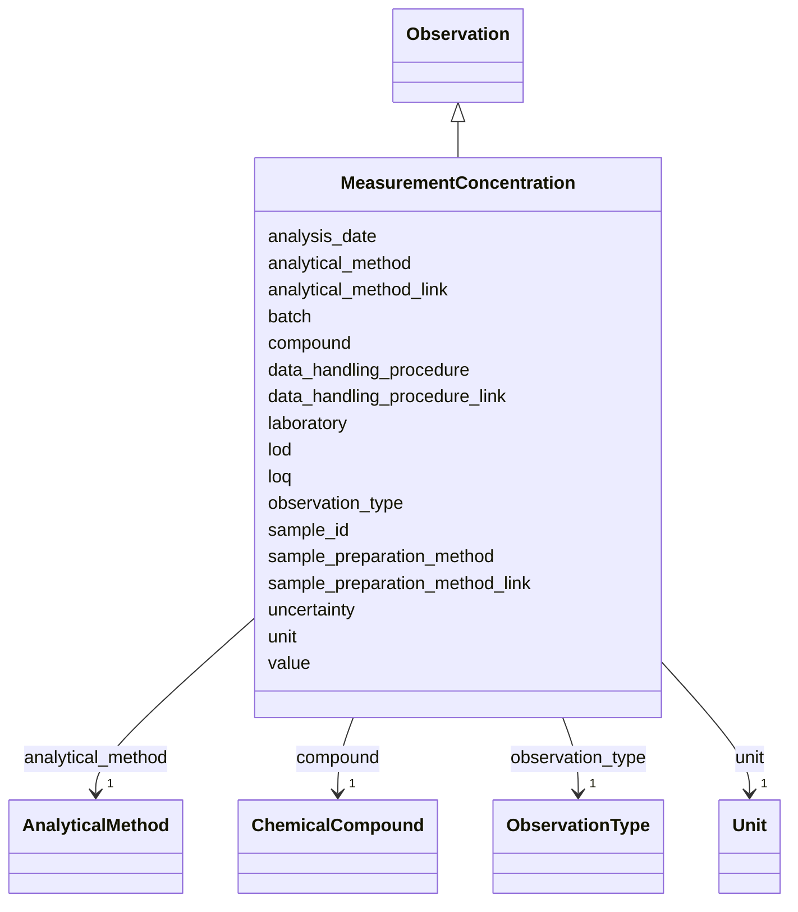

---
search:
  boost: 10.0
---

# Class: MeasurementConcentration 


_A measured concentration of a chemical compound in a sample. At least one of concentration, LOQ, or LOD must be provided._


<div data-search-exclude markdown="1">


URI: [cenvo:MeasurementConcentration](https://w3id.org/chemical-exposome/schema/chemicals-outdoor/MeasurementConcentration)





## Inheritance
* [Observation](Observation.md)
    * **MeasurementConcentration**


## Slots

| Name | Cardinality and Range | Description | Inheritance |
| ---  | --- | --- | --- |
| [laboratory](laboratory.md) | 1 [String](String.md) | Name of the laboratory performing the analysis | direct |
| [batch](batch.md) | 0..1 [String](String.md) | Internal laboratory designation of the group of samples analyzed together | direct |
| [analysis_date](analysis_date.md) | 0..1 [Date](Date.md) | The date on which the concentration was determined | direct |
| [compound](compound.md) | 1 [ChemicalCompound](ChemicalCompound.md) | Chemical compound measured in the sample | direct |
| [sample_preparation_method](sample_preparation_method.md) | 1 [String](String.md) | Description of the process from sample collection to chemical analysis (e | direct |
| [sample_preparation_method_link](sample_preparation_method_link.md) | 0..1 [IRI](IRI.md) | GUPRI (e | direct |
| [analytical_method](analytical_method.md) | 1 [AnalyticalMethod](AnalyticalMethod.md) | Analytical method used to determine the analyte | direct |
| [analytical_method_link](analytical_method_link.md) | 0..1 [IRI](IRI.md) | GUPRI linking to a public SOP or document describing the method | direct |
| [data_handling_procedure](data_handling_procedure.md) | 1 [String](String.md) | Description of steps taken after chemical analysis (e | direct |
| [data_handling_procedure_link](data_handling_procedure_link.md) | 0..1 [IRI](IRI.md) | GUPRI linking to a document describing the data handling procedure | direct |
| [loq](loq.md) | 0..1 [Double](Double.md) | Limit of quantification | direct |
| [lod](lod.md) | 0..1 [Double](Double.md) | Limit of detection | direct |
| [sample_id](sample_id.md) | 1 [String](String.md) | Unique identifier for the sample | [Observation](Observation.md) |
| [unit](unit.md) | 1 [Unit](Unit.md) | Unit of measurement | [Observation](Observation.md) |
| [uncertainty](uncertainty.md) | 0..1 [Double](Double.md) | Measurement uncertainty of the concentration/paramter value, expressed as a p... | [Observation](Observation.md) |
| [value](value.md) | 0..1 [Double](Double.md) | Measured value of the chemical concentration or other parameter | [Observation](Observation.md) |
| [observation_type](observation_type.md) | 1 [ObservationType](ObservationType.md) | Type of measurement/observation: i) Chemical concentration in the environment... | [Observation](Observation.md) |


## Rules


### at_least_one_measurement_value_required

| Rule Applied | Preconditions | Postconditions | Elseconditions |
|--------------|---------------|----------------|----------------|
| slot_conditions |```{'value': {'value_presence': 'ABSENT'}, 'loq': {'value_presence': 'ABSENT'}, 'lod': {'value_presence': 'ABSENT'}}``` |```{'value': {'value_presence': 'PRESENT'}}``` | |


## Identifier and Mapping Information


### Schema Source


* from schema: https://w3id.org/chemical-exposome/schema/chemicals-outdoor


## Mappings

| Mapping Type | Mapped Value |
| ---  | ---  |
| self | cenvo:MeasurementConcentration |
| native | cenvo:MeasurementConcentration |


## LinkML Source

<!-- TODO: investigate https://stackoverflow.com/questions/37606292/how-to-create-tabbed-code-blocks-in-mkdocs-or-sphinx -->

### Direct

<details>
```yaml
name: MeasurementConcentration
description: A measured concentration of a chemical compound in a sample. At least
  one of concentration, LOQ, or LOD must be provided.
from_schema: https://w3id.org/chemical-exposome/schema/chemicals-outdoor
is_a: Observation
attributes:
  laboratory:
    name: laboratory
    description: Name of the laboratory performing the analysis
    in_subset:
    - mandatory
    from_schema: https://w3id.org/chemical-exposome/schema/chemicals-outdoor
    rank: 1000
    domain_of:
    - MeasurementConcentration
    range: string
    required: true
  batch:
    name: batch
    description: Internal laboratory designation of the group of samples analyzed
      together
    from_schema: https://w3id.org/chemical-exposome/schema/chemicals-outdoor
    rank: 1000
    domain_of:
    - MeasurementConcentration
    range: string
    required: false
  analysis_date:
    name: analysis_date
    description: The date on which the concentration was determined
    from_schema: https://w3id.org/chemical-exposome/schema/chemicals-outdoor
    rank: 1000
    domain_of:
    - MeasurementConcentration
    range: date
    required: false
  compound:
    name: compound
    description: Chemical compound measured in the sample. Reference to the PARC WP9
      compound list entry (ChemicalCompound class). Identified by WP9_id, name, CAS,
      EC, InChI, and InChIKey. Mappable to ChEBI, PubChem, and NORMAN identifiers.
      A single measurement record should typically correspond to one compound.
    in_subset:
    - mandatory
    from_schema: https://w3id.org/chemical-exposome/schema/chemicals-outdoor
    rank: 1000
    domain_of:
    - MeasurementConcentration
    range: ChemicalCompound
    required: true
  sample_preparation_method:
    name: sample_preparation_method
    description: Description of the process from sample collection to chemical analysis
      (e.g., extraction, cleanup, fractionation).
    in_subset:
    - mandatory
    from_schema: https://w3id.org/chemical-exposome/schema/chemicals-outdoor
    rank: 1000
    domain_of:
    - MeasurementConcentration
    range: string
    required: true
  sample_preparation_method_link:
    name: sample_preparation_method_link
    description: GUPRI (e.g. DOI) linking to a public SOP, article, or other document
      describing the method.
    from_schema: https://w3id.org/chemical-exposome/schema/chemicals-outdoor
    rank: 1000
    domain_of:
    - MeasurementConcentration
    range: IRI
    required: false
  analytical_method:
    name: analytical_method
    description: Analytical method used to determine the analyte
    in_subset:
    - mandatory
    from_schema: https://w3id.org/chemical-exposome/schema/chemicals-outdoor
    rank: 1000
    domain_of:
    - MeasurementConcentration
    range: AnalyticalMethod
    required: true
  analytical_method_link:
    name: analytical_method_link
    description: GUPRI linking to a public SOP or document describing the method
    from_schema: https://w3id.org/chemical-exposome/schema/chemicals-outdoor
    rank: 1000
    domain_of:
    - MeasurementConcentration
    range: IRI
    required: false
  data_handling_procedure:
    name: data_handling_procedure
    description: Description of steps taken after chemical analysis (e.g., blank correction,
      quality control, calibration, recovery, standardization, recalculations).
    in_subset:
    - mandatory
    from_schema: https://w3id.org/chemical-exposome/schema/chemicals-outdoor
    rank: 1000
    domain_of:
    - MeasurementConcentration
    range: string
    required: true
  data_handling_procedure_link:
    name: data_handling_procedure_link
    description: GUPRI linking to a document describing the data handling procedure
    from_schema: https://w3id.org/chemical-exposome/schema/chemicals-outdoor
    rank: 1000
    domain_of:
    - MeasurementConcentration
    range: IRI
    required: false
  loq:
    name: loq
    description: Limit of quantification
    from_schema: https://w3id.org/chemical-exposome/schema/chemicals-outdoor
    rank: 1000
    domain_of:
    - MeasurementConcentration
    range: double
    required: false
  lod:
    name: lod
    description: Limit of detection
    from_schema: https://w3id.org/chemical-exposome/schema/chemicals-outdoor
    rank: 1000
    domain_of:
    - MeasurementConcentration
    range: double
    required: false
rules:
- preconditions:
    slot_conditions:
      value:
        name: value
        value_presence: ABSENT
      loq:
        name: loq
        value_presence: ABSENT
      lod:
        name: lod
        value_presence: ABSENT
  postconditions:
    slot_conditions:
      value:
        name: value
        value_presence: PRESENT
  description: At least one of concentration value (value), LOQ, or LOD  must be provided
    per measurement record. This rule creates a logical contradiction when all three
    are absent, making that state invalid. The postcondition on value is  conventional
    — any of the three would work equivalently.
  title: at_least_one_measurement_value_required

```
</details>

### Induced

<details>
```yaml
name: MeasurementConcentration
description: A measured concentration of a chemical compound in a sample. At least
  one of concentration, LOQ, or LOD must be provided.
from_schema: https://w3id.org/chemical-exposome/schema/chemicals-outdoor
is_a: Observation
attributes:
  laboratory:
    name: laboratory
    description: Name of the laboratory performing the analysis
    in_subset:
    - mandatory
    from_schema: https://w3id.org/chemical-exposome/schema/chemicals-outdoor
    rank: 1000
    owner: MeasurementConcentration
    domain_of:
    - MeasurementConcentration
    range: string
    required: true
  batch:
    name: batch
    description: Internal laboratory designation of the group of samples analyzed
      together
    from_schema: https://w3id.org/chemical-exposome/schema/chemicals-outdoor
    rank: 1000
    owner: MeasurementConcentration
    domain_of:
    - MeasurementConcentration
    range: string
    required: false
  analysis_date:
    name: analysis_date
    description: The date on which the concentration was determined
    from_schema: https://w3id.org/chemical-exposome/schema/chemicals-outdoor
    rank: 1000
    owner: MeasurementConcentration
    domain_of:
    - MeasurementConcentration
    range: date
    required: false
  compound:
    name: compound
    description: Chemical compound measured in the sample. Reference to the PARC WP9
      compound list entry (ChemicalCompound class). Identified by WP9_id, name, CAS,
      EC, InChI, and InChIKey. Mappable to ChEBI, PubChem, and NORMAN identifiers.
      A single measurement record should typically correspond to one compound.
    in_subset:
    - mandatory
    from_schema: https://w3id.org/chemical-exposome/schema/chemicals-outdoor
    rank: 1000
    owner: MeasurementConcentration
    domain_of:
    - MeasurementConcentration
    range: ChemicalCompound
    required: true
  sample_preparation_method:
    name: sample_preparation_method
    description: Description of the process from sample collection to chemical analysis
      (e.g., extraction, cleanup, fractionation).
    in_subset:
    - mandatory
    from_schema: https://w3id.org/chemical-exposome/schema/chemicals-outdoor
    rank: 1000
    owner: MeasurementConcentration
    domain_of:
    - MeasurementConcentration
    range: string
    required: true
  sample_preparation_method_link:
    name: sample_preparation_method_link
    description: GUPRI (e.g. DOI) linking to a public SOP, article, or other document
      describing the method.
    from_schema: https://w3id.org/chemical-exposome/schema/chemicals-outdoor
    rank: 1000
    owner: MeasurementConcentration
    domain_of:
    - MeasurementConcentration
    range: IRI
    required: false
  analytical_method:
    name: analytical_method
    description: Analytical method used to determine the analyte
    in_subset:
    - mandatory
    from_schema: https://w3id.org/chemical-exposome/schema/chemicals-outdoor
    rank: 1000
    owner: MeasurementConcentration
    domain_of:
    - MeasurementConcentration
    range: AnalyticalMethod
    required: true
  analytical_method_link:
    name: analytical_method_link
    description: GUPRI linking to a public SOP or document describing the method
    from_schema: https://w3id.org/chemical-exposome/schema/chemicals-outdoor
    rank: 1000
    owner: MeasurementConcentration
    domain_of:
    - MeasurementConcentration
    range: IRI
    required: false
  data_handling_procedure:
    name: data_handling_procedure
    description: Description of steps taken after chemical analysis (e.g., blank correction,
      quality control, calibration, recovery, standardization, recalculations).
    in_subset:
    - mandatory
    from_schema: https://w3id.org/chemical-exposome/schema/chemicals-outdoor
    rank: 1000
    owner: MeasurementConcentration
    domain_of:
    - MeasurementConcentration
    range: string
    required: true
  data_handling_procedure_link:
    name: data_handling_procedure_link
    description: GUPRI linking to a document describing the data handling procedure
    from_schema: https://w3id.org/chemical-exposome/schema/chemicals-outdoor
    rank: 1000
    owner: MeasurementConcentration
    domain_of:
    - MeasurementConcentration
    range: IRI
    required: false
  loq:
    name: loq
    description: Limit of quantification
    from_schema: https://w3id.org/chemical-exposome/schema/chemicals-outdoor
    rank: 1000
    owner: MeasurementConcentration
    domain_of:
    - MeasurementConcentration
    range: double
    required: false
  lod:
    name: lod
    description: Limit of detection
    from_schema: https://w3id.org/chemical-exposome/schema/chemicals-outdoor
    rank: 1000
    owner: MeasurementConcentration
    domain_of:
    - MeasurementConcentration
    range: double
    required: false
  sample_id:
    name: sample_id
    description: Unique identifier for the sample
    in_subset:
    - mandatory
    from_schema: https://w3id.org/chemical-exposome/schema/chemicals-outdoor
    rank: 1000
    owner: MeasurementConcentration
    domain_of:
    - Sample
    - Observation
    range: string
    required: true
  unit:
    name: unit
    description: Unit of measurement
    in_subset:
    - mandatory
    from_schema: https://w3id.org/chemical-exposome/schema/chemicals-outdoor
    rank: 1000
    owner: MeasurementConcentration
    domain_of:
    - Observation
    range: Unit
    required: true
  uncertainty:
    name: uncertainty
    description: 'Measurement uncertainty of the concentration/paramter value, expressed
      as a percentage (%) at 95% confidence level.  '
    from_schema: https://w3id.org/chemical-exposome/schema/chemicals-outdoor
    rank: 1000
    owner: MeasurementConcentration
    domain_of:
    - Observation
    range: double
    minimum_value: 0
  value:
    name: value
    description: Measured value of the chemical concentration or other parameter
    in_subset:
    - mandatory
    from_schema: https://w3id.org/chemical-exposome/schema/chemicals-outdoor
    rank: 1000
    owner: MeasurementConcentration
    domain_of:
    - Observation
    range: double
    required: false
  observation_type:
    name: observation_type
    description: 'Type of measurement/observation: i) Chemical concentration in the
      environment or biota - main observation and; ii) Other parameters - they give
      context to the main measurement.'
    in_subset:
    - mandatory
    from_schema: https://w3id.org/chemical-exposome/schema/chemicals-outdoor
    rank: 1000
    designates_type: true
    owner: MeasurementConcentration
    domain_of:
    - Observation
    range: ObservationType
    required: true
rules:
- preconditions:
    slot_conditions:
      value:
        name: value
        value_presence: ABSENT
      loq:
        name: loq
        value_presence: ABSENT
      lod:
        name: lod
        value_presence: ABSENT
  postconditions:
    slot_conditions:
      value:
        name: value
        value_presence: PRESENT
  description: At least one of concentration value (value), LOQ, or LOD  must be provided
    per measurement record. This rule creates a logical contradiction when all three
    are absent, making that state invalid. The postcondition on value is  conventional
    — any of the three would work equivalently.
  title: at_least_one_measurement_value_required

```
</details></div>