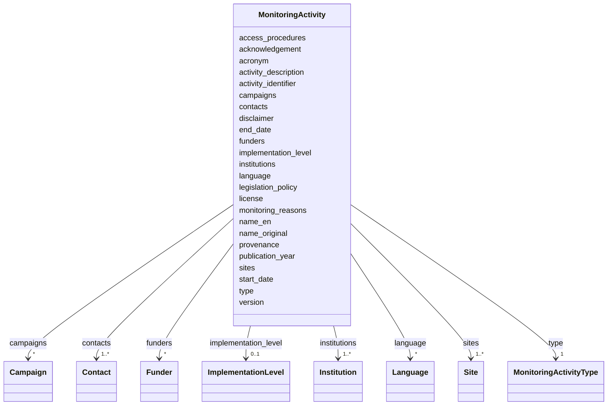

---
search:
  boost: 10.0
---

# Class: MonitoringActivity 


_A research project or monitoring programme collecting environmental data on chemicals in the outdoor environment (air, water, sediment, soil, biota)_


<div data-search-exclude markdown="1">


URI: [cenvo:MonitoringActivity](https://w3id.org/chemical-exposome/schema/chemicals-outdoor/MonitoringActivity)





<!-- no inheritance hierarchy -->

## Class Properties

| Property | Value |
| --- | --- |
| Tree Root | Yes |


## Slots

| Name | Cardinality and Range | Description | Inheritance |
| ---  | --- | --- | --- |
| [name_en](name_en.md) | 1 [String](String.md) | Name or designation in English | direct |
| [name_original](name_original.md) | 1 [String](String.md) | Name of the entity in the original language of the  institution/site/project | direct |
| [acronym](acronym.md) | 1 [String](String.md) | Short name or acronym | direct |
| [type](type.md) | 1 [MonitoringActivityType](MonitoringActivityType.md) | Type of monitoring activity | direct |
| [activity_description](activity_description.md) | 1 [String](String.md) | A brief summary with the most important details summarising the project (obje... | direct |
| [activity_identifier](activity_identifier.md) | * [IRI](IRI.md) | Project/monitoring programme identifier provided as URL (GUPRI) | direct |
| [monitoring_reasons](monitoring_reasons.md) | 0..1 [String](String.md) | Primary reasons for performing monitoring (e | direct |
| [legislation_policy](legislation_policy.md) | * [IRI](IRI.md) | Link(s) to policy, convention, or legislation underpinning the monitoring act... | direct |
| [implementation_level](implementation_level.md) | 0..1 [ImplementationLevel](ImplementationLevel.md) | The geographic scale of the monitoring coverage (international, national, reg... | direct |
| [language](language.md) | * [Language](Language.md) | Language(s) used, as 2-letter codes according to ISO 639-1 | direct |
| [start_date](start_date.md) | 1 [Date](Date.md) | The beginning (or previewed starting) date of the monitoring programme/projec... | direct |
| [end_date](end_date.md) | 0..1 [Date](Date.md) | End date of the project/monitoring programme | direct |
| [campaigns](campaigns.md) | * [Campaign](Campaign.md) | If an Environmental Monitoring Programme/Project has a long-term perspective ... | direct |
| [institutions](institutions.md) | 1..* [Institution](Institution.md) | Institution(s) responsible for implementing the monitoring activity | direct |
| [contacts](contacts.md) | 1..* [Contact](Contact.md) | Contact person(s) for the monitoring activity | direct |
| [funders](funders.md) | * [Funder](Funder.md) | Funding entity/entities supporting the monitoring activity | direct |
| [access_procedures](access_procedures.md) | 1 [String](String.md) | Information on procedure to obtain access to the dataset | direct |
| [acknowledgement](acknowledgement.md) | 1 [String](String.md) | Text for acknowledgement which should be reported when using/re-using the dat... | direct |
| [license](license.md) | 1 [String](String.md) | License or terms for data reuse | direct |
| [disclaimer](disclaimer.md) | 0..1 [String](String.md) | Text for disclaimer when using/re-using the data | direct |
| [version](version.md) | 0..1 [String](String.md) | Version of the dataset | direct |
| [publication_year](publication_year.md) | 0..1 [Integer](Integer.md) | Year when the dataset was or will be made publicly available | direct |
| [provenance](provenance.md) | 0..1 [String](String.md) | A statement about the lineage of the dataset | direct |
| [sites](sites.md) | 1..* [Site](Site.md) | Monitoring site(s) associated with this project or monitoring programme | direct |


## Rules


### monitoring_reasons_required_for_monitoring_programme

| Rule Applied | Preconditions | Postconditions | Elseconditions |
|--------------|---------------|----------------|----------------|
| slot_conditions |```{'type': {'equals_string': 'monitoring_programme'}}``` |```{'monitoring_reasons': {'required': True}}``` | |


### legislation_policy_required_for_monitoring_programme

| Rule Applied | Preconditions | Postconditions | Elseconditions |
|--------------|---------------|----------------|----------------|
| slot_conditions |```{'type': {'equals_string': 'monitoring_programme'}}``` |```{'legislation_policy': {'required': True, 'minimum_cardinality': 1}}``` | |


## Identifier and Mapping Information


### Schema Source


* from schema: https://w3id.org/chemical-exposome/schema/chemicals-outdoor


## Mappings

| Mapping Type | Mapped Value |
| ---  | ---  |
| self | cenvo:MonitoringActivity |
| native | cenvo:MonitoringActivity |


## LinkML Source

<!-- TODO: investigate https://stackoverflow.com/questions/37606292/how-to-create-tabbed-code-blocks-in-mkdocs-or-sphinx -->

### Direct

<details>
```yaml
name: MonitoringActivity
description: A research project or monitoring programme collecting environmental data
  on chemicals in the outdoor environment (air, water, sediment, soil, biota)
from_schema: https://w3id.org/chemical-exposome/schema/chemicals-outdoor
slots:
- name_en
- name_original
- acronym
slot_usage:
  acronym:
    name: acronym
    identifier: true
attributes:
  type:
    name: type
    description: Type of monitoring activity
    in_subset:
    - mandatory
    from_schema: https://w3id.org/chemical-exposome/schema/chemicals-outdoor
    rank: 1000
    domain_of:
    - MonitoringActivity
    range: MonitoringActivityType
    required: true
  activity_description:
    name: activity_description
    description: A brief summary with the most important details summarising the project
      (objectives, scope, target group, key aspects, design, methods).
    in_subset:
    - mandatory
    from_schema: https://w3id.org/chemical-exposome/schema/chemicals-outdoor
    rank: 1000
    domain_of:
    - MonitoringActivity
    range: string
    required: true
  activity_identifier:
    name: activity_identifier
    description: Project/monitoring programme identifier provided as URL (GUPRI).
      At least one identifier required.
    from_schema: https://w3id.org/chemical-exposome/schema/chemicals-outdoor
    rank: 1000
    domain_of:
    - MonitoringActivity
    range: IRI
    multivalued: true
  monitoring_reasons:
    name: monitoring_reasons
    description: Primary reasons for performing monitoring (e.g. regulatory requirements).
      Mandatory for monitoring programmes; optional for projects if relevant.
    in_subset:
    - mandatory_if
    from_schema: https://w3id.org/chemical-exposome/schema/chemicals-outdoor
    rank: 1000
    domain_of:
    - MonitoringActivity
    range: string
  legislation_policy:
    name: legislation_policy
    description: 'Link(s) to policy, convention, or legislation underpinning the monitoring
      activity. Mandatory for monitoring programmes; optional for projects if relevant. '
    in_subset:
    - mandatory_if
    from_schema: https://w3id.org/chemical-exposome/schema/chemicals-outdoor
    rank: 1000
    domain_of:
    - MonitoringActivity
    range: IRI
    multivalued: true
  implementation_level:
    name: implementation_level
    description: The geographic scale of the monitoring coverage (international, national,
      regional, or local).
    from_schema: https://w3id.org/chemical-exposome/schema/chemicals-outdoor
    rank: 1000
    domain_of:
    - MonitoringActivity
    range: ImplementationLevel
  language:
    name: language
    description: Language(s) used, as 2-letter codes according to ISO 639-1.
    from_schema: https://w3id.org/chemical-exposome/schema/chemicals-outdoor
    rank: 1000
    domain_of:
    - MonitoringActivity
    range: Language
    multivalued: true
  start_date:
    name: start_date
    description: The beginning (or previewed starting) date of the monitoring programme/project.
    in_subset:
    - mandatory
    from_schema: https://w3id.org/chemical-exposome/schema/chemicals-outdoor
    domain_of:
    - MonitoringActivity
    - Campaign
    - Sample
    range: date
    required: true
  end_date:
    name: end_date
    description: End date of the project/monitoring programme.
    from_schema: https://w3id.org/chemical-exposome/schema/chemicals-outdoor
    domain_of:
    - MonitoringActivity
    - Campaign
    - Sample
    range: date
    required: false
  campaigns:
    name: campaigns
    description: If an Environmental Monitoring Programme/Project has a long-term
      perspective of at least  a few years, it may be necessary to input data at suitable
      time intervals. For this time period,  is used the term "Campaign". A Campaign
      is defined by its start and end, and it is recommended  to name it within the
      project using a consistent style.
    from_schema: https://w3id.org/chemical-exposome/schema/chemicals-outdoor
    rank: 1000
    domain_of:
    - MonitoringActivity
    range: Campaign
    required: false
    multivalued: true
    inlined_as_list: true
  institutions:
    name: institutions
    description: Institution(s) responsible for implementing the monitoring activity.
    in_subset:
    - mandatory
    from_schema: https://w3id.org/chemical-exposome/schema/chemicals-outdoor
    rank: 1000
    domain_of:
    - MonitoringActivity
    range: Institution
    required: true
    multivalued: true
    inlined_as_list: true
    minimum_cardinality: 1
  contacts:
    name: contacts
    description: Contact person(s) for the monitoring activity.
    in_subset:
    - mandatory
    from_schema: https://w3id.org/chemical-exposome/schema/chemicals-outdoor
    rank: 1000
    domain_of:
    - MonitoringActivity
    range: Contact
    required: true
    multivalued: true
    inlined_as_list: true
    minimum_cardinality: 1
  funders:
    name: funders
    description: Funding entity/entities supporting the monitoring activity.
    from_schema: https://w3id.org/chemical-exposome/schema/chemicals-outdoor
    rank: 1000
    domain_of:
    - MonitoringActivity
    range: Funder
    required: false
    multivalued: true
    inlined_as_list: true
  access_procedures:
    name: access_procedures
    description: Information on procedure to obtain access to the dataset.
    in_subset:
    - mandatory
    from_schema: https://w3id.org/chemical-exposome/schema/chemicals-outdoor
    rank: 1000
    domain_of:
    - MonitoringActivity
    range: string
    required: true
  acknowledgement:
    name: acknowledgement
    description: Text for acknowledgement which should be reported when using/re-using
      the data.
    in_subset:
    - mandatory
    from_schema: https://w3id.org/chemical-exposome/schema/chemicals-outdoor
    rank: 1000
    domain_of:
    - MonitoringActivity
    range: string
    required: true
  license:
    name: license
    description: License or terms for data reuse.
    in_subset:
    - mandatory
    from_schema: https://w3id.org/chemical-exposome/schema/chemicals-outdoor
    rank: 1000
    domain_of:
    - MonitoringActivity
    range: string
    required: true
  disclaimer:
    name: disclaimer
    description: Text for disclaimer when using/re-using the data.
    from_schema: https://w3id.org/chemical-exposome/schema/chemicals-outdoor
    rank: 1000
    domain_of:
    - MonitoringActivity
    range: string
  version:
    name: version
    description: Version of the dataset.
    from_schema: https://w3id.org/chemical-exposome/schema/chemicals-outdoor
    rank: 1000
    domain_of:
    - MonitoringActivity
    range: string
    required: false
  publication_year:
    name: publication_year
    description: Year when the dataset was or will be made publicly available.
    from_schema: https://w3id.org/chemical-exposome/schema/chemicals-outdoor
    rank: 1000
    domain_of:
    - MonitoringActivity
    range: integer
    required: false
  provenance:
    name: provenance
    description: A statement about the lineage of the dataset.
    from_schema: https://w3id.org/chemical-exposome/schema/chemicals-outdoor
    rank: 1000
    domain_of:
    - MonitoringActivity
    range: string
    required: false
  sites:
    name: sites
    description: Monitoring site(s) associated with this project or monitoring programme.
    from_schema: https://w3id.org/chemical-exposome/schema/chemicals-outdoor
    rank: 1000
    domain_of:
    - MonitoringActivity
    range: Site
    required: true
    multivalued: true
    inlined_as_list: true
tree_root: true
rules:
- preconditions:
    slot_conditions:
      type:
        name: type
        equals_string: monitoring_programme
  postconditions:
    slot_conditions:
      monitoring_reasons:
        name: monitoring_reasons
        required: true
  description: Monitoring reasons are mandatory when the monitoring activity type
    is a monitoring programme, as it is driven by legislative requirements that must
    be explicitly documented.
  title: monitoring_reasons_required_for_monitoring_programme
- preconditions:
    slot_conditions:
      type:
        name: type
        equals_string: monitoring_programme
  postconditions:
    slot_conditions:
      legislation_policy:
        name: legislation_policy
        required: true
        minimum_cardinality: 1
  description: At least one link to legislation or policy is mandatory when the activity
    type is a monitoring programme.
  title: legislation_policy_required_for_monitoring_programme

```
</details>

### Induced

<details>
```yaml
name: MonitoringActivity
description: A research project or monitoring programme collecting environmental data
  on chemicals in the outdoor environment (air, water, sediment, soil, biota)
from_schema: https://w3id.org/chemical-exposome/schema/chemicals-outdoor
slot_usage:
  acronym:
    name: acronym
    identifier: true
attributes:
  type:
    name: type
    description: Type of monitoring activity
    in_subset:
    - mandatory
    from_schema: https://w3id.org/chemical-exposome/schema/chemicals-outdoor
    rank: 1000
    owner: MonitoringActivity
    domain_of:
    - MonitoringActivity
    range: MonitoringActivityType
    required: true
  activity_description:
    name: activity_description
    description: A brief summary with the most important details summarising the project
      (objectives, scope, target group, key aspects, design, methods).
    in_subset:
    - mandatory
    from_schema: https://w3id.org/chemical-exposome/schema/chemicals-outdoor
    rank: 1000
    owner: MonitoringActivity
    domain_of:
    - MonitoringActivity
    range: string
    required: true
  activity_identifier:
    name: activity_identifier
    description: Project/monitoring programme identifier provided as URL (GUPRI).
      At least one identifier required.
    from_schema: https://w3id.org/chemical-exposome/schema/chemicals-outdoor
    rank: 1000
    owner: MonitoringActivity
    domain_of:
    - MonitoringActivity
    range: IRI
    multivalued: true
  monitoring_reasons:
    name: monitoring_reasons
    description: Primary reasons for performing monitoring (e.g. regulatory requirements).
      Mandatory for monitoring programmes; optional for projects if relevant.
    in_subset:
    - mandatory_if
    from_schema: https://w3id.org/chemical-exposome/schema/chemicals-outdoor
    rank: 1000
    owner: MonitoringActivity
    domain_of:
    - MonitoringActivity
    range: string
  legislation_policy:
    name: legislation_policy
    description: 'Link(s) to policy, convention, or legislation underpinning the monitoring
      activity. Mandatory for monitoring programmes; optional for projects if relevant. '
    in_subset:
    - mandatory_if
    from_schema: https://w3id.org/chemical-exposome/schema/chemicals-outdoor
    rank: 1000
    owner: MonitoringActivity
    domain_of:
    - MonitoringActivity
    range: IRI
    multivalued: true
  implementation_level:
    name: implementation_level
    description: The geographic scale of the monitoring coverage (international, national,
      regional, or local).
    from_schema: https://w3id.org/chemical-exposome/schema/chemicals-outdoor
    rank: 1000
    owner: MonitoringActivity
    domain_of:
    - MonitoringActivity
    range: ImplementationLevel
  language:
    name: language
    description: Language(s) used, as 2-letter codes according to ISO 639-1.
    from_schema: https://w3id.org/chemical-exposome/schema/chemicals-outdoor
    rank: 1000
    owner: MonitoringActivity
    domain_of:
    - MonitoringActivity
    range: Language
    multivalued: true
  start_date:
    name: start_date
    description: The beginning (or previewed starting) date of the monitoring programme/project.
    in_subset:
    - mandatory
    from_schema: https://w3id.org/chemical-exposome/schema/chemicals-outdoor
    owner: MonitoringActivity
    domain_of:
    - MonitoringActivity
    - Campaign
    - Sample
    range: date
    required: true
  end_date:
    name: end_date
    description: End date of the project/monitoring programme.
    from_schema: https://w3id.org/chemical-exposome/schema/chemicals-outdoor
    owner: MonitoringActivity
    domain_of:
    - MonitoringActivity
    - Campaign
    - Sample
    range: date
    required: false
  campaigns:
    name: campaigns
    description: If an Environmental Monitoring Programme/Project has a long-term
      perspective of at least  a few years, it may be necessary to input data at suitable
      time intervals. For this time period,  is used the term "Campaign". A Campaign
      is defined by its start and end, and it is recommended  to name it within the
      project using a consistent style.
    from_schema: https://w3id.org/chemical-exposome/schema/chemicals-outdoor
    rank: 1000
    owner: MonitoringActivity
    domain_of:
    - MonitoringActivity
    range: Campaign
    required: false
    multivalued: true
    inlined: true
    inlined_as_list: true
  institutions:
    name: institutions
    description: Institution(s) responsible for implementing the monitoring activity.
    in_subset:
    - mandatory
    from_schema: https://w3id.org/chemical-exposome/schema/chemicals-outdoor
    rank: 1000
    owner: MonitoringActivity
    domain_of:
    - MonitoringActivity
    range: Institution
    required: true
    multivalued: true
    inlined: true
    inlined_as_list: true
    minimum_cardinality: 1
  contacts:
    name: contacts
    description: Contact person(s) for the monitoring activity.
    in_subset:
    - mandatory
    from_schema: https://w3id.org/chemical-exposome/schema/chemicals-outdoor
    rank: 1000
    owner: MonitoringActivity
    domain_of:
    - MonitoringActivity
    range: Contact
    required: true
    multivalued: true
    inlined: true
    inlined_as_list: true
    minimum_cardinality: 1
  funders:
    name: funders
    description: Funding entity/entities supporting the monitoring activity.
    from_schema: https://w3id.org/chemical-exposome/schema/chemicals-outdoor
    rank: 1000
    owner: MonitoringActivity
    domain_of:
    - MonitoringActivity
    range: Funder
    required: false
    multivalued: true
    inlined: true
    inlined_as_list: true
  access_procedures:
    name: access_procedures
    description: Information on procedure to obtain access to the dataset.
    in_subset:
    - mandatory
    from_schema: https://w3id.org/chemical-exposome/schema/chemicals-outdoor
    rank: 1000
    owner: MonitoringActivity
    domain_of:
    - MonitoringActivity
    range: string
    required: true
  acknowledgement:
    name: acknowledgement
    description: Text for acknowledgement which should be reported when using/re-using
      the data.
    in_subset:
    - mandatory
    from_schema: https://w3id.org/chemical-exposome/schema/chemicals-outdoor
    rank: 1000
    owner: MonitoringActivity
    domain_of:
    - MonitoringActivity
    range: string
    required: true
  license:
    name: license
    description: License or terms for data reuse.
    in_subset:
    - mandatory
    from_schema: https://w3id.org/chemical-exposome/schema/chemicals-outdoor
    rank: 1000
    owner: MonitoringActivity
    domain_of:
    - MonitoringActivity
    range: string
    required: true
  disclaimer:
    name: disclaimer
    description: Text for disclaimer when using/re-using the data.
    from_schema: https://w3id.org/chemical-exposome/schema/chemicals-outdoor
    rank: 1000
    owner: MonitoringActivity
    domain_of:
    - MonitoringActivity
    range: string
  version:
    name: version
    description: Version of the dataset.
    from_schema: https://w3id.org/chemical-exposome/schema/chemicals-outdoor
    rank: 1000
    owner: MonitoringActivity
    domain_of:
    - MonitoringActivity
    range: string
    required: false
  publication_year:
    name: publication_year
    description: Year when the dataset was or will be made publicly available.
    from_schema: https://w3id.org/chemical-exposome/schema/chemicals-outdoor
    rank: 1000
    owner: MonitoringActivity
    domain_of:
    - MonitoringActivity
    range: integer
    required: false
  provenance:
    name: provenance
    description: A statement about the lineage of the dataset.
    from_schema: https://w3id.org/chemical-exposome/schema/chemicals-outdoor
    rank: 1000
    owner: MonitoringActivity
    domain_of:
    - MonitoringActivity
    range: string
    required: false
  sites:
    name: sites
    description: Monitoring site(s) associated with this project or monitoring programme.
    from_schema: https://w3id.org/chemical-exposome/schema/chemicals-outdoor
    rank: 1000
    owner: MonitoringActivity
    domain_of:
    - MonitoringActivity
    range: Site
    required: true
    multivalued: true
    inlined: true
    inlined_as_list: true
  name_en:
    name: name_en
    description: Name or designation in English
    in_subset:
    - mandatory_if
    from_schema: https://w3id.org/chemical-exposome/schema/chemicals-outdoor
    rank: 1000
    owner: MonitoringActivity
    domain_of:
    - MonitoringActivity
    - Campaign
    - OrganisationMetadata
    range: string
    required: true
  name_original:
    name: name_original
    description: Name of the entity in the original language of the  institution/site/project.
      Use the local official name.
    in_subset:
    - mandatory
    from_schema: https://w3id.org/chemical-exposome/schema/chemicals-outdoor
    rank: 1000
    owner: MonitoringActivity
    domain_of:
    - MonitoringActivity
    - OrganisationMetadata
    range: string
    required: true
  acronym:
    name: acronym
    description: Short name or acronym.
    in_subset:
    - mandatory_if
    from_schema: https://w3id.org/chemical-exposome/schema/chemicals-outdoor
    rank: 1000
    identifier: true
    owner: MonitoringActivity
    domain_of:
    - MonitoringActivity
    - Campaign
    - Institution
    - Site
    range: string
    required: true
tree_root: true
rules:
- preconditions:
    slot_conditions:
      type:
        name: type
        equals_string: monitoring_programme
  postconditions:
    slot_conditions:
      monitoring_reasons:
        name: monitoring_reasons
        required: true
  description: Monitoring reasons are mandatory when the monitoring activity type
    is a monitoring programme, as it is driven by legislative requirements that must
    be explicitly documented.
  title: monitoring_reasons_required_for_monitoring_programme
- preconditions:
    slot_conditions:
      type:
        name: type
        equals_string: monitoring_programme
  postconditions:
    slot_conditions:
      legislation_policy:
        name: legislation_policy
        required: true
        minimum_cardinality: 1
  description: At least one link to legislation or policy is mandatory when the activity
    type is a monitoring programme.
  title: legislation_policy_required_for_monitoring_programme

```
</details></div>