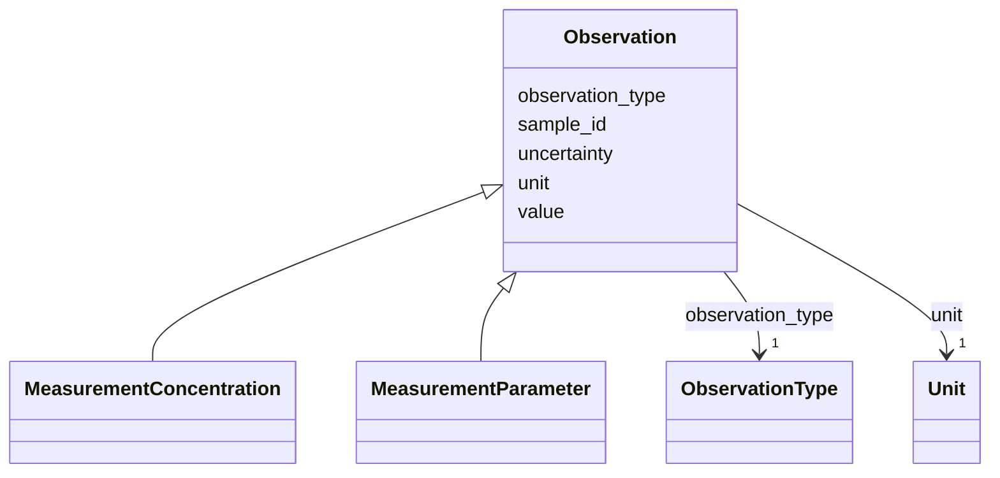

---
search:
  boost: 10.0
---

# Class: Observation 


_Abstract base class for all observations associated with a sample. Every observation must be either a MeasurementConcentration or a MeasurementParameter. Contains shared slots (unit, uncertainty, value) common to all observation types._


<div data-search-exclude markdown="1">


* __NOTE__: this is an abstract class and should not be instantiated directly


URI: [cenvo:Observation](https://w3id.org/chemical-exposome/schema/chemicals-outdoor/Observation)





## Inheritance
* **Observation**
    * [MeasurementConcentration](MeasurementConcentration.md)
    * [MeasurementParameter](MeasurementParameter.md)


## Slots

| Name | Cardinality and Range | Description | Inheritance |
| ---  | --- | --- | --- |
| [sample_id](sample_id.md) | 1 [String](String.md) | Unique identifier for the sample | direct |
| [unit](unit.md) | 1 [Unit](Unit.md) | Unit of measurement | direct |
| [uncertainty](uncertainty.md) | 0..1 [Double](Double.md) | Measurement uncertainty of the concentration/paramter value, expressed as a p... | direct |
| [value](value.md) | 0..1 [Double](Double.md) | Measured value of the chemical concentration or other parameter | direct |
| [observation_type](observation_type.md) | 1 [ObservationType](ObservationType.md) | Type of measurement/observation: i) Chemical concentration in the environment... | direct |


## Usages

| used by | used in | type | used |
| ---  | --- | --- | --- |
| [Sample](Sample.md) | [observations](observations.md) | range | [Observation](Observation.md) |
| [Atmospheric](Atmospheric.md) | [observations](observations.md) | range | [Observation](Observation.md) |
| [Aquatic](Aquatic.md) | [observations](observations.md) | range | [Observation](Observation.md) |
| [Terrestrial](Terrestrial.md) | [observations](observations.md) | range | [Observation](Observation.md) |
| [Biota](Biota.md) | [observations](observations.md) | range | [Observation](Observation.md) |


## Identifier and Mapping Information


### Schema Source


* from schema: https://w3id.org/chemical-exposome/schema/chemicals-outdoor


## Mappings

| Mapping Type | Mapped Value |
| ---  | ---  |
| self | cenvo:Observation |
| native | cenvo:Observation |


## LinkML Source

<!-- TODO: investigate https://stackoverflow.com/questions/37606292/how-to-create-tabbed-code-blocks-in-mkdocs-or-sphinx -->

### Direct

<details>
```yaml
name: Observation
description: Abstract base class for all observations associated with a sample. Every
  observation must be either a MeasurementConcentration or a MeasurementParameter.
  Contains shared slots (unit, uncertainty, value) common to all observation types.
from_schema: https://w3id.org/chemical-exposome/schema/chemicals-outdoor
abstract: true
slots:
- sample_id
- unit
- uncertainty
- value
attributes:
  observation_type:
    name: observation_type
    description: 'Type of measurement/observation: i) Chemical concentration in the
      environment or biota - main observation and; ii) Other parameters - they give
      context to the main measurement.'
    in_subset:
    - mandatory
    from_schema: https://w3id.org/chemical-exposome/schema/chemicals-outdoor
    rank: 1000
    designates_type: true
    domain_of:
    - Observation
    range: ObservationType
    required: true

```
</details>

### Induced

<details>
```yaml
name: Observation
description: Abstract base class for all observations associated with a sample. Every
  observation must be either a MeasurementConcentration or a MeasurementParameter.
  Contains shared slots (unit, uncertainty, value) common to all observation types.
from_schema: https://w3id.org/chemical-exposome/schema/chemicals-outdoor
abstract: true
attributes:
  observation_type:
    name: observation_type
    description: 'Type of measurement/observation: i) Chemical concentration in the
      environment or biota - main observation and; ii) Other parameters - they give
      context to the main measurement.'
    in_subset:
    - mandatory
    from_schema: https://w3id.org/chemical-exposome/schema/chemicals-outdoor
    rank: 1000
    designates_type: true
    owner: Observation
    domain_of:
    - Observation
    range: ObservationType
    required: true
  sample_id:
    name: sample_id
    description: Unique identifier for the sample
    in_subset:
    - mandatory
    from_schema: https://w3id.org/chemical-exposome/schema/chemicals-outdoor
    rank: 1000
    owner: Observation
    domain_of:
    - Sample
    - Observation
    range: string
    required: true
  unit:
    name: unit
    description: Unit of measurement
    in_subset:
    - mandatory
    from_schema: https://w3id.org/chemical-exposome/schema/chemicals-outdoor
    rank: 1000
    owner: Observation
    domain_of:
    - Observation
    range: Unit
    required: true
  uncertainty:
    name: uncertainty
    description: 'Measurement uncertainty of the concentration/paramter value, expressed
      as a percentage (%) at 95% confidence level.  '
    from_schema: https://w3id.org/chemical-exposome/schema/chemicals-outdoor
    rank: 1000
    owner: Observation
    domain_of:
    - Observation
    range: double
    minimum_value: 0
  value:
    name: value
    description: Measured value of the chemical concentration or other parameter
    in_subset:
    - mandatory
    from_schema: https://w3id.org/chemical-exposome/schema/chemicals-outdoor
    rank: 1000
    owner: Observation
    domain_of:
    - Observation
    range: double
    required: false

```
</details></div>