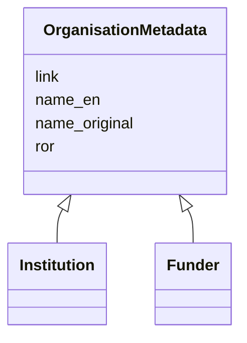

---
search:
  boost: 10.0
---

# Class: OrganisationMetadata 


_Shared metadata for organisations — institutions and funders._


<div data-search-exclude markdown="1">


URI: [cenvo:OrganisationMetadata](https://w3id.org/chemical-exposome/schema/chemicals-outdoor/OrganisationMetadata)





<!-- no inheritance hierarchy -->

## Class Properties

| Property | Value |
| --- | --- |
| Mixin | Yes |


## Slots

| Name | Cardinality and Range | Description | Inheritance |
| ---  | --- | --- | --- |
| [name_en](name_en.md) | 1 [String](String.md) | Name or designation in English | direct |
| [name_original](name_original.md) | 1 [String](String.md) | Name of the entity in the original language of the  institution/site/project | direct |
| [ror](ror.md) | 0..1 [RorIdentifier](RorIdentifier.md) | ROR identifier of the institution (format ror | direct |
| [link](link.md) | 0..1 [IRI](IRI.md) | URL with information about the institution | direct |


## Mixin Usage

| mixed into | description |
| --- | --- |
| [Institution](Institution.md) | Institution |
| [Funder](Funder.md) | Funder |


## Identifier and Mapping Information


### Schema Source


* from schema: https://w3id.org/chemical-exposome/schema/chemicals-outdoor


## Mappings

| Mapping Type | Mapped Value |
| ---  | ---  |
| self | cenvo:OrganisationMetadata |
| native | cenvo:OrganisationMetadata |


## LinkML Source

<!-- TODO: investigate https://stackoverflow.com/questions/37606292/how-to-create-tabbed-code-blocks-in-mkdocs-or-sphinx -->

### Direct

<details>
```yaml
name: OrganisationMetadata
description: Shared metadata for organisations — institutions and funders.
from_schema: https://w3id.org/chemical-exposome/schema/chemicals-outdoor
mixin: true
slots:
- name_en
- name_original
- ror
- link

```
</details>

### Induced

<details>
```yaml
name: OrganisationMetadata
description: Shared metadata for organisations — institutions and funders.
from_schema: https://w3id.org/chemical-exposome/schema/chemicals-outdoor
mixin: true
attributes:
  name_en:
    name: name_en
    description: Name or designation in English
    in_subset:
    - mandatory_if
    from_schema: https://w3id.org/chemical-exposome/schema/chemicals-outdoor
    rank: 1000
    owner: OrganisationMetadata
    domain_of:
    - MonitoringActivity
    - Campaign
    - OrganisationMetadata
    range: string
    required: true
  name_original:
    name: name_original
    description: Name of the entity in the original language of the  institution/site/project.
      Use the local official name.
    in_subset:
    - mandatory
    from_schema: https://w3id.org/chemical-exposome/schema/chemicals-outdoor
    rank: 1000
    owner: OrganisationMetadata
    domain_of:
    - MonitoringActivity
    - OrganisationMetadata
    range: string
    required: true
  ror:
    name: ror
    description: ROR identifier of the institution (format ror.org/xxxxxxxx)
    from_schema: https://w3id.org/chemical-exposome/schema/chemicals-outdoor
    rank: 1000
    owner: OrganisationMetadata
    domain_of:
    - OrganisationMetadata
    range: RorIdentifier
  link:
    name: link
    description: URL with information about the institution
    from_schema: https://w3id.org/chemical-exposome/schema/chemicals-outdoor
    rank: 1000
    owner: OrganisationMetadata
    domain_of:
    - OrganisationMetadata
    - Site
    range: IRI

```
</details></div>