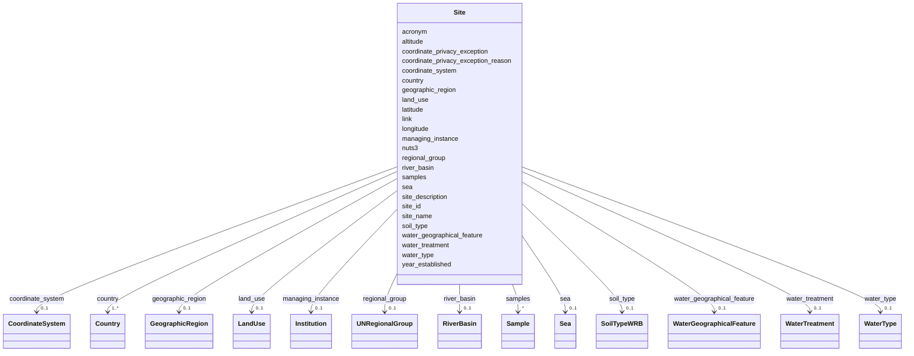

---
search:
  boost: 10.0
---

# Class: Site 


_A monitoring site or location where samples are collected. Coordinates (latitude and longitude) are mandatory unless they cannot be provided for privacy, security or confidentiality reasons. When coordinates are provided, GIS-derived fields (NUTS3, land use, river basin, sea, soil type) can be automatically retrieved from GIS layers. When coordinates are not provided, expert-described location fields (country, geographic region, NUTS3) are required instead._


<div data-search-exclude markdown="1">


URI: [cenvo:Site](https://w3id.org/chemical-exposome/schema/chemicals-outdoor/Site)





<!-- no inheritance hierarchy -->

## Slots

| Name | Cardinality and Range | Description | Inheritance |
| ---  | --- | --- | --- |
| [acronym](acronym.md) | 0..1 [String](String.md) | Short name or acronym | direct |
| [country](country.md) | 1..* [Country](Country.md) | Country code(s) according to ISO 3166-1 alpha-2 | direct |
| [site_id](site_id.md) | 1 [String](String.md) | Unique identifier of the monitoring site where the sample was collected | direct |
| [site_name](site_name.md) | 1 [String](String.md) | Name of the monitoring site | direct |
| [link](link.md) | 0..1 [IRI](IRI.md) | URL with information about the institution | direct |
| [coordinate_privacy_exception](coordinate_privacy_exception.md) | 0..1 [Boolean](Boolean.md) | Set to true (value = true) if coordinates cannot be provided for privacy, sec... | direct |
| [coordinate_privacy_exception_reason](coordinate_privacy_exception_reason.md) | 0..1 [String](String.md) | Justification for not providing coordinates | direct |
| [samples](samples.md) | * [Sample](Sample.md) | Samples collected at this monitoring site | direct |
| [latitude](latitude.md) | 0..1 [DecimalDegree](DecimalDegree.md) | Latitude in signed decimal degrees (format 0 | direct |
| [longitude](longitude.md) | 0..1 [DecimalDegree](DecimalDegree.md) | Longitude in signed decimal degrees (format 0 | direct |
| [coordinate_system](coordinate_system.md) | 0..1 [CoordinateSystem](CoordinateSystem.md) | Coordinate reference system used | direct |
| [geographic_region](geographic_region.md) | 0..1 [GeographicRegion](GeographicRegion.md) | UN M49 geographic region | direct |
| [regional_group](regional_group.md) | 0..1 [UNRegionalGroup](UNRegionalGroup.md) | Regional group of United Nations member states | direct |
| [nuts3](nuts3.md) | 0..1 [String](String.md) | NUTS3 region code according to the Eurostat NUTS classification (Nomenclature... | direct |
| [year_established](year_established.md) | 0..1 [YearValue](YearValue.md) | Year of establishment of the monitoring station (YYYY) | direct |
| [site_description](site_description.md) | 0..1 [String](String.md) | Description of the site where samples were collected | direct |
| [managing_instance](managing_instance.md) | 0..1 [Institution](Institution.md) | The institution that manages the sampling site | direct |
| [water_type](water_type.md) | 0..1 [WaterType](WaterType.md) | Type of water body at the site | direct |
| [water_geographical_feature](water_geographical_feature.md) | 0..1 [WaterGeographicalFeature](WaterGeographicalFeature.md) | Geographical water feature type at the site | direct |
| [water_treatment](water_treatment.md) | 0..1 [WaterTreatment](WaterTreatment.md) | Water treatment status at the site | direct |
| [altitude](altitude.md) | 0..1 [Double](Double.md) | Altitude in meters above sea level (MSL) | direct |
| [land_use](land_use.md) | 0..1 [LandUse](LandUse.md) | Land use classification according to CORINE Land Cover nomenclature | direct |
| [river_basin](river_basin.md) | 0..1 [RiverBasin](RiverBasin.md) | River basin associated with the site, based on the EEA river basin districts ... | direct |
| [sea](sea.md) | 0..1 [Sea](Sea.md) | Sea or ocean associated with the site, based on the Marine Regions Gazetteer | direct |
| [soil_type](soil_type.md) | 0..1 [SoilTypeWRB](SoilTypeWRB.md) | World Reference Base for Soil Resources (WRB) 2006/2007 Reference Soil Group ... | direct |


## Usages

| used by | used in | type | used |
| ---  | --- | --- | --- |
| [MonitoringActivity](MonitoringActivity.md) | [sites](sites.md) | range | [Site](Site.md) |


## Rules


### coordinates_required_when_no_privacy_exception

| Rule Applied | Preconditions | Postconditions | Elseconditions |
|--------------|---------------|----------------|----------------|
| slot_conditions |```{'coordinate_privacy_exception': {'equals_string': 'false'}}``` |```{'latitude': {'required': True}, 'longitude': {'required': True}}``` | |


### expert_fields_required_when_coordinates_withheld

| Rule Applied | Preconditions | Postconditions | Elseconditions |
|--------------|---------------|----------------|----------------|
| slot_conditions |```{'coordinate_privacy_exception': {'equals_string': 'true'}}``` |```{'coordinate_privacy_exception_reason': {'required': True}, 'country': {'required': True}, 'geographic_region': {'required': True}, 'nuts3': {'required': True}, 'regional_group': {'required': True}}``` | |


## Identifier and Mapping Information


### Schema Source


* from schema: https://w3id.org/chemical-exposome/schema/chemicals-outdoor


## Mappings

| Mapping Type | Mapped Value |
| ---  | ---  |
| self | cenvo:Site |
| native | cenvo:Site |


## LinkML Source

<!-- TODO: investigate https://stackoverflow.com/questions/37606292/how-to-create-tabbed-code-blocks-in-mkdocs-or-sphinx -->

### Direct

<details>
```yaml
name: Site
description: A monitoring site or location where samples are collected. Coordinates
  (latitude and longitude) are mandatory unless they cannot be provided for privacy,
  security or confidentiality reasons. When coordinates are provided, GIS-derived
  fields (NUTS3, land use, river basin, sea, soil type) can be automatically retrieved
  from GIS layers. When coordinates are not provided, expert-described location fields
  (country, geographic region, NUTS3) are required instead.
from_schema: https://w3id.org/chemical-exposome/schema/chemicals-outdoor
slots:
- acronym
- country
- site_id
- site_name
- link
slot_usage:
  country:
    name: country
    description: Country code(s) according to ISO 3166-1 alpha-2. Extended with XX
      (unknown) and XZ (international waters).
    in_subset:
    - mandatory_if
    multivalued: true
  site_id:
    name: site_id
    identifier: true
attributes:
  coordinate_privacy_exception:
    name: coordinate_privacy_exception
    description: Set to true (value = true) if coordinates cannot be provided for
      privacy, security or confidentiality reasons. If true, expert location fields
      (country, geographic_region, nuts3) are required instead.  Optional - if not
      provided, it is assumed coordinates are not withheld for privacy reasons.
    from_schema: https://w3id.org/chemical-exposome/schema/chemicals-outdoor
    rank: 1000
    ifabsent: 'false'
    domain_of:
    - Site
    range: boolean
    required: false
  coordinate_privacy_exception_reason:
    name: coordinate_privacy_exception_reason
    description: Justification for not providing coordinates. Required when coordinate_privacy_exception
      is true. Provide a brief explanation of the privacy, security or confidentiality
      reason that prevents disclosure of the exact site location.
    in_subset:
    - mandatory_if
    from_schema: https://w3id.org/chemical-exposome/schema/chemicals-outdoor
    rank: 1000
    domain_of:
    - Site
    range: string
    required: false
  samples:
    name: samples
    description: Samples collected at this monitoring site.
    from_schema: https://w3id.org/chemical-exposome/schema/chemicals-outdoor
    rank: 1000
    domain_of:
    - Site
    range: Sample
    required: false
    multivalued: true
    inlined_as_list: true
  latitude:
    name: latitude
    description: 'Latitude in signed decimal degrees (format 0.000000, range -90 to
      90). South latitude with minus sign. Coordinate reference system: WGS 84 (EPSG:4326).
      Mandatory unless coordinate_privacy_exception is true.'
    in_subset:
    - mandatory_if
    from_schema: https://w3id.org/chemical-exposome/schema/chemicals-outdoor
    rank: 1000
    domain_of:
    - Site
    range: DecimalDegree
    required: false
    minimum_value: -90
    maximum_value: 90
  longitude:
    name: longitude
    description: 'Longitude in signed decimal degrees (format 0.000000, range -180
      to 180). West longitude with minus sign. Coordinate reference system: WGS 84
      (EPSG:4326). Mandatory unless coordinate_privacy_exception is true.'
    in_subset:
    - mandatory_if
    from_schema: https://w3id.org/chemical-exposome/schema/chemicals-outdoor
    rank: 1000
    domain_of:
    - Site
    range: DecimalDegree
    required: false
    minimum_value: -180
    maximum_value: 180
  coordinate_system:
    name: coordinate_system
    description: Coordinate reference system used. Default is EPSG:4326 (WGS 84).
    in_subset:
    - mandatory_if
    from_schema: https://w3id.org/chemical-exposome/schema/chemicals-outdoor
    rank: 1000
    domain_of:
    - Site
    range: CoordinateSystem
    required: false
  geographic_region:
    name: geographic_region
    description: UN M49 geographic region
    in_subset:
    - mandatory_if
    from_schema: https://w3id.org/chemical-exposome/schema/chemicals-outdoor
    rank: 1000
    domain_of:
    - Site
    range: GeographicRegion
    required: false
  regional_group:
    name: regional_group
    description: Regional group of United Nations member states
    in_subset:
    - mandatory_if
    from_schema: https://w3id.org/chemical-exposome/schema/chemicals-outdoor
    rank: 1000
    domain_of:
    - Site
    range: UNRegionalGroup
    required: false
  nuts3:
    name: nuts3
    description: 'NUTS3 region code according to the Eurostat NUTS classification
      (Nomenclature of Territorial Units for Statistics), level 3. Example: CZ080
      (Moravskoslezsky kraj), DE300 (Berlin). If NUTS3 is not applicable (e.g. non-EU
      countries), use an alternative administrative classification.'
    in_subset:
    - mandatory_if
    from_schema: https://w3id.org/chemical-exposome/schema/chemicals-outdoor
    see_also:
    - http://data.europa.eu/nuts/
    rank: 1000
    domain_of:
    - Site
    range: string
    required: false
    pattern: ^[A-Z]{2}[A-Z0-9]{3,4}$
  year_established:
    name: year_established
    description: Year of establishment of the monitoring station (YYYY)
    from_schema: https://w3id.org/chemical-exposome/schema/chemicals-outdoor
    rank: 1000
    domain_of:
    - Site
    range: YearValue
    required: false
  site_description:
    name: site_description
    description: Description of the site where samples were collected. Provide all
      important information that cannot be captured in other fields.
    from_schema: https://w3id.org/chemical-exposome/schema/chemicals-outdoor
    rank: 1000
    domain_of:
    - Site
    range: string
    required: false
  managing_instance:
    name: managing_instance
    description: The institution that manages the sampling site
    from_schema: https://w3id.org/chemical-exposome/schema/chemicals-outdoor
    rank: 1000
    domain_of:
    - Site
    range: Institution
    required: false
  water_type:
    name: water_type
    description: Type of water body at the site. Only relevant for water and sediment
      sampling.
    from_schema: https://w3id.org/chemical-exposome/schema/chemicals-outdoor
    rank: 1000
    domain_of:
    - Site
    range: WaterType
    required: false
  water_geographical_feature:
    name: water_geographical_feature
    description: Geographical water feature type at the site. Only relevant for water
      and sediment sampling.
    from_schema: https://w3id.org/chemical-exposome/schema/chemicals-outdoor
    rank: 1000
    domain_of:
    - Site
    range: WaterGeographicalFeature
    required: false
  water_treatment:
    name: water_treatment
    description: Water treatment status at the site. Only relevant for water and sediment
      sampling.
    from_schema: https://w3id.org/chemical-exposome/schema/chemicals-outdoor
    rank: 1000
    domain_of:
    - Site
    range: WaterTreatment
    required: false
  altitude:
    name: altitude
    description: Altitude in meters above sea level (MSL). Use positive values for
      above and negative for below sea level.
    from_schema: https://w3id.org/chemical-exposome/schema/chemicals-outdoor
    rank: 1000
    domain_of:
    - Site
    range: double
    required: false
  land_use:
    name: land_use
    description: Land use classification according to CORINE Land Cover nomenclature.
    from_schema: https://w3id.org/chemical-exposome/schema/chemicals-outdoor
    see_also:
    - https://www.w3.org/2015/03/corine
    rank: 1000
    domain_of:
    - Site
    range: LandUse
    required: false
  river_basin:
    name: river_basin
    description: River basin associated with the site, based on the EEA river basin
      districts dataset. Only relevant for water and sediment sampling.
    from_schema: https://w3id.org/chemical-exposome/schema/chemicals-outdoor
    see_also:
    - https://www.eea.europa.eu/en/datahub/datahubitem-view/dc1b1cdf-5fa0-4535-8c89-10cc051e00db
    rank: 1000
    domain_of:
    - Site
    range: RiverBasin
    required: false
  sea:
    name: sea
    description: Sea or ocean associated with the site, based on the Marine Regions
      Gazetteer. Only relevant for water and sediment sampling.
    from_schema: https://w3id.org/chemical-exposome/schema/chemicals-outdoor
    see_also:
    - https://www.marineregions.org
    rank: 1000
    domain_of:
    - Site
    range: Sea
    required: false
  soil_type:
    name: soil_type
    description: World Reference Base for Soil Resources (WRB) 2006/2007 Reference
      Soil Group at the site. Only relevant for soil sampling.
    from_schema: https://w3id.org/chemical-exposome/schema/chemicals-outdoor
    see_also:
    - https://inspire.ec.europa.eu/codelist/WRBReferenceSoilGroupValue
    rank: 1000
    domain_of:
    - Site
    range: SoilTypeWRB
    required: false
rules:
- preconditions:
    slot_conditions:
      coordinate_privacy_exception:
        name: coordinate_privacy_exception
        equals_string: 'false'
  postconditions:
    slot_conditions:
      latitude:
        name: latitude
        required: true
      longitude:
        name: longitude
        required: true
  description: Coordinates are mandatory when coordinate_privacy_exception is false
    or not provided (defaults to false via ifabsent).
  title: coordinates_required_when_no_privacy_exception
- preconditions:
    slot_conditions:
      coordinate_privacy_exception:
        name: coordinate_privacy_exception
        equals_string: 'true'
  postconditions:
    slot_conditions:
      coordinate_privacy_exception_reason:
        name: coordinate_privacy_exception_reason
        required: true
      country:
        name: country
        required: true
      geographic_region:
        name: geographic_region
        required: true
      nuts3:
        name: nuts3
        required: true
      regional_group:
        name: regional_group
        required: true
  description: When coordinates cannot be provided for privacy or confidentiality
    reasons, a justification and expert location fields must be provided.
  title: expert_fields_required_when_coordinates_withheld

```
</details>

### Induced

<details>
```yaml
name: Site
description: A monitoring site or location where samples are collected. Coordinates
  (latitude and longitude) are mandatory unless they cannot be provided for privacy,
  security or confidentiality reasons. When coordinates are provided, GIS-derived
  fields (NUTS3, land use, river basin, sea, soil type) can be automatically retrieved
  from GIS layers. When coordinates are not provided, expert-described location fields
  (country, geographic region, NUTS3) are required instead.
from_schema: https://w3id.org/chemical-exposome/schema/chemicals-outdoor
slot_usage:
  country:
    name: country
    description: Country code(s) according to ISO 3166-1 alpha-2. Extended with XX
      (unknown) and XZ (international waters).
    in_subset:
    - mandatory_if
    multivalued: true
  site_id:
    name: site_id
    identifier: true
attributes:
  coordinate_privacy_exception:
    name: coordinate_privacy_exception
    description: Set to true (value = true) if coordinates cannot be provided for
      privacy, security or confidentiality reasons. If true, expert location fields
      (country, geographic_region, nuts3) are required instead.  Optional - if not
      provided, it is assumed coordinates are not withheld for privacy reasons.
    from_schema: https://w3id.org/chemical-exposome/schema/chemicals-outdoor
    rank: 1000
    ifabsent: 'false'
    owner: Site
    domain_of:
    - Site
    range: boolean
    required: false
  coordinate_privacy_exception_reason:
    name: coordinate_privacy_exception_reason
    description: Justification for not providing coordinates. Required when coordinate_privacy_exception
      is true. Provide a brief explanation of the privacy, security or confidentiality
      reason that prevents disclosure of the exact site location.
    in_subset:
    - mandatory_if
    from_schema: https://w3id.org/chemical-exposome/schema/chemicals-outdoor
    rank: 1000
    owner: Site
    domain_of:
    - Site
    range: string
    required: false
  samples:
    name: samples
    description: Samples collected at this monitoring site.
    from_schema: https://w3id.org/chemical-exposome/schema/chemicals-outdoor
    rank: 1000
    owner: Site
    domain_of:
    - Site
    range: Sample
    required: false
    multivalued: true
    inlined: true
    inlined_as_list: true
  latitude:
    name: latitude
    description: 'Latitude in signed decimal degrees (format 0.000000, range -90 to
      90). South latitude with minus sign. Coordinate reference system: WGS 84 (EPSG:4326).
      Mandatory unless coordinate_privacy_exception is true.'
    in_subset:
    - mandatory_if
    from_schema: https://w3id.org/chemical-exposome/schema/chemicals-outdoor
    rank: 1000
    owner: Site
    domain_of:
    - Site
    range: DecimalDegree
    required: false
    minimum_value: -90
    maximum_value: 90
  longitude:
    name: longitude
    description: 'Longitude in signed decimal degrees (format 0.000000, range -180
      to 180). West longitude with minus sign. Coordinate reference system: WGS 84
      (EPSG:4326). Mandatory unless coordinate_privacy_exception is true.'
    in_subset:
    - mandatory_if
    from_schema: https://w3id.org/chemical-exposome/schema/chemicals-outdoor
    rank: 1000
    owner: Site
    domain_of:
    - Site
    range: DecimalDegree
    required: false
    minimum_value: -180
    maximum_value: 180
  coordinate_system:
    name: coordinate_system
    description: Coordinate reference system used. Default is EPSG:4326 (WGS 84).
    in_subset:
    - mandatory_if
    from_schema: https://w3id.org/chemical-exposome/schema/chemicals-outdoor
    rank: 1000
    owner: Site
    domain_of:
    - Site
    range: CoordinateSystem
    required: false
  geographic_region:
    name: geographic_region
    description: UN M49 geographic region
    in_subset:
    - mandatory_if
    from_schema: https://w3id.org/chemical-exposome/schema/chemicals-outdoor
    rank: 1000
    owner: Site
    domain_of:
    - Site
    range: GeographicRegion
    required: false
  regional_group:
    name: regional_group
    description: Regional group of United Nations member states
    in_subset:
    - mandatory_if
    from_schema: https://w3id.org/chemical-exposome/schema/chemicals-outdoor
    rank: 1000
    owner: Site
    domain_of:
    - Site
    range: UNRegionalGroup
    required: false
  nuts3:
    name: nuts3
    description: 'NUTS3 region code according to the Eurostat NUTS classification
      (Nomenclature of Territorial Units for Statistics), level 3. Example: CZ080
      (Moravskoslezsky kraj), DE300 (Berlin). If NUTS3 is not applicable (e.g. non-EU
      countries), use an alternative administrative classification.'
    in_subset:
    - mandatory_if
    from_schema: https://w3id.org/chemical-exposome/schema/chemicals-outdoor
    see_also:
    - http://data.europa.eu/nuts/
    rank: 1000
    owner: Site
    domain_of:
    - Site
    range: string
    required: false
    pattern: ^[A-Z]{2}[A-Z0-9]{3,4}$
  year_established:
    name: year_established
    description: Year of establishment of the monitoring station (YYYY)
    from_schema: https://w3id.org/chemical-exposome/schema/chemicals-outdoor
    rank: 1000
    owner: Site
    domain_of:
    - Site
    range: YearValue
    required: false
  site_description:
    name: site_description
    description: Description of the site where samples were collected. Provide all
      important information that cannot be captured in other fields.
    from_schema: https://w3id.org/chemical-exposome/schema/chemicals-outdoor
    rank: 1000
    owner: Site
    domain_of:
    - Site
    range: string
    required: false
  managing_instance:
    name: managing_instance
    description: The institution that manages the sampling site
    from_schema: https://w3id.org/chemical-exposome/schema/chemicals-outdoor
    rank: 1000
    owner: Site
    domain_of:
    - Site
    range: Institution
    required: false
  water_type:
    name: water_type
    description: Type of water body at the site. Only relevant for water and sediment
      sampling.
    from_schema: https://w3id.org/chemical-exposome/schema/chemicals-outdoor
    rank: 1000
    owner: Site
    domain_of:
    - Site
    range: WaterType
    required: false
  water_geographical_feature:
    name: water_geographical_feature
    description: Geographical water feature type at the site. Only relevant for water
      and sediment sampling.
    from_schema: https://w3id.org/chemical-exposome/schema/chemicals-outdoor
    rank: 1000
    owner: Site
    domain_of:
    - Site
    range: WaterGeographicalFeature
    required: false
  water_treatment:
    name: water_treatment
    description: Water treatment status at the site. Only relevant for water and sediment
      sampling.
    from_schema: https://w3id.org/chemical-exposome/schema/chemicals-outdoor
    rank: 1000
    owner: Site
    domain_of:
    - Site
    range: WaterTreatment
    required: false
  altitude:
    name: altitude
    description: Altitude in meters above sea level (MSL). Use positive values for
      above and negative for below sea level.
    from_schema: https://w3id.org/chemical-exposome/schema/chemicals-outdoor
    rank: 1000
    owner: Site
    domain_of:
    - Site
    range: double
    required: false
  land_use:
    name: land_use
    description: Land use classification according to CORINE Land Cover nomenclature.
    from_schema: https://w3id.org/chemical-exposome/schema/chemicals-outdoor
    see_also:
    - https://www.w3.org/2015/03/corine
    rank: 1000
    owner: Site
    domain_of:
    - Site
    range: LandUse
    required: false
  river_basin:
    name: river_basin
    description: River basin associated with the site, based on the EEA river basin
      districts dataset. Only relevant for water and sediment sampling.
    from_schema: https://w3id.org/chemical-exposome/schema/chemicals-outdoor
    see_also:
    - https://www.eea.europa.eu/en/datahub/datahubitem-view/dc1b1cdf-5fa0-4535-8c89-10cc051e00db
    rank: 1000
    owner: Site
    domain_of:
    - Site
    range: RiverBasin
    required: false
  sea:
    name: sea
    description: Sea or ocean associated with the site, based on the Marine Regions
      Gazetteer. Only relevant for water and sediment sampling.
    from_schema: https://w3id.org/chemical-exposome/schema/chemicals-outdoor
    see_also:
    - https://www.marineregions.org
    rank: 1000
    owner: Site
    domain_of:
    - Site
    range: Sea
    required: false
  soil_type:
    name: soil_type
    description: World Reference Base for Soil Resources (WRB) 2006/2007 Reference
      Soil Group at the site. Only relevant for soil sampling.
    from_schema: https://w3id.org/chemical-exposome/schema/chemicals-outdoor
    see_also:
    - https://inspire.ec.europa.eu/codelist/WRBReferenceSoilGroupValue
    rank: 1000
    owner: Site
    domain_of:
    - Site
    range: SoilTypeWRB
    required: false
  acronym:
    name: acronym
    description: Short name or acronym.
    in_subset:
    - mandatory_if
    from_schema: https://w3id.org/chemical-exposome/schema/chemicals-outdoor
    rank: 1000
    owner: Site
    domain_of:
    - MonitoringActivity
    - Campaign
    - Institution
    - Site
    range: string
  country:
    name: country
    description: Country code(s) according to ISO 3166-1 alpha-2. Extended with XX
      (unknown) and XZ (international waters).
    in_subset:
    - mandatory_if
    from_schema: https://w3id.org/chemical-exposome/schema/chemicals-outdoor
    rank: 1000
    owner: Site
    domain_of:
    - Institution
    - Site
    range: Country
    required: true
    multivalued: true
  site_id:
    name: site_id
    description: Unique identifier of the monitoring site where the sample was collected.
      References the site_id of a Site record.
    in_subset:
    - mandatory
    from_schema: https://w3id.org/chemical-exposome/schema/chemicals-outdoor
    rank: 1000
    identifier: true
    owner: Site
    domain_of:
    - Site
    - Sample
    range: string
    required: true
  site_name:
    name: site_name
    description: Name of the monitoring site. Provide in the local language as the
      primary name. An English name may be added if available and commonly used. Multiple
      names in different languages are accepted.
    in_subset:
    - mandatory
    from_schema: https://w3id.org/chemical-exposome/schema/chemicals-outdoor
    rank: 1000
    owner: Site
    domain_of:
    - Site
    - Sample
    range: string
    required: true
  link:
    name: link
    description: URL with information about the institution
    from_schema: https://w3id.org/chemical-exposome/schema/chemicals-outdoor
    rank: 1000
    owner: Site
    domain_of:
    - OrganisationMetadata
    - Site
    range: IRI
rules:
- preconditions:
    slot_conditions:
      coordinate_privacy_exception:
        name: coordinate_privacy_exception
        equals_string: 'false'
  postconditions:
    slot_conditions:
      latitude:
        name: latitude
        required: true
      longitude:
        name: longitude
        required: true
  description: Coordinates are mandatory when coordinate_privacy_exception is false
    or not provided (defaults to false via ifabsent).
  title: coordinates_required_when_no_privacy_exception
- preconditions:
    slot_conditions:
      coordinate_privacy_exception:
        name: coordinate_privacy_exception
        equals_string: 'true'
  postconditions:
    slot_conditions:
      coordinate_privacy_exception_reason:
        name: coordinate_privacy_exception_reason
        required: true
      country:
        name: country
        required: true
      geographic_region:
        name: geographic_region
        required: true
      nuts3:
        name: nuts3
        required: true
      regional_group:
        name: regional_group
        required: true
  description: When coordinates cannot be provided for privacy or confidentiality
    reasons, a justification and expert location fields must be provided.
  title: expert_fields_required_when_coordinates_withheld

```
</details></div>