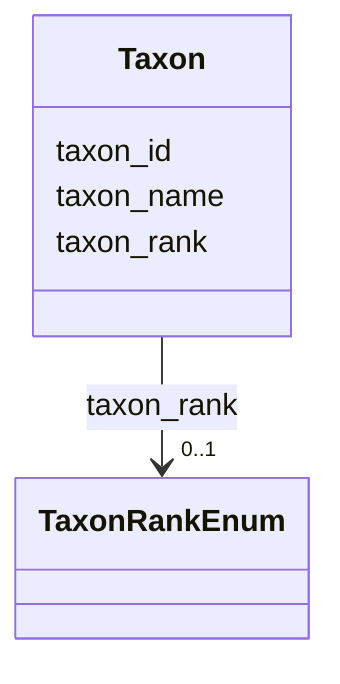

---
search:
  boost: 10.0
---

# Class: Taxon 


_A taxonomic entity identified in a biological sample, referenced against the GBIF Backbone Taxonomy._


<div data-search-exclude markdown="1">


URI: [cenvo:Taxon](https://w3id.org/chemical-exposome/schema/chemicals-outdoor/Taxon)





<!-- no inheritance hierarchy -->

## Slots

| Name | Cardinality and Range | Description | Inheritance |
| ---  | --- | --- | --- |
| [taxon_id](taxon_id.md) | 1 [Integer](Integer.md) | GBIF species key (integer) | direct |
| [taxon_name](taxon_name.md) | 1 [String](String.md) | Scientific name of the taxon (genus, species or higher rank) as accepted in t... | direct |
| [taxon_rank](taxon_rank.md) | 0..1 [TaxonRankEnum](TaxonRankEnum.md) | Taxonomic rank of the identified taxon | direct |


## Usages

| used by | used in | type | used |
| ---  | --- | --- | --- |
| [Biota](Biota.md) | [taxonomic_classification](taxonomic_classification.md) | range | [Taxon](Taxon.md) |


## See Also

* [https://www.gbif.org/species/search](https://www.gbif.org/species/search)


## Identifier and Mapping Information


### Schema Source


* from schema: https://w3id.org/chemical-exposome/schema/chemicals-outdoor


## Mappings

| Mapping Type | Mapped Value |
| ---  | ---  |
| self | cenvo:Taxon |
| native | cenvo:Taxon |


## LinkML Source

<!-- TODO: investigate https://stackoverflow.com/questions/37606292/how-to-create-tabbed-code-blocks-in-mkdocs-or-sphinx -->

### Direct

<details>
```yaml
name: Taxon
description: A taxonomic entity identified in a biological sample, referenced against
  the GBIF Backbone Taxonomy.
from_schema: https://w3id.org/chemical-exposome/schema/chemicals-outdoor
see_also:
- https://www.gbif.org/species/search
attributes:
  taxon_id:
    name: taxon_id
    description: GBIF species key (integer). Resolves to https://www.gbif.org/species/{taxon_id}
    in_subset:
    - mandatory
    from_schema: https://w3id.org/chemical-exposome/schema/chemicals-outdoor
    see_also:
    - https://www.gbif.org/species/search
    rank: 1000
    identifier: true
    domain_of:
    - Taxon
    range: integer
    required: true
  taxon_name:
    name: taxon_name
    description: Scientific name of the taxon (genus, species or higher rank) as accepted
      in the GBIF Backbone Taxonomy.
    in_subset:
    - mandatory
    from_schema: https://w3id.org/chemical-exposome/schema/chemicals-outdoor
    see_also:
    - https://www.gbif.org/species/search
    rank: 1000
    domain_of:
    - Taxon
    range: string
    required: true
  taxon_rank:
    name: taxon_rank
    description: Taxonomic rank of the identified taxon.
    from_schema: https://w3id.org/chemical-exposome/schema/chemicals-outdoor
    see_also:
    - https://www.gbif.org/developer/species#rank
    rank: 1000
    domain_of:
    - Taxon
    range: TaxonRankEnum
    required: false

```
</details>

### Induced

<details>
```yaml
name: Taxon
description: A taxonomic entity identified in a biological sample, referenced against
  the GBIF Backbone Taxonomy.
from_schema: https://w3id.org/chemical-exposome/schema/chemicals-outdoor
see_also:
- https://www.gbif.org/species/search
attributes:
  taxon_id:
    name: taxon_id
    description: GBIF species key (integer). Resolves to https://www.gbif.org/species/{taxon_id}
    in_subset:
    - mandatory
    from_schema: https://w3id.org/chemical-exposome/schema/chemicals-outdoor
    see_also:
    - https://www.gbif.org/species/search
    rank: 1000
    identifier: true
    owner: Taxon
    domain_of:
    - Taxon
    range: integer
    required: true
  taxon_name:
    name: taxon_name
    description: Scientific name of the taxon (genus, species or higher rank) as accepted
      in the GBIF Backbone Taxonomy.
    in_subset:
    - mandatory
    from_schema: https://w3id.org/chemical-exposome/schema/chemicals-outdoor
    see_also:
    - https://www.gbif.org/species/search
    rank: 1000
    owner: Taxon
    domain_of:
    - Taxon
    range: string
    required: true
  taxon_rank:
    name: taxon_rank
    description: Taxonomic rank of the identified taxon.
    from_schema: https://w3id.org/chemical-exposome/schema/chemicals-outdoor
    see_also:
    - https://www.gbif.org/developer/species#rank
    rank: 1000
    owner: Taxon
    domain_of:
    - Taxon
    range: TaxonRankEnum
    required: false

```
</details></div>