# Class Diagram

Class hierarchy and inheritance relationships.

## Sample

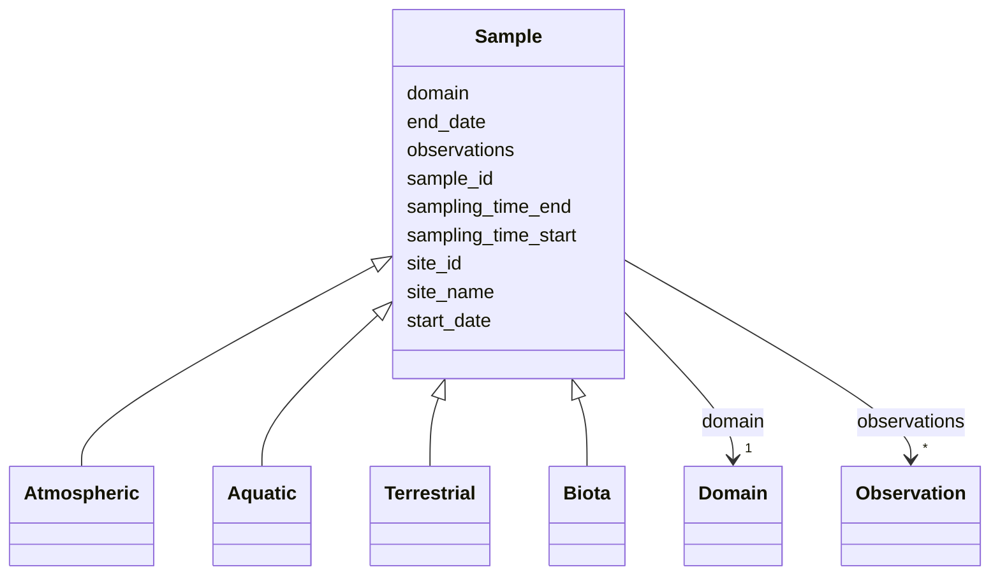

---

## Atmospheric

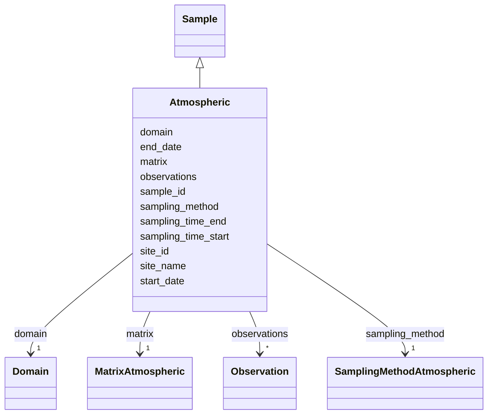

---

## Aquatic

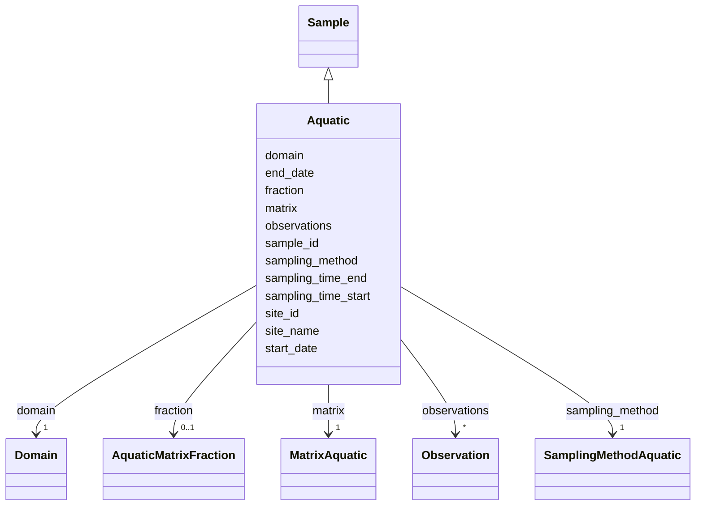

---

## Terrestrial

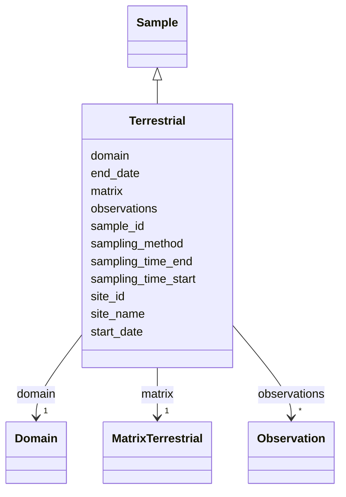

---

## Biota

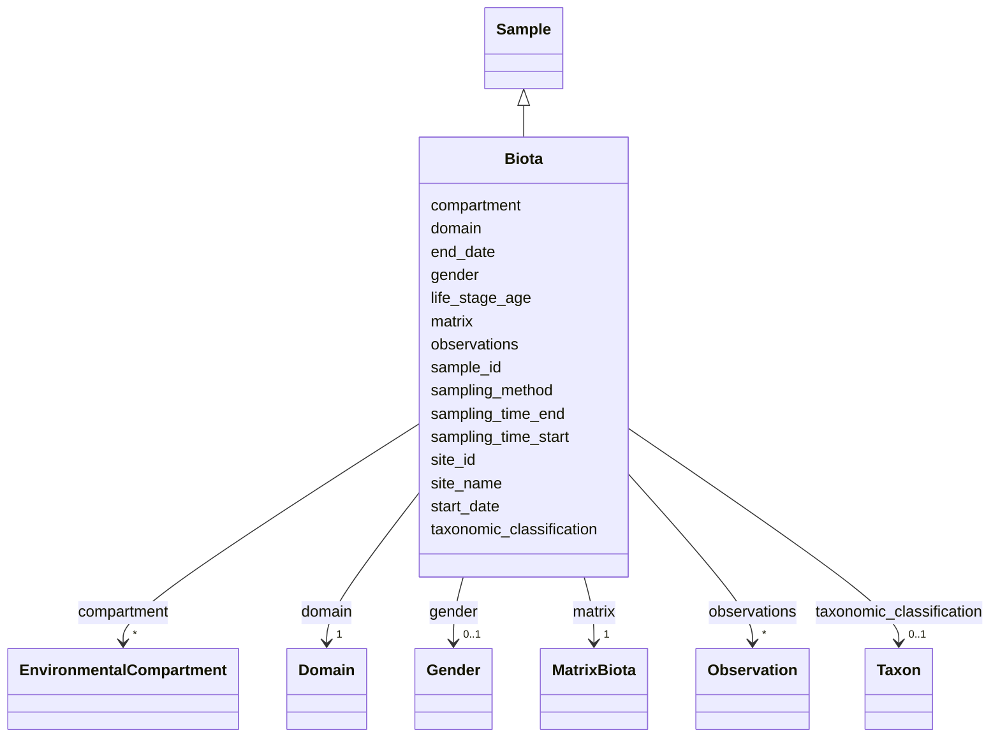

---

## Observation

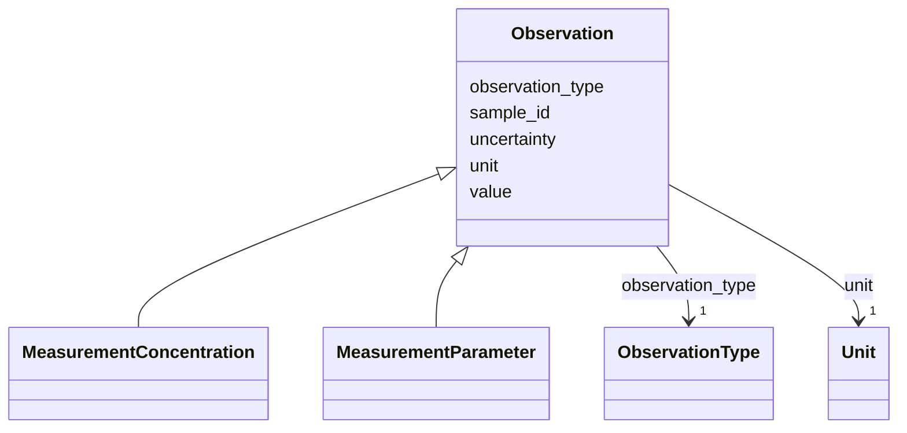

---

## MeasurementConcentration

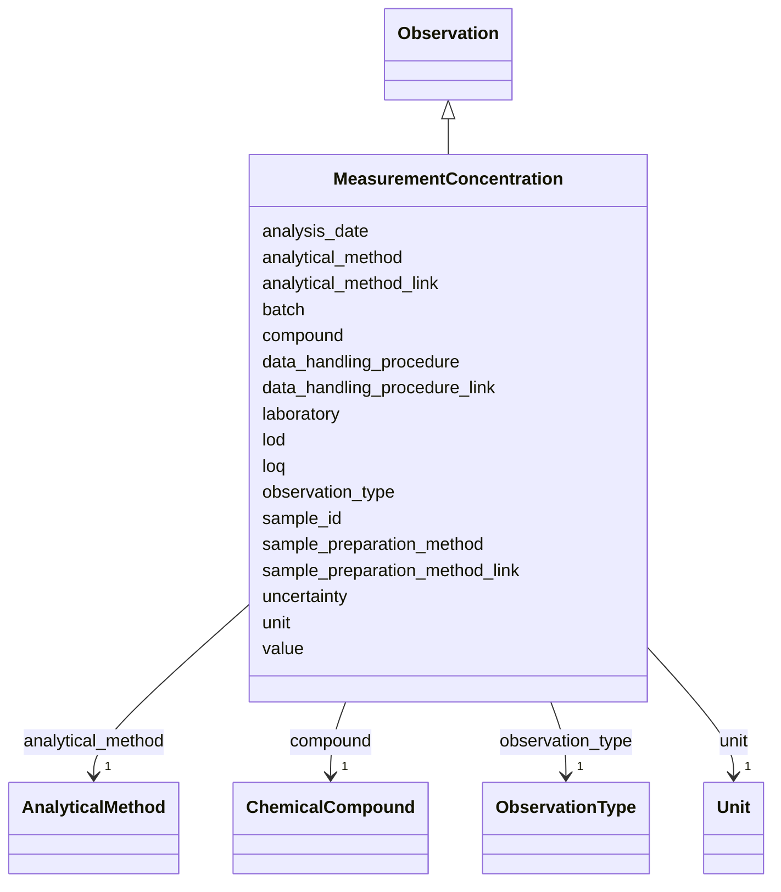

---

## MeasurementParameter

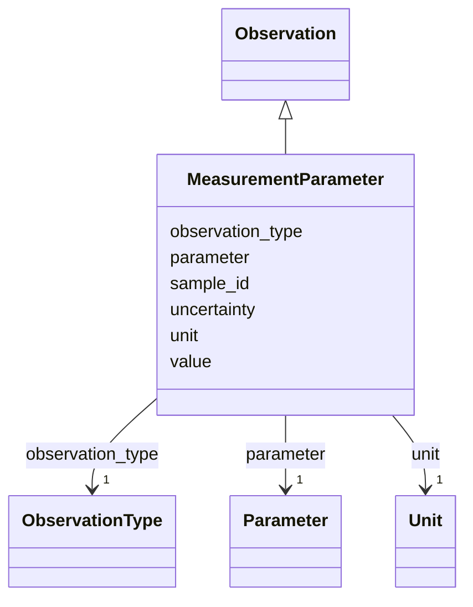

---

## MonitoringActivity

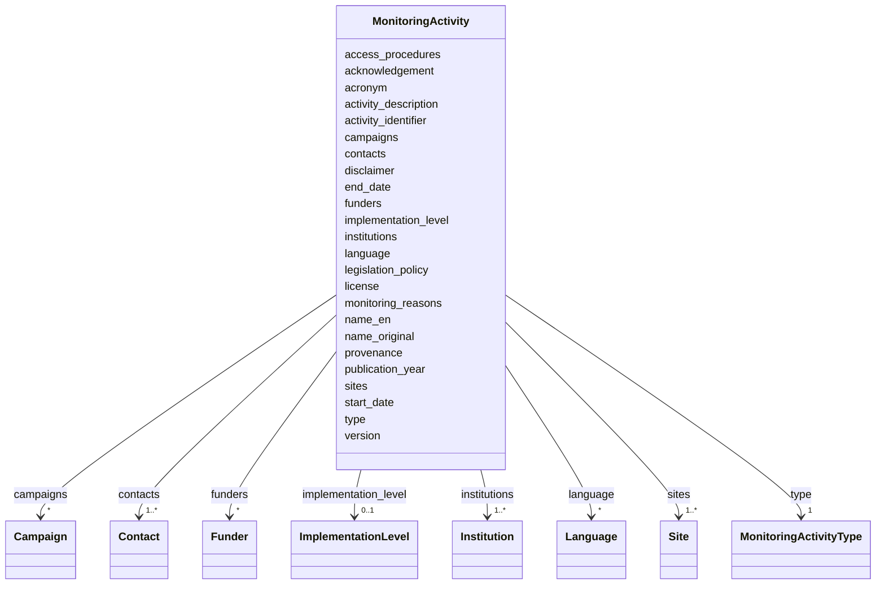

---

## Site

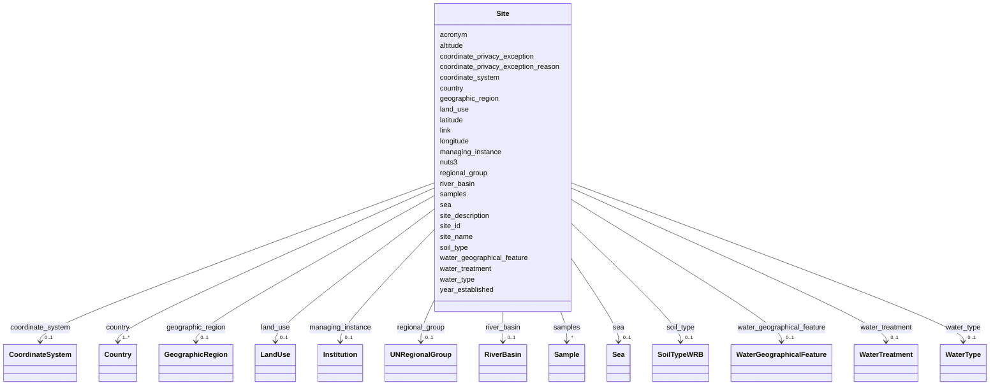

---

## ChemicalCompound

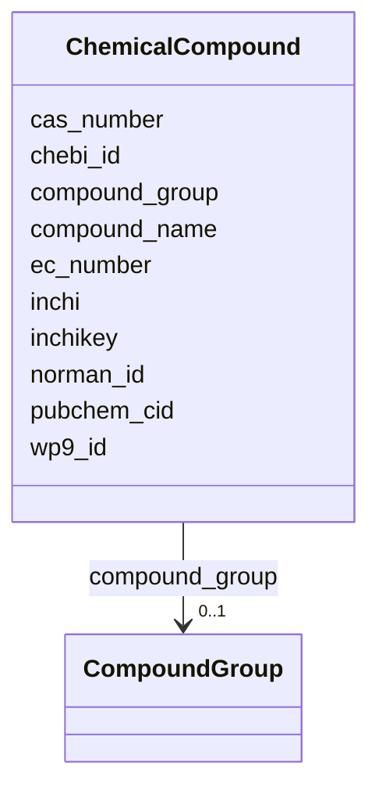

---

