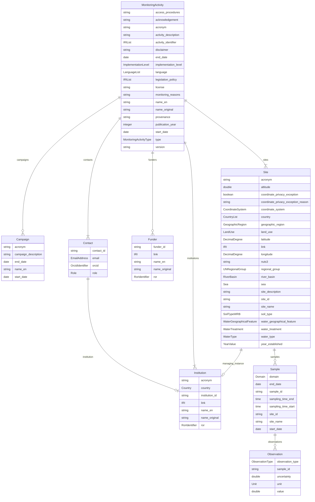

```mermaid
erDiagram
Campaign {
    string acronym  
    string campaign_description  
    date end_date  
    string name_en  
    date start_date  
}
Contact {
    string contact_id  
    EmailAddress email  
    OrcidIdentifier orcid  
    Role role  
}
Funder {
    string funder_id  
    IRI link  
    string name_en  
    string name_original  
    RorIdentifier ror  
}
Institution {
    string acronym  
    Country country  
    string institution_id  
    IRI link  
    string name_en  
    string name_original  
    RorIdentifier ror  
}
MonitoringActivity {
    string access_procedures  
    string acknowledgement  
    string acronym  
    string activity_description  
    IRIList activity_identifier  
    string disclaimer  
    date end_date  
    ImplementationLevel implementation_level  
    LanguageList language  
    IRIList legislation_policy  
    string license  
    string monitoring_reasons  
    string name_en  
    string name_original  
    string provenance  
    integer publication_year  
    date start_date  
    MonitoringActivityType type  
    string version  
}
Observation {
    ObservationType observation_type  
    string sample_id  
    double uncertainty  
    Unit unit  
    double value  
}
Sample {
    Domain domain  
    date end_date  
    string sample_id  
    time sampling_time_end  
    time sampling_time_start  
    string site_id  
    string site_name  
    date start_date  
}
Site {
    string acronym  
    double altitude  
    boolean coordinate_privacy_exception  
    string coordinate_privacy_exception_reason  
    CoordinateSystem coordinate_system  
    CountryList country  
    GeographicRegion geographic_region  
    LandUse land_use  
    DecimalDegree latitude  
    IRI link  
    DecimalDegree longitude  
    string nuts3  
    UNRegionalGroup regional_group  
    RiverBasin river_basin  
    Sea sea  
    string site_description  
    string site_id  
    string site_name  
    SoilTypeWRB soil_type  
    WaterGeographicalFeature water_geographical_feature  
    WaterTreatment water_treatment  
    WaterType water_type  
    YearValue year_established  
}

Contact ||--|o Institution : "institution"
MonitoringActivity ||--}o Campaign : "campaigns"
MonitoringActivity ||--}o Funder : "funders"
MonitoringActivity ||--}| Contact : "contacts"
MonitoringActivity ||--}| Institution : "institutions"
MonitoringActivity ||--}| Site : "sites"
Sample ||--}o Observation : "observations"
Site ||--|o Institution : "managing_instance"
Site ||--}o Sample : "samples"

```

