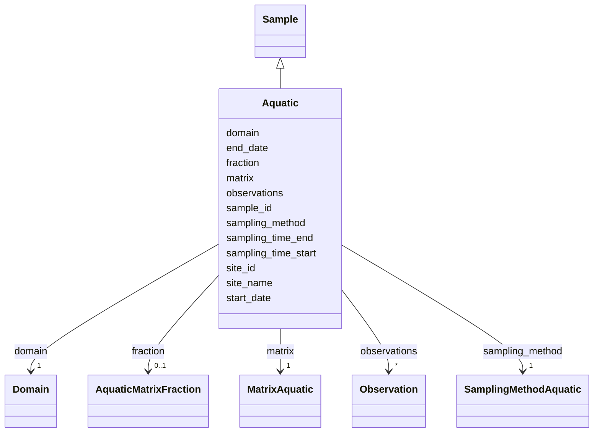

```mermaid
 classDiagram
    class Aquatic
    click Aquatic href "../Aquatic"
      Sample <|-- Aquatic
        click Sample href "../Sample"
      
      Aquatic : domain
        
          
    
        
        
        Aquatic --> "1" Domain : domain
        click Domain href "../Domain"
    

        
      Aquatic : end_date
        
      Aquatic : fraction
        
          
    
        
        
        Aquatic --> "0..1" AquaticMatrixFraction : fraction
        click AquaticMatrixFraction href "../AquaticMatrixFraction"
    

        
      Aquatic : matrix
        
          
    
        
        
        Aquatic --> "1" MatrixAquatic : matrix
        click MatrixAquatic href "../MatrixAquatic"
    

        
      Aquatic : observations
        
          
    
        
        
        Aquatic --> "*" Observation : observations
        click Observation href "../Observation"
    

        
      Aquatic : sample_id
        
      Aquatic : sampling_method
        
          
    
        
        
        Aquatic --> "1" SamplingMethodAquatic : sampling_method
        click SamplingMethodAquatic href "../SamplingMethodAquatic"
    

        
      Aquatic : sampling_time_end
        
      Aquatic : sampling_time_start
        
      Aquatic : site_id
        
      Aquatic : site_name
        
      Aquatic : start_date
        
      
```
