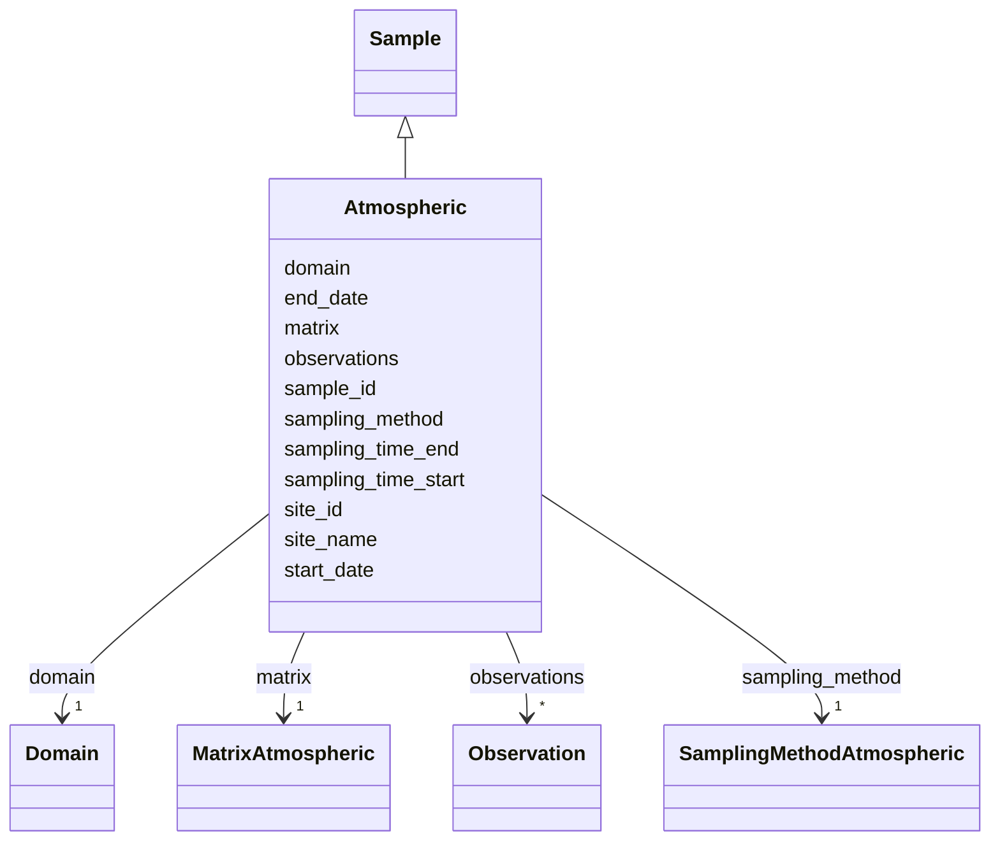

```mermaid
 classDiagram
    class Atmospheric
    click Atmospheric href "../Atmospheric"
      Sample <|-- Atmospheric
        click Sample href "../Sample"
      
      Atmospheric : domain
        
          
    
        
        
        Atmospheric --> "1" Domain : domain
        click Domain href "../Domain"
    

        
      Atmospheric : end_date
        
      Atmospheric : matrix
        
          
    
        
        
        Atmospheric --> "1" MatrixAtmospheric : matrix
        click MatrixAtmospheric href "../MatrixAtmospheric"
    

        
      Atmospheric : observations
        
          
    
        
        
        Atmospheric --> "*" Observation : observations
        click Observation href "../Observation"
    

        
      Atmospheric : sample_id
        
      Atmospheric : sampling_method
        
          
    
        
        
        Atmospheric --> "1" SamplingMethodAtmospheric : sampling_method
        click SamplingMethodAtmospheric href "../SamplingMethodAtmospheric"
    

        
      Atmospheric : sampling_time_end
        
      Atmospheric : sampling_time_start
        
      Atmospheric : site_id
        
      Atmospheric : site_name
        
      Atmospheric : start_date
        
      
```
