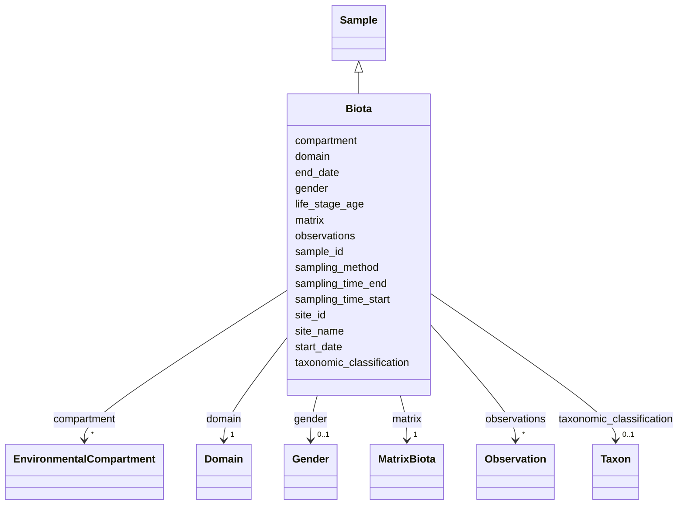

```mermaid
 classDiagram
    class Biota
    click Biota href "../Biota"
      Sample <|-- Biota
        click Sample href "../Sample"
      
      Biota : compartment
        
          
    
        
        
        Biota --> "*" EnvironmentalCompartment : compartment
        click EnvironmentalCompartment href "../EnvironmentalCompartment"
    

        
      Biota : domain
        
          
    
        
        
        Biota --> "1" Domain : domain
        click Domain href "../Domain"
    

        
      Biota : end_date
        
      Biota : gender
        
          
    
        
        
        Biota --> "0..1" Gender : gender
        click Gender href "../Gender"
    

        
      Biota : life_stage_age
        
      Biota : matrix
        
          
    
        
        
        Biota --> "1" MatrixBiota : matrix
        click MatrixBiota href "../MatrixBiota"
    

        
      Biota : observations
        
          
    
        
        
        Biota --> "*" Observation : observations
        click Observation href "../Observation"
    

        
      Biota : sample_id
        
      Biota : sampling_method
        
      Biota : sampling_time_end
        
      Biota : sampling_time_start
        
      Biota : site_id
        
      Biota : site_name
        
      Biota : start_date
        
      Biota : taxonomic_classification
        
          
    
        
        
        Biota --> "0..1" Taxon : taxonomic_classification
        click Taxon href "../Taxon"
    

        
      
```
