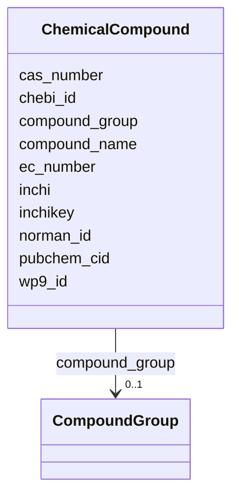

```mermaid
 classDiagram
    class ChemicalCompound
    click ChemicalCompound href "../ChemicalCompound"
      ChemicalCompound : cas_number
        
      ChemicalCompound : chebi_id
        
      ChemicalCompound : compound_group
        
          
    
        
        
        ChemicalCompound --> "0..1" CompoundGroup : compound_group
        click CompoundGroup href "../CompoundGroup"
    

        
      ChemicalCompound : compound_name
        
      ChemicalCompound : ec_number
        
      ChemicalCompound : inchi
        
      ChemicalCompound : inchikey
        
      ChemicalCompound : norman_id
        
      ChemicalCompound : pubchem_cid
        
      ChemicalCompound : wp9_id
        
      
```
