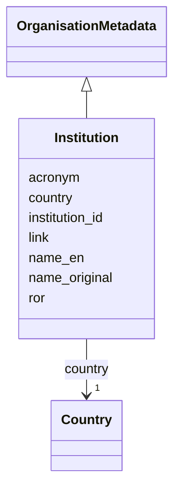

```mermaid
 classDiagram
    class Institution
    click Institution href "../Institution"
      OrganisationMetadata <|-- Institution
        click OrganisationMetadata href "../OrganisationMetadata"
      
      Institution : acronym
        
      Institution : country
        
          
    
        
        
        Institution --> "1" Country : country
        click Country href "../Country"
    

        
      Institution : institution_id
        
      Institution : link
        
      Institution : name_en
        
      Institution : name_original
        
      Institution : ror
        
      
```
