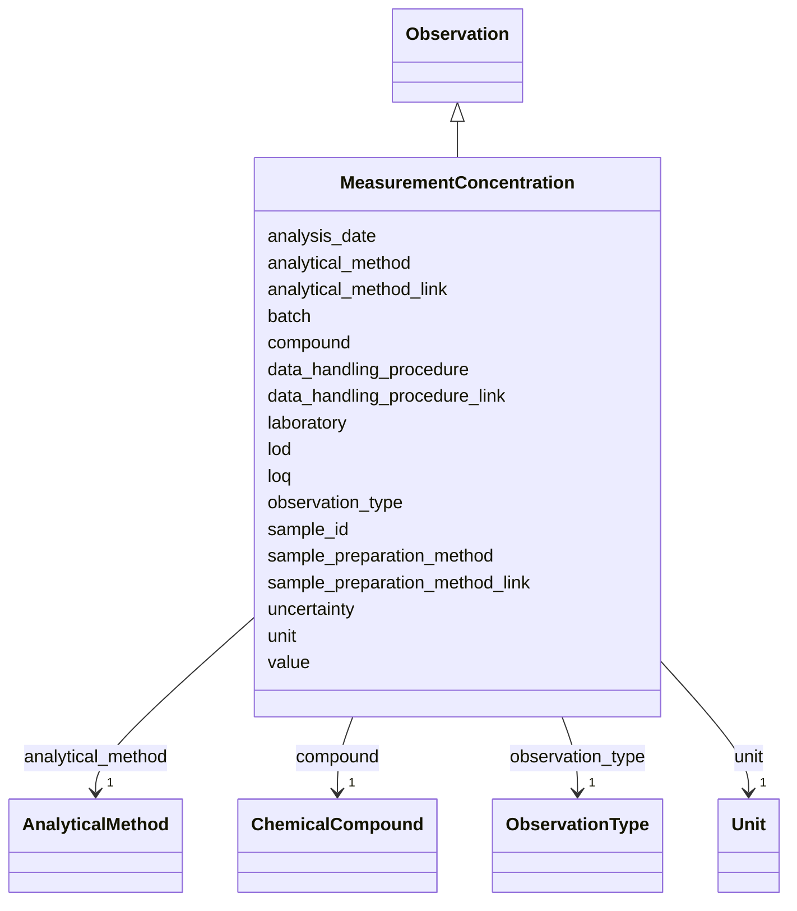

```mermaid
 classDiagram
    class MeasurementConcentration
    click MeasurementConcentration href "../MeasurementConcentration"
      Observation <|-- MeasurementConcentration
        click Observation href "../Observation"
      
      MeasurementConcentration : analysis_date
        
      MeasurementConcentration : analytical_method
        
          
    
        
        
        MeasurementConcentration --> "1" AnalyticalMethod : analytical_method
        click AnalyticalMethod href "../AnalyticalMethod"
    

        
      MeasurementConcentration : analytical_method_link
        
      MeasurementConcentration : batch
        
      MeasurementConcentration : compound
        
          
    
        
        
        MeasurementConcentration --> "1" ChemicalCompound : compound
        click ChemicalCompound href "../ChemicalCompound"
    

        
      MeasurementConcentration : data_handling_procedure
        
      MeasurementConcentration : data_handling_procedure_link
        
      MeasurementConcentration : laboratory
        
      MeasurementConcentration : lod
        
      MeasurementConcentration : loq
        
      MeasurementConcentration : observation_type
        
          
    
        
        
        MeasurementConcentration --> "1" ObservationType : observation_type
        click ObservationType href "../ObservationType"
    

        
      MeasurementConcentration : sample_id
        
      MeasurementConcentration : sample_preparation_method
        
      MeasurementConcentration : sample_preparation_method_link
        
      MeasurementConcentration : uncertainty
        
      MeasurementConcentration : unit
        
          
    
        
        
        MeasurementConcentration --> "1" Unit : unit
        click Unit href "../Unit"
    

        
      MeasurementConcentration : value
        
      
```
