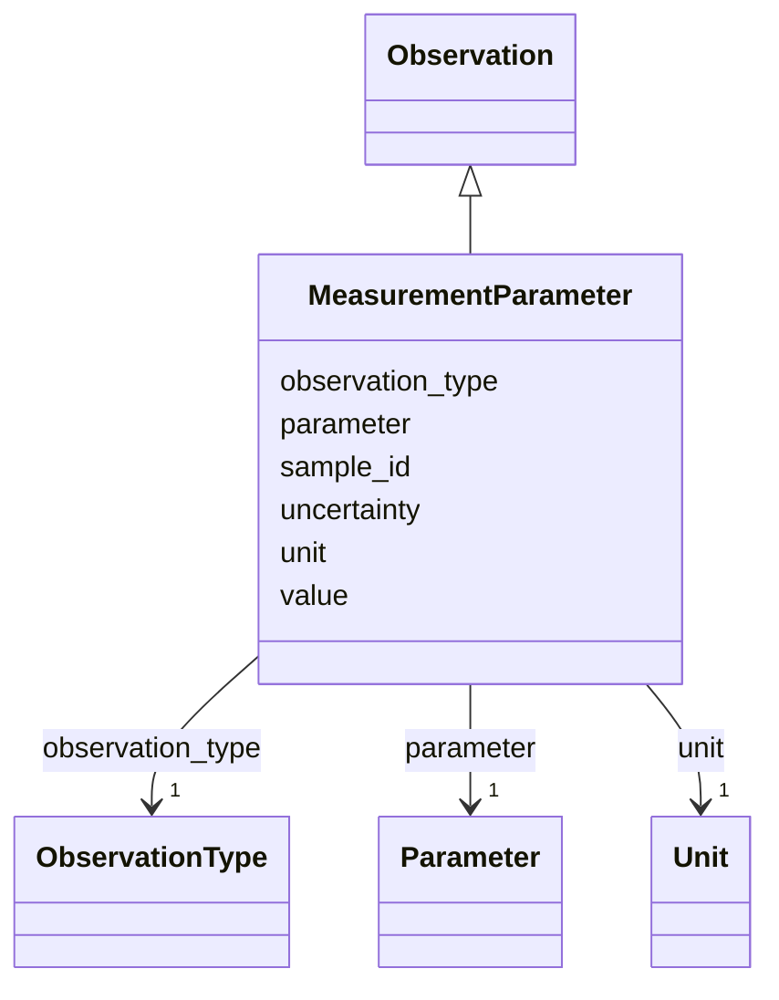

```mermaid
 classDiagram
    class MeasurementParameter
    click MeasurementParameter href "../MeasurementParameter"
      Observation <|-- MeasurementParameter
        click Observation href "../Observation"
      
      MeasurementParameter : observation_type
        
          
    
        
        
        MeasurementParameter --> "1" ObservationType : observation_type
        click ObservationType href "../ObservationType"
    

        
      MeasurementParameter : parameter
        
          
    
        
        
        MeasurementParameter --> "1" Parameter : parameter
        click Parameter href "../Parameter"
    

        
      MeasurementParameter : sample_id
        
      MeasurementParameter : uncertainty
        
      MeasurementParameter : unit
        
          
    
        
        
        MeasurementParameter --> "1" Unit : unit
        click Unit href "../Unit"
    

        
      MeasurementParameter : value
        
      
```
