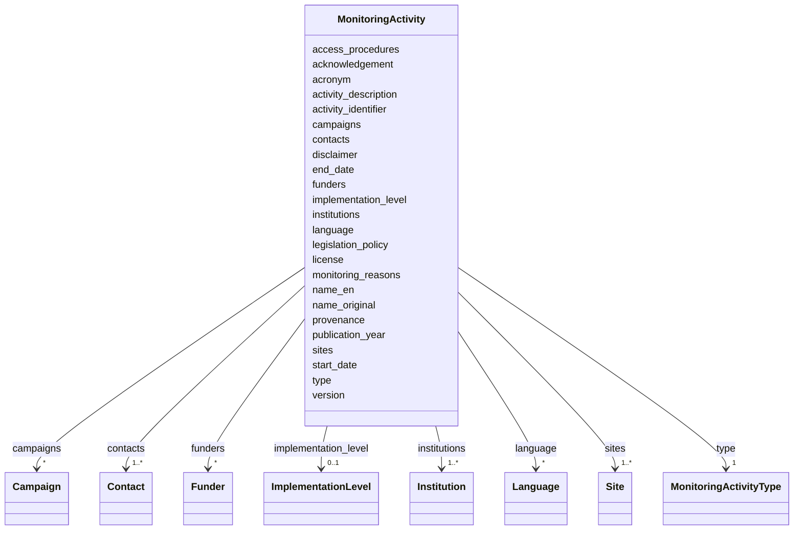

```mermaid
 classDiagram
    class MonitoringActivity
    click MonitoringActivity href "../MonitoringActivity"
      MonitoringActivity : access_procedures
        
      MonitoringActivity : acknowledgement
        
      MonitoringActivity : acronym
        
      MonitoringActivity : activity_description
        
      MonitoringActivity : activity_identifier
        
      MonitoringActivity : campaigns
        
          
    
        
        
        MonitoringActivity --> "*" Campaign : campaigns
        click Campaign href "../Campaign"
    

        
      MonitoringActivity : contacts
        
          
    
        
        
        MonitoringActivity --> "1..*" Contact : contacts
        click Contact href "../Contact"
    

        
      MonitoringActivity : disclaimer
        
      MonitoringActivity : end_date
        
      MonitoringActivity : funders
        
          
    
        
        
        MonitoringActivity --> "*" Funder : funders
        click Funder href "../Funder"
    

        
      MonitoringActivity : implementation_level
        
          
    
        
        
        MonitoringActivity --> "0..1" ImplementationLevel : implementation_level
        click ImplementationLevel href "../ImplementationLevel"
    

        
      MonitoringActivity : institutions
        
          
    
        
        
        MonitoringActivity --> "1..*" Institution : institutions
        click Institution href "../Institution"
    

        
      MonitoringActivity : language
        
          
    
        
        
        MonitoringActivity --> "*" Language : language
        click Language href "../Language"
    

        
      MonitoringActivity : legislation_policy
        
      MonitoringActivity : license
        
      MonitoringActivity : monitoring_reasons
        
      MonitoringActivity : name_en
        
      MonitoringActivity : name_original
        
      MonitoringActivity : provenance
        
      MonitoringActivity : publication_year
        
      MonitoringActivity : sites
        
          
    
        
        
        MonitoringActivity --> "1..*" Site : sites
        click Site href "../Site"
    

        
      MonitoringActivity : start_date
        
      MonitoringActivity : type
        
          
    
        
        
        MonitoringActivity --> "1" MonitoringActivityType : type
        click MonitoringActivityType href "../MonitoringActivityType"
    

        
      MonitoringActivity : version
        
      
```
