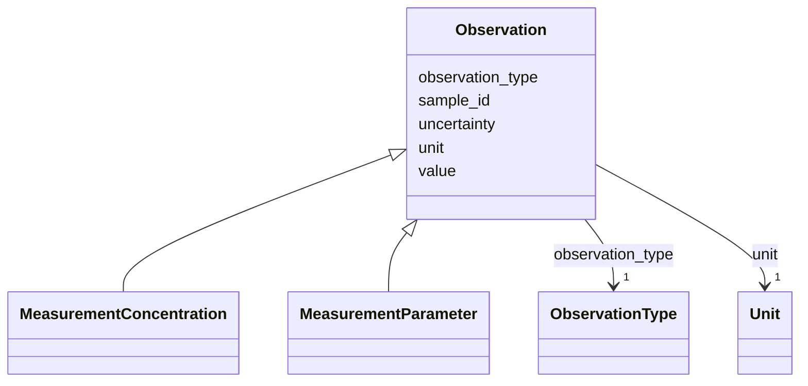

```mermaid
 classDiagram
    class Observation
    click Observation href "../Observation"
      Observation <|-- MeasurementConcentration
        click MeasurementConcentration href "../MeasurementConcentration"
      Observation <|-- MeasurementParameter
        click MeasurementParameter href "../MeasurementParameter"
      
      Observation : observation_type
        
          
    
        
        
        Observation --> "1" ObservationType : observation_type
        click ObservationType href "../ObservationType"
    

        
      Observation : sample_id
        
      Observation : uncertainty
        
      Observation : unit
        
          
    
        
        
        Observation --> "1" Unit : unit
        click Unit href "../Unit"
    

        
      Observation : value
        
      
```
