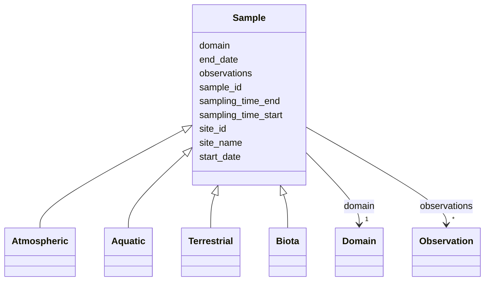

```mermaid
 classDiagram
    class Sample
    click Sample href "../Sample"
      Sample <|-- Atmospheric
        click Atmospheric href "../Atmospheric"
      Sample <|-- Aquatic
        click Aquatic href "../Aquatic"
      Sample <|-- Terrestrial
        click Terrestrial href "../Terrestrial"
      Sample <|-- Biota
        click Biota href "../Biota"
      
      Sample : domain
        
          
    
        
        
        Sample --> "1" Domain : domain
        click Domain href "../Domain"
    

        
      Sample : end_date
        
      Sample : observations
        
          
    
        
        
        Sample --> "*" Observation : observations
        click Observation href "../Observation"
    

        
      Sample : sample_id
        
      Sample : sampling_time_end
        
      Sample : sampling_time_start
        
      Sample : site_id
        
      Sample : site_name
        
      Sample : start_date
        
      
```
