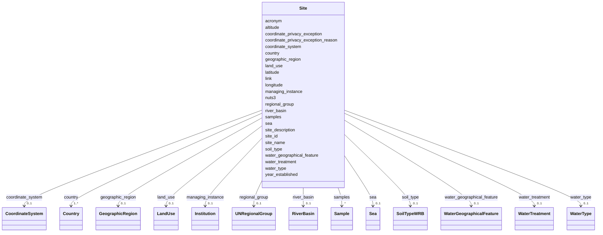

```mermaid
 classDiagram
    class Site
    click Site href "../Site"
      Site : acronym
        
      Site : altitude
        
      Site : coordinate_privacy_exception
        
      Site : coordinate_privacy_exception_reason
        
      Site : coordinate_system
        
          
    
        
        
        Site --> "0..1" CoordinateSystem : coordinate_system
        click CoordinateSystem href "../CoordinateSystem"
    

        
      Site : country
        
          
    
        
        
        Site --> "1..*" Country : country
        click Country href "../Country"
    

        
      Site : geographic_region
        
          
    
        
        
        Site --> "0..1" GeographicRegion : geographic_region
        click GeographicRegion href "../GeographicRegion"
    

        
      Site : land_use
        
          
    
        
        
        Site --> "0..1" LandUse : land_use
        click LandUse href "../LandUse"
    

        
      Site : latitude
        
      Site : link
        
      Site : longitude
        
      Site : managing_instance
        
          
    
        
        
        Site --> "0..1" Institution : managing_instance
        click Institution href "../Institution"
    

        
      Site : nuts3
        
      Site : regional_group
        
          
    
        
        
        Site --> "0..1" UNRegionalGroup : regional_group
        click UNRegionalGroup href "../UNRegionalGroup"
    

        
      Site : river_basin
        
          
    
        
        
        Site --> "0..1" RiverBasin : river_basin
        click RiverBasin href "../RiverBasin"
    

        
      Site : samples
        
          
    
        
        
        Site --> "*" Sample : samples
        click Sample href "../Sample"
    

        
      Site : sea
        
          
    
        
        
        Site --> "0..1" Sea : sea
        click Sea href "../Sea"
    

        
      Site : site_description
        
      Site : site_id
        
      Site : site_name
        
      Site : soil_type
        
          
    
        
        
        Site --> "0..1" SoilTypeWRB : soil_type
        click SoilTypeWRB href "../SoilTypeWRB"
    

        
      Site : water_geographical_feature
        
          
    
        
        
        Site --> "0..1" WaterGeographicalFeature : water_geographical_feature
        click WaterGeographicalFeature href "../WaterGeographicalFeature"
    

        
      Site : water_treatment
        
          
    
        
        
        Site --> "0..1" WaterTreatment : water_treatment
        click WaterTreatment href "../WaterTreatment"
    

        
      Site : water_type
        
          
    
        
        
        Site --> "0..1" WaterType : water_type
        click WaterType href "../WaterType"
    

        
      Site : year_established
        
      
```
