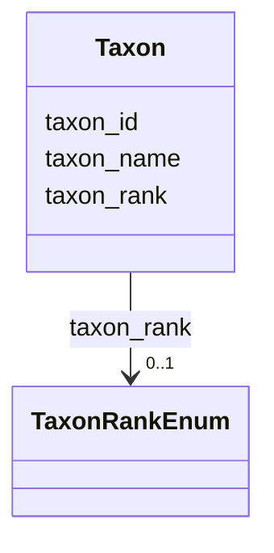

```mermaid
 classDiagram
    class Taxon
    click Taxon href "../Taxon"
      Taxon : taxon_id
        
      Taxon : taxon_name
        
      Taxon : taxon_rank
        
          
    
        
        
        Taxon --> "0..1" TaxonRankEnum : taxon_rank
        click TaxonRankEnum href "../TaxonRankEnum"
    

        
      
```
