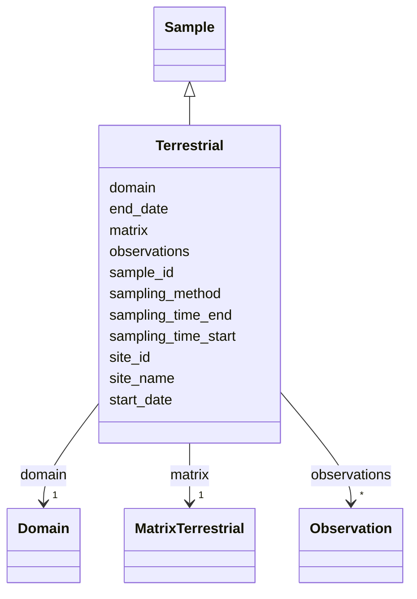

```mermaid
 classDiagram
    class Terrestrial
    click Terrestrial href "../Terrestrial"
      Sample <|-- Terrestrial
        click Sample href "../Sample"
      
      Terrestrial : domain
        
          
    
        
        
        Terrestrial --> "1" Domain : domain
        click Domain href "../Domain"
    

        
      Terrestrial : end_date
        
      Terrestrial : matrix
        
          
    
        
        
        Terrestrial --> "1" MatrixTerrestrial : matrix
        click MatrixTerrestrial href "../MatrixTerrestrial"
    

        
      Terrestrial : observations
        
          
    
        
        
        Terrestrial --> "*" Observation : observations
        click Observation href "../Observation"
    

        
      Terrestrial : sample_id
        
      Terrestrial : sampling_method
        
      Terrestrial : sampling_time_end
        
      Terrestrial : sampling_time_start
        
      Terrestrial : site_id
        
      Terrestrial : site_name
        
      Terrestrial : start_date
        
      
```
